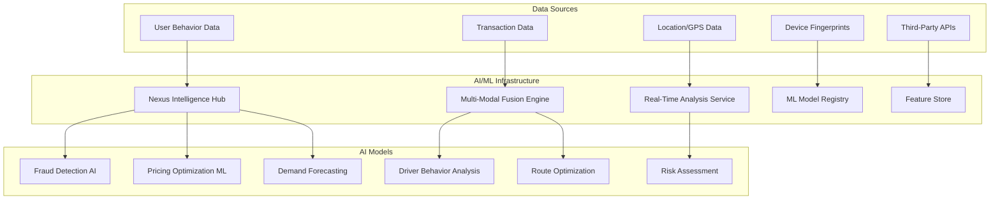
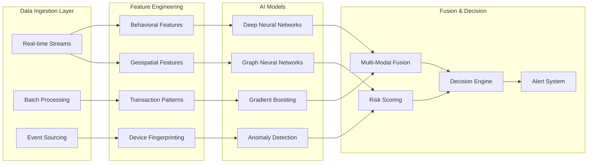
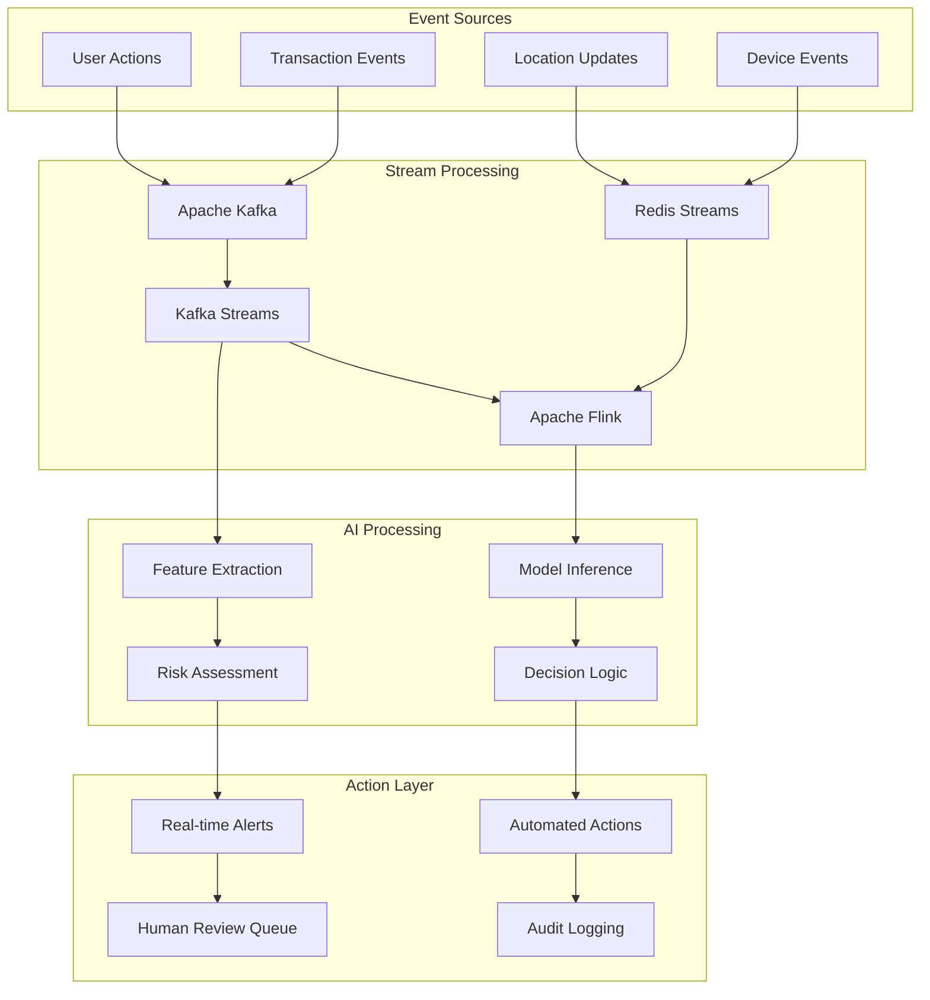
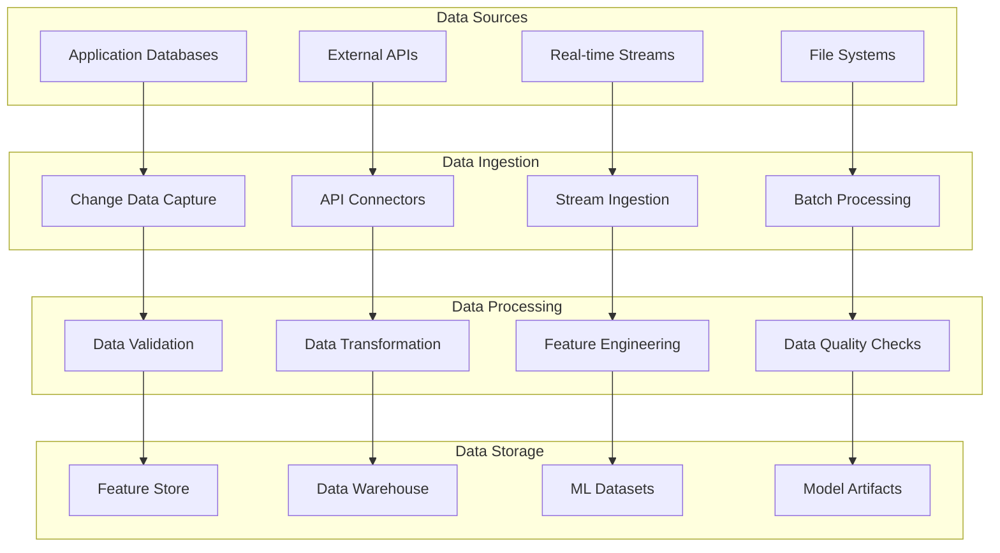
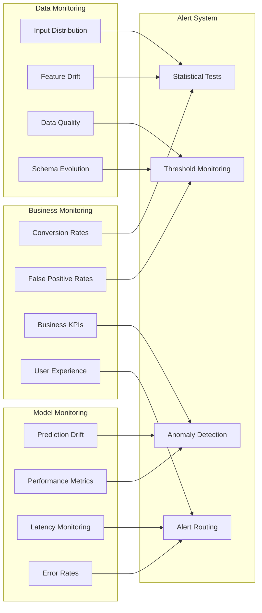

# AI Technical Specification - Xpress Ops Tower

## Overview

The Xpress Ops Tower incorporates advanced AI/ML capabilities for fraud detection, predictive analytics, and intelligent automation. This document outlines the technical specifications for all AI components in the system.

## AI Architecture Overview

### Core AI Services



## 1. Nexus Intelligence System

### 1.1 Architecture
- **Central AI Hub**: Unified interface for all AI/ML operations
- **Dual Approval Workflow**: Human oversight for critical AI decisions
- **Cross-Domain Analytics**: Combines pricing, surge, regional, and risk intelligence
- **Real-Time Processing**: Sub-second response times for critical operations

### 1.2 Key Components

#### Recommendations Engine
```typescript
interface AIRecommendation {
  id: number;
  domain: 'pricing' | 'surge' | 'regional' | 'risk';
  title: string;
  message: string;
  confidence: number; // 0-1
  riskLevel: 'low' | 'medium' | 'high';
  status: 'generated' | 'proposed' | 'approved' | 'rejected';
  createdByModel: string;
  details: {
    currentValue?: number;
    proposedValue?: number;
    estimatedImpact?: string;
    complianceCheck?: boolean;
  };
}
```

#### Cross-Domain Bundles
```typescript
interface AIBundle {
  id: number;
  title: string;
  summary: string;
  recommendationIds: number[];
  confidence: number;
  riskLevel: 'low' | 'medium' | 'high';
  estimatedImpact: {
    revenue?: string;
    trips?: string;
    roi?: string;
  };
  bundleType: 'optimization' | 'expansion' | 'recovery' | 'compliance';
}
```

### 1.3 AI Model Performance Metrics

| Model | Domain | Accuracy | MAPE | Drift Threshold | SLA |
|-------|--------|----------|------|----------------|-----|
| pricing-optimizer-v2.1 | Pricing | 94.2% | 5.8% | <0.05 | <200ms |
| surge-predictor-v1.7 | Surge | 91.8% | 8.1% | <0.08 | <150ms |
| regional-ai-v4.0 | Regional | 87.9% | 12.1% | <0.1 | <300ms |
| fraud-detector-v3.2 | Risk | 99.2% | 0.8% | <0.02 | <100ms |

## 2. Multi-Modal Fraud Detection

### 2.1 Technical Architecture



### 2.2 Model Specifications

#### Primary Fraud Detection Model
- **Architecture**: Ensemble of XGBoost, LightGBM, and Neural Networks
- **Features**: 247 engineered features across behavioral, transactional, and device categories
- **Training Data**: 2.5M labeled transactions (updated weekly)
- **Performance**: 99.2% accuracy, 0.3% false positive rate
- **Inference Time**: <50ms p95

#### Anomaly Detection Model
- **Architecture**: Isolation Forest + Autoencoder hybrid
- **Use Case**: Detecting novel fraud patterns
- **Sensitivity**: Configurable threshold (default: 3 standard deviations)
- **Update Frequency**: Real-time learning with concept drift detection

### 2.3 Feature Categories

#### Behavioral Features (87 features)
- Transaction velocity patterns
- User interaction sequences
- Time-based behavior analytics
- Device usage patterns
- Location transition analysis

#### Transactional Features (94 features)
- Amount distribution analysis
- Payment method patterns
- Refund/chargeback history
- Cross-merchant analysis
- Currency conversion patterns

#### Device Features (43 features)
- Device fingerprinting (Browser, OS, Screen resolution)
- IP geolocation analysis
- VPN/Proxy detection
- Device reputation scoring
- Hardware characteristic analysis

#### Network Features (23 features)
- Social network analysis
- Connection graph patterns
- Community detection
- Centrality measures
- Path analysis between users

## 3. Real-Time Processing Engine

### 3.1 Stream Processing Architecture



### 3.2 Performance Specifications

#### Processing Latency (P95)
- Event ingestion: <10ms
- Feature extraction: <30ms  
- Model inference: <50ms
- Decision processing: <20ms
- **Total end-to-end**: <100ms

#### Throughput Capacity
- Peak events per second: 100,000 EPS
- Concurrent model inferences: 50,000/sec
- Alert generation rate: 1,000/sec
- Sustained processing: 24/7 with <0.1% downtime

## 4. Machine Learning Operations (MLOps)

### 4.1 Model Lifecycle Management

```mermaid
graph LR
    subgraph "Development"
        A[Data Collection]
        B[Feature Engineering]
        C[Model Training]
        D[Model Validation]
    end
    
    subgraph "Deployment"
        E[Model Registry]
        F[A/B Testing]
        G[Canary Deployment]
        H[Production Deployment]
    end
    
    subgraph "Monitoring"
        I[Performance Monitoring]
        J[Drift Detection]
        K[Business Metrics]
        L[Model Health]
    end
    
    subgraph "Maintenance"
        M[Retraining Pipeline]
        N[Model Updates]
        O[Rollback Procedures]
        P[Archive Management]
    end
    
    A --> B
    B --> C
    C --> D
    D --> E
    
    E --> F
    F --> G
    G --> H
    
    H --> I
    I --> J
    J --> K
    K --> L
    
    L --> M
    M --> N
    N --> O
    O --> P
    P --> A
```



### 4.2 Model Registry Specifications

#### Model Versioning
- **Semantic Versioning**: major.minor.patch format
- **Metadata Tracking**: Training data version, hyperparameters, performance metrics
- **Lineage Tracking**: Full data and code lineage for reproducibility
- **Environment Management**: Containerized environments for consistency

#### Automated Testing Pipeline
```yaml
model_validation:
  unit_tests:
    - model_serialization_test
    - prediction_consistency_test
    - performance_benchmark_test
  
  integration_tests:
    - end_to_end_prediction_test
    - api_response_test
    - data_pipeline_test
  
  performance_tests:
    - latency_test: <50ms p95
    - throughput_test: >10k QPS
    - memory_usage_test: <2GB
  
  business_logic_tests:
    - accuracy_threshold: >98%
    - false_positive_rate: <0.5%
    - model_fairness_test
```

## 5. Data Pipeline Architecture

### 5.1 Data Flow Architecture



### 5.2 Feature Store Implementation

#### Feature Categories
```python
@dataclass
class FeatureGroup:
    name: str
    description: str
    features: List[str]
    update_frequency: str
    retention_days: int
    
# Example Feature Groups
USER_BEHAVIOR_FEATURES = FeatureGroup(
    name="user_behavior",
    description="User behavioral patterns and preferences",
    features=["avg_transaction_amount", "login_frequency", "device_consistency"],
    update_frequency="real-time",
    retention_days=365
)

TRANSACTION_FEATURES = FeatureGroup(
    name="transaction_patterns",
    description="Transaction-based features for fraud detection",
    features=["velocity_1h", "velocity_24h", "merchant_diversity"],
    update_frequency="real-time", 
    retention_days=730
)
```

#### Feature Serving API
```typescript
interface FeatureServingAPI {
  getFeatures(entityId: string, featureGroups: string[]): Promise<FeatureVector>;
  getBatchFeatures(entityIds: string[], featureGroups: string[]): Promise<FeatureMatrix>;
  getHistoricalFeatures(
    entityIds: string[],
    featureGroups: string[],
    timestamp: Date
  ): Promise<FeatureMatrix>;
}
```

## 6. Model Monitoring and Drift Detection

### 6.1 Monitoring Framework



### 6.2 Drift Detection Algorithms

#### Statistical Drift Detection
- **Kolmogorov-Smirnov Test**: For continuous features
- **Chi-Square Test**: For categorical features  
- **Population Stability Index (PSI)**: For feature distribution changes
- **Wasserstein Distance**: For distribution similarity

#### Threshold Configuration
```yaml
drift_detection:
  statistical_tests:
    ks_test_threshold: 0.05
    chi_square_threshold: 0.05
    psi_threshold: 0.1
    wasserstein_threshold: 0.2
  
  monitoring_windows:
    short_term: 1_hour
    medium_term: 24_hours
    long_term: 7_days
  
  alert_thresholds:
    warning: 2_consecutive_failures
    critical: 5_consecutive_failures
    emergency: 10_consecutive_failures
```

## 7. Security and Privacy

### 7.1 AI Model Security

#### Model Protection
- **Model Encryption**: AES-256 encryption for model artifacts
- **Access Control**: RBAC for model access and deployment
- **Audit Logging**: Complete audit trail for model operations
- **Adversarial Detection**: Protection against adversarial attacks

#### Privacy-Preserving ML
- **Differential Privacy**: ε-differential privacy for sensitive features (ε=1.0)
- **Federated Learning**: For decentralized model training
- **Homomorphic Encryption**: For secure model inference
- **Data Minimization**: Automatic feature pruning for privacy

### 7.2 Explainability and Fairness

#### Model Explainability
```python
class ModelExplainer:
    def global_explanations(self, model) -> Dict[str, float]:
        """SHAP-based global feature importance"""
        pass
    
    def local_explanations(self, model, instance) -> Dict[str, float]:
        """LIME-based local explanations for individual predictions"""
        pass
    
    def counterfactual_explanations(self, model, instance) -> Dict[str, Any]:
        """What-if analysis for decision understanding"""
        pass
```

#### Bias Detection and Mitigation
- **Fairness Metrics**: Equal opportunity, demographic parity, calibration
- **Bias Detection**: Continuous monitoring across protected attributes
- **Mitigation Strategies**: Pre-processing, in-processing, post-processing
- **Regulatory Compliance**: Alignment with anti-discrimination laws

## 8. Performance Optimization

### 8.1 Model Optimization Techniques

#### Model Compression
- **Quantization**: INT8 quantization for 4x speed improvement
- **Pruning**: Structured pruning for 60% model size reduction
- **Knowledge Distillation**: Student-teacher architecture
- **TensorRT Optimization**: GPU inference acceleration

#### Inference Optimization
```yaml
optimization_config:
  model_serving:
    batch_size: 32
    max_latency: 50ms
    gpu_memory_fraction: 0.7
    num_replicas: 4
    
  caching:
    feature_cache_ttl: 300s
    prediction_cache_ttl: 60s
    model_cache_size: 2GB
    
  hardware:
    cpu_cores: 8
    memory_gb: 16
    gpu_type: "Tesla V100"
    storage_type: "NVMe SSD"
```

### 8.2 Scalability Architecture

#### Auto-Scaling Configuration
```yaml
autoscaling:
  metrics:
    - type: cpu
      target: 70%
    - type: memory  
      target: 80%
    - type: custom
      name: prediction_latency
      target: 40ms
  
  scaling_policy:
    min_replicas: 2
    max_replicas: 20
    scale_up_cooldown: 60s
    scale_down_cooldown: 300s
```

## 9. Integration Specifications

### 9.1 API Specifications

#### Fraud Detection API
```typescript
interface FraudDetectionRequest {
  transactionId: string;
  userId: string;
  amount: number;
  currency: string;
  merchantId: string;
  deviceFingerprint: DeviceFingerprint;
  location: GeoLocation;
  timestamp: Date;
}

interface FraudDetectionResponse {
  transactionId: string;
  riskScore: number; // 0-1000
  decision: 'approve' | 'review' | 'decline';
  riskFactors: RiskFactor[];
  modelVersion: string;
  processingTimeMs: number;
}
```

#### Real-Time Scoring API
```typescript
interface ScoringRequest {
  entityId: string;
  entityType: 'user' | 'transaction' | 'device';
  features?: Record<string, any>;
  modelName?: string;
}

interface ScoringResponse {
  entityId: string;
  scores: Record<string, number>;
  explanations?: Record<string, number>;
  confidence: number;
  modelMetadata: ModelMetadata;
}
```

### 9.2 External Integrations

#### Third-Party AI Services
- **Google Cloud AI**: Vision API for document verification
- **Azure Cognitive Services**: Text analytics for customer support
- **AWS Rekognition**: Identity verification and fraud detection
- **Twilio Verify**: SMS-based two-factor authentication

#### Data Providers
- **PAGASA Weather API**: Weather data for demand forecasting
- **MMDA Traffic Feed**: Real-time traffic data for route optimization
- **BSP Economic Indicators**: Macroeconomic data for pricing models
- **Social Media APIs**: Sentiment analysis for market intelligence

## 10. Compliance and Governance

### 10.1 AI Governance Framework

#### Model Governance
- **Model Risk Management**: Comprehensive risk assessment framework
- **Change Management**: Structured approval process for model updates
- **Documentation Standards**: Complete model documentation requirements
- **Validation Framework**: Independent model validation procedures

#### Regulatory Compliance
- **Data Privacy Act (Philippines)**: Full compliance with local privacy regulations
- **BSP Guidelines**: Adherence to central bank AI guidelines
- **GDPR Alignment**: European data protection standards
- **AI Ethics Board**: Regular ethical review of AI systems

### 10.2 Audit and Reporting

#### Automated Reporting
```yaml
reporting_schedule:
  daily:
    - model_performance_summary
    - fraud_detection_metrics
    - system_health_report
  
  weekly:
    - model_drift_analysis
    - business_impact_assessment
    - compliance_status_report
  
  monthly:
    - comprehensive_ai_audit
    - risk_assessment_update
    - governance_review
```

---

**Document Version**: 1.0  
**Last Updated**: 2025-09-02  
**Next Review**: 2025-12-02  
**Owner**: Data Science & AI Team  
**Classification**: Internal Use Only