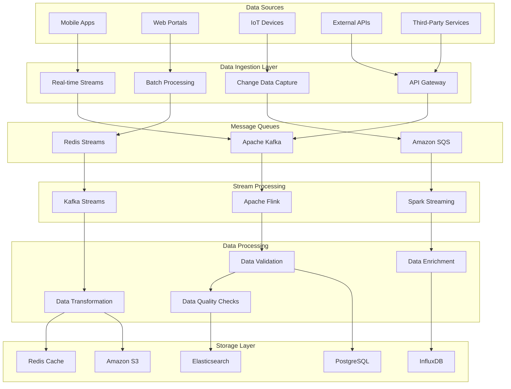
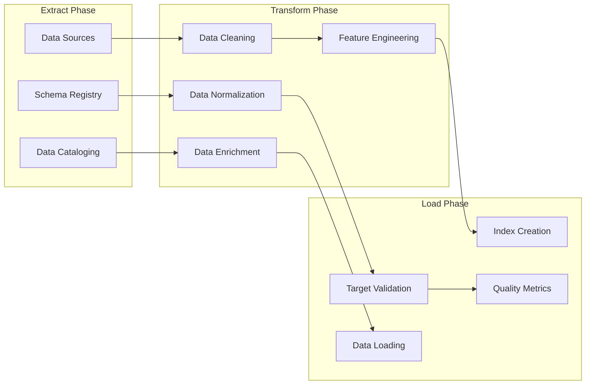
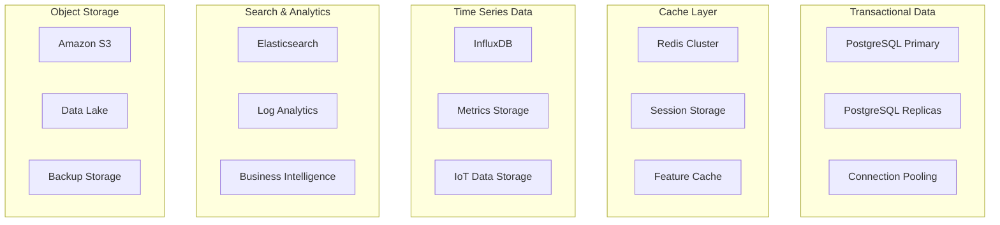
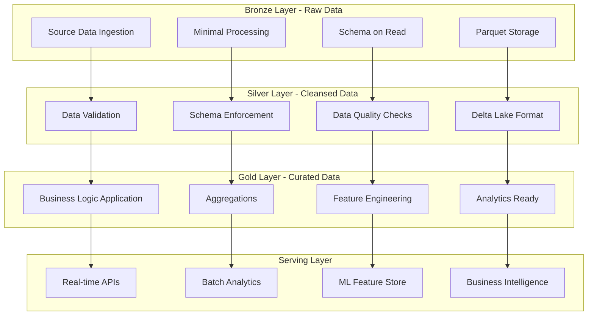
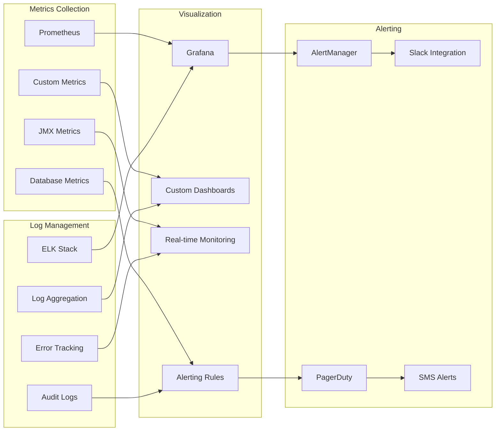

# Data Pipeline Architecture - Xpress Ops Tower

## Overview

The Xpress Ops Tower data pipeline architecture provides a comprehensive, scalable, and real-time data processing system optimized for ridesharing operations in the Philippines. This document outlines the complete data flow, processing mechanisms, and storage strategies.

## Data Pipeline Overview

### High-Level Architecture



## 1. Data Ingestion Layer

### 1.1 Real-Time Data Streams

#### Stream Specifications
- **Throughput**: 100,000+ events/second peak capacity
- **Latency**: <10ms end-to-end processing
- **Availability**: 99.99% uptime SLA
- **Durability**: At-least-once delivery guarantee

#### Data Source Categories

**User Interaction Data**
```yaml
stream: user_interactions
topics:
  - user_login_events
  - user_action_events
  - user_session_events
  - user_preference_updates
schema:
  user_id: string
  session_id: string
  event_type: string
  timestamp: datetime
  metadata: json
```

**Transaction Data**
```yaml
stream: financial_transactions
topics:
  - payment_initiated
  - payment_completed
  - payment_failed
  - refund_processed
schema:
  transaction_id: string
  user_id: string
  amount: decimal
  currency: string
  payment_method: string
  merchant_id: string
  timestamp: datetime
  status: string
```

**Location and Movement Data**
```yaml
stream: location_updates
topics:
  - driver_location_updates
  - trip_route_tracking
  - geofence_events
  - traffic_updates
schema:
  entity_id: string
  latitude: float
  longitude: float
  accuracy: float
  speed: float
  heading: float
  timestamp: datetime
```

### 1.2 Batch Data Processing

#### Batch Job Specifications
```yaml
batch_jobs:
  financial_reconciliation:
    schedule: "0 2 * * *"  # Daily at 2 AM
    input: payment_transactions
    output: reconciliation_reports
    sla: 2_hours
    
  driver_performance_analytics:
    schedule: "0 1 * * *"  # Daily at 1 AM
    input: trip_data, rating_data
    output: driver_scorecards
    sla: 1_hour
    
  fraud_model_training:
    schedule: "0 0 * * 0"  # Weekly on Sunday
    input: labeled_transactions
    output: updated_ml_models
    sla: 4_hours
```

### 1.3 Change Data Capture (CDC)

#### CDC Configuration
```yaml
cdc_sources:
  postgresql_primary:
    tables:
      - users
      - drivers
      - trips
      - payments
    capture_mode: log_based
    output_format: avro
    
  mongodb_documents:
    collections:
      - user_preferences
      - driver_documents
      - compliance_records
    capture_mode: oplog
    output_format: json
```

## 2. Message Queue Architecture

### 2.1 Apache Kafka Configuration

#### Cluster Specification
```yaml
kafka_cluster:
  brokers: 6
  replication_factor: 3
  min_in_sync_replicas: 2
  log_retention_hours: 168  # 7 days
  log_segment_bytes: 1073741824  # 1GB
  
  partitions:
    user_events: 32
    transaction_events: 16
    location_updates: 64
    system_metrics: 8
```

#### Topic Configuration
```yaml
topics:
  high_volume_streams:
    - name: location_updates
      partitions: 64
      retention_ms: 86400000  # 24 hours
      compression_type: lz4
      
    - name: user_interactions
      partitions: 32
      retention_ms: 604800000  # 7 days
      compression_type: gzip
      
  critical_streams:
    - name: payment_events
      partitions: 16
      retention_ms: 2592000000  # 30 days
      compression_type: snappy
      cleanup_policy: compact
```

### 2.2 Stream Processing Architecture

#### Apache Flink Configuration
```yaml
flink_cluster:
  job_managers: 2
  task_managers: 8
  slots_per_task_manager: 4
  heap_size: 4g
  
  checkpointing:
    interval_ms: 30000
    mode: exactly_once
    storage: s3://ops-tower-checkpoints
    
  parallelism:
    default: 16
    max: 64
```

#### Stream Processing Jobs
```scala
// Real-time Fraud Detection Stream
val fraudDetectionStream = env
  .addSource(new FlinkKafkaConsumer("transaction_events", schema, properties))
  .keyBy(_.userId)
  .window(TumblingEventTimeWindows.of(Time.minutes(5)))
  .process(new FraudDetectionFunction())
  .addSink(new FlinkKafkaProducer("fraud_alerts", schema, properties))

// Real-time Analytics Stream  
val analyticsStream = env
  .addSource(new FlinkKafkaConsumer("user_events", schema, properties))
  .keyBy(_.eventType)
  .window(SlidingEventTimeWindows.of(Time.hours(1), Time.minutes(5)))
  .aggregate(new EventAggregationFunction())
  .addSink(new InfluxDBSink())
```

## 3. Data Processing Framework

### 3.1 Data Validation Pipeline

#### Validation Rules Engine
```python
class DataValidationPipeline:
    def __init__(self):
        self.rules = [
            SchemaValidationRule(),
            DataQualityRule(),
            BusinessLogicRule(),
            ConsistencyRule()
        ]
    
    def validate(self, data_batch):
        validation_results = []
        for rule in self.rules:
            result = rule.validate(data_batch)
            validation_results.append(result)
            if result.is_critical_failure():
                raise ValidationException(result.error_message)
        return validation_results
```

#### Validation Rule Specifications
```yaml
validation_rules:
  schema_validation:
    - check_required_fields
    - validate_data_types
    - check_field_constraints
    - validate_enum_values
    
  data_quality:
    - null_value_threshold: 5%
    - duplicate_record_threshold: 1%
    - outlier_detection_sigma: 3
    - freshness_threshold: 5_minutes
    
  business_logic:
    - transaction_amount_limits
    - geographic_boundary_checks
    - temporal_consistency_checks
    - referential_integrity_checks
```

### 3.2 Data Transformation Layer

#### ETL Pipeline Architecture


#### Transformation Functions
```python
class DataTransformationPipeline:
    def clean_user_data(self, raw_data):
        """Clean and standardize user data"""
        return raw_data.pipe(
            self.remove_duplicates,
            self.standardize_phone_numbers,
            self.normalize_addresses,
            self.validate_email_formats
        )
    
    def enrich_location_data(self, location_data):
        """Enrich location data with additional context"""
        return location_data.pipe(
            self.add_reverse_geocoding,
            self.add_weather_data,
            self.add_traffic_conditions,
            self.add_poi_proximity
        )
    
    def engineer_features(self, transaction_data):
        """Create ML features from raw transaction data"""
        return transaction_data.pipe(
            self.calculate_velocity_features,
            self.create_merchant_features,
            self.generate_behavioral_features,
            self.compute_risk_scores
        )
```

### 3.3 Data Quality Framework

#### Quality Metrics
```yaml
data_quality_metrics:
  completeness:
    - null_percentage
    - missing_field_percentage
    - record_completeness_score
    
  accuracy:
    - format_compliance_rate
    - business_rule_compliance
    - cross_field_consistency
    
  consistency:
    - duplicate_rate
    - referential_integrity_score
    - temporal_consistency_score
    
  timeliness:
    - data_freshness_score
    - processing_latency
    - end_to_end_delay
```

#### Quality Monitoring Dashboard
```typescript
interface DataQualityMetrics {
  timestamp: Date;
  dataset: string;
  completeness_score: number;
  accuracy_score: number;
  consistency_score: number;
  timeliness_score: number;
  overall_quality_score: number;
  issues_detected: QualityIssue[];
}

interface QualityIssue {
  issue_type: 'schema' | 'business_rule' | 'data_drift' | 'anomaly';
  severity: 'low' | 'medium' | 'high' | 'critical';
  description: string;
  affected_records: number;
  suggested_action: string;
}
```

## 4. Storage Architecture

### 4.1 Multi-Database Strategy

#### Database Selection Criteria


### 4.2 Data Storage Specifications

#### PostgreSQL Configuration
```yaml
postgresql:
  version: 14.9
  instances:
    primary:
      instance_type: r6g.2xlarge
      storage: 2TB GP3 SSD
      iops: 10000
      connections: 500
      
    read_replicas: 3
    replica_instance_type: r6g.xlarge
    replica_storage: 2TB GP3 SSD
    
  configuration:
    shared_buffers: 8GB
    work_mem: 256MB
    maintenance_work_mem: 2GB
    checkpoint_completion_target: 0.9
    wal_buffers: 64MB
    max_wal_size: 4GB
```

#### Redis Configuration
```yaml
redis:
  deployment: cluster
  nodes: 6
  replicas_per_node: 1
  instance_type: r6g.large
  memory: 16GB
  persistence: AOF
  
  cluster_settings:
    cluster_require_full_coverage: false
    cluster_node_timeout: 15000
    cluster_migration_barrier: 1
    
  eviction_policy: allkeys-lru
  maxmemory_samples: 10
```

#### InfluxDB Configuration
```yaml
influxdb:
  version: 2.7
  instance_type: m6i.2xlarge
  storage: 1TB NVMe SSD
  retention_policies:
    high_frequency: 7_days
    medium_frequency: 30_days  
    low_frequency: 1_year
    
  shard_duration:
    high_frequency: 1h
    medium_frequency: 24h
    low_frequency: 168h
```

### 4.3 Data Partitioning Strategy

#### Time-based Partitioning
```sql
-- Transaction data partitioning by month
CREATE TABLE transactions (
    id BIGSERIAL,
    user_id UUID,
    amount DECIMAL(10,2),
    created_at TIMESTAMP,
    ...
) PARTITION BY RANGE (created_at);

-- Create monthly partitions
CREATE TABLE transactions_2025_01 PARTITION OF transactions
    FOR VALUES FROM ('2025-01-01') TO ('2025-02-01');

CREATE TABLE transactions_2025_02 PARTITION OF transactions  
    FOR VALUES FROM ('2025-02-01') TO ('2025-03-01');
```

#### Hash-based Partitioning
```sql
-- User data partitioning by user_id hash
CREATE TABLE user_activities (
    user_id UUID,
    activity_type VARCHAR(50),
    activity_data JSONB,
    timestamp TIMESTAMP
) PARTITION BY HASH (user_id);

-- Create hash partitions
CREATE TABLE user_activities_0 PARTITION OF user_activities
    FOR VALUES WITH (modulus 16, remainder 0);
    
CREATE TABLE user_activities_1 PARTITION OF user_activities
    FOR VALUES WITH (modulus 16, remainder 1);
```

## 5. Data Lake Architecture

### 5.1 Data Lake Strategy

#### Lake House Architecture


### 5.2 Data Catalog and Governance

#### Data Catalog Schema
```yaml
data_catalog:
  datasets:
    - name: user_transactions
      description: All user financial transactions
      owner: payments_team
      tags: [pii, financial, critical]
      schema_version: 2.1
      retention_policy: 7_years
      access_level: restricted
      
    - name: driver_locations
      description: Real-time driver location data
      owner: operations_team
      tags: [location, real-time, sensitive]
      schema_version: 1.3
      retention_policy: 30_days
      access_level: internal
```

#### Governance Policies
```yaml
governance_policies:
  data_classification:
    public: no_restrictions
    internal: employee_access_only
    confidential: need_to_know_basis
    restricted: explicit_approval_required
    
  retention_policies:
    financial_data: 7_years
    user_data: 2_years  
    location_data: 30_days
    system_logs: 90_days
    
  access_controls:
    role_based: true
    attribute_based: true
    time_based: true
    location_based: true
```

## 6. Philippines-Specific Data Considerations

### 6.1 Regulatory Compliance

#### Data Privacy Act Compliance
```yaml
dpa_compliance:
  lawful_basis:
    - consent
    - contract
    - legal_obligation
    - vital_interests
    - public_task
    - legitimate_interests
    
  data_subject_rights:
    - right_to_information
    - right_of_access
    - right_to_rectification
    - right_to_erasure
    - right_to_data_portability
    - right_to_object
    
  technical_measures:
    - pseudonymization
    - encryption_at_rest
    - encryption_in_transit
    - access_logging
    - data_minimization
```

#### BSP Data Requirements
```yaml
bsp_requirements:
  transaction_reporting:
    frequency: daily
    format: XML
    encryption: AES-256
    transmission: SFTP
    
  audit_trail:
    retention: 5_years
    immutable: true
    digital_signature: required
    timestamp_server: BSP_approved
    
  data_residency:
    primary_location: Philippines
    backup_location: ASEAN_only
    cross_border_restrictions: BSP_approval_required
```

### 6.2 Local Integration Requirements

#### Government API Integrations
```yaml
government_apis:
  ltfrb:
    endpoint: https://api.ltfrb.gov.ph/v1
    authentication: oauth2
    rate_limit: 1000_requests_per_hour
    data_types: [driver_verification, vehicle_registration]
    
  bir:
    endpoint: https://api.bir.gov.ph/v2
    authentication: certificate_based
    rate_limit: 500_requests_per_hour
    data_types: [tax_computation, receipt_validation]
    
  nbi:
    endpoint: https://api.nbi.gov.ph/clearance
    authentication: api_key
    rate_limit: 100_requests_per_hour
    data_types: [background_check, clearance_status]
```

## 7. Performance Optimization

### 7.1 Query Optimization

#### Database Indexing Strategy
```sql
-- Composite indexes for common query patterns
CREATE INDEX CONCURRENTLY idx_transactions_user_time 
ON transactions (user_id, created_at DESC) 
WHERE status = 'completed';

-- Partial indexes for specific conditions
CREATE INDEX CONCURRENTLY idx_high_value_transactions
ON transactions (amount, created_at)
WHERE amount > 10000;

-- GIN indexes for JSONB columns
CREATE INDEX CONCURRENTLY idx_user_metadata_gin
ON users USING gin(metadata);
```

#### Caching Strategy
```yaml
caching_strategy:
  levels:
    - application_cache: Redis
      ttl: 300_seconds
      eviction: LRU
      
    - database_cache: PostgreSQL shared_buffers
      size: 8GB
      hit_ratio_target: 95%
      
    - cdn_cache: CloudFront
      ttl: 3600_seconds
      compression: gzip
      
  cache_patterns:
    - user_profile: 1_hour
    - driver_location: 30_seconds
    - pricing_data: 5_minutes
    - static_content: 24_hours
```

### 7.2 Performance Monitoring

#### Key Performance Indicators
```yaml
performance_kpis:
  latency:
    ingestion_latency_p95: <10ms
    processing_latency_p95: <100ms
    query_response_time_p95: <200ms
    end_to_end_latency_p95: <500ms
    
  throughput:
    events_per_second: 100000
    queries_per_second: 50000
    batch_processing_gb_per_hour: 1000
    
  availability:
    system_uptime: 99.99%
    data_availability: 99.95%
    recovery_time_objective: 15_minutes
    recovery_point_objective: 1_minute
```

## 8. Monitoring and Alerting

### 8.1 Data Pipeline Monitoring

#### Monitoring Stack


### 8.2 Alert Configuration

#### Critical Alerts
```yaml
critical_alerts:
  - name: high_ingestion_latency
    condition: ingestion_latency_p95 > 50ms
    duration: 2m
    severity: critical
    
  - name: data_pipeline_failure
    condition: failed_jobs > 0
    duration: 0s
    severity: critical
    
  - name: data_quality_degradation
    condition: quality_score < 0.95
    duration: 5m
    severity: high
    
  - name: storage_capacity_warning
    condition: disk_usage > 80%
    duration: 10m
    severity: warning
```

## 9. Disaster Recovery

### 9.1 Backup Strategy

#### Backup Configuration
```yaml
backup_strategy:
  databases:
    postgresql:
      full_backup: daily_2am
      incremental_backup: every_4_hours
      point_in_time_recovery: enabled
      retention: 30_days
      
    redis:
      snapshot_backup: every_6_hours
      aof_backup: continuous
      retention: 7_days
      
    influxdb:
      backup_frequency: daily
      retention: 90_days
      compression: enabled
      
  storage_locations:
    primary: s3://ops-tower-backups-primary
    secondary: s3://ops-tower-backups-dr
    offsite: azure_blob_storage
```

### 9.2 Recovery Procedures

#### Recovery Time Objectives
```yaml
recovery_objectives:
  critical_systems:
    rto: 15_minutes
    rpo: 1_minute
    
  important_systems:
    rto: 1_hour
    rpo: 15_minutes
    
  standard_systems:
    rto: 4_hours
    rpo: 1_hour
```

---

**Document Version**: 1.0  
**Last Updated**: 2025-09-02  
**Next Review**: 2025-12-02  
**Owner**: Data Engineering Team  
**Classification**: Internal Use Only