# Xpress Ops Tower - Detailed API Descriptions & Integration Guide
**Version:** 4.1  
**Date:** September 5, 2025  
**For:** Product & Development Teams  

---

## 📋 Overview

This document provides **detailed descriptions** for each API group in the Xpress Ops Tower system, explaining:
- **What it does** - Functionality and purpose
- **Why it's needed** - Business requirements and use cases
- **How it works** - Technical architecture and data flow
- **Gotchas & warnings** - Implementation pitfalls and considerations
- **Integration points** - How it connects with web apps, mobile apps, and other systems

---

## 1. 🔐 Authentication & Authorization System

### What It Does
The authentication system provides secure user login, session management, multi-factor authentication, and role-based access control for all platform users (drivers, customers, admins, operators).

### Why It's Needed
**Business Requirements:**
- Secure access to sensitive ride and financial data
- Regulatory compliance (Data Privacy Act, BSP requirements)
- Multi-tenant system supporting different user types
- Audit trails for all actions
- Temporary access for emergency situations

**Use Cases:**
- Driver logs in via mobile app to go online
- Admin accesses dashboard with MFA verification
- Customer books rides through authenticated mobile session
- Operator views their fleet data with regional restrictions
- Emergency access during system outages

### How It Works

**Technical Architecture:**
```typescript
// JWT-based authentication flow
1. User Login → Validate credentials → Generate JWT + Refresh Token
2. JWT contains: userId, role, permissions, regionAccess, sessionId
3. Every API call validates JWT → Check permissions → Allow/Deny
4. Refresh token rotates every 24 hours → Maintains security
5. MFA adds TOTP layer → Backup codes for recovery

// RBAC Permission Matrix
interface UserPermissions {
  drivers: ['read', 'write', 'delete'];
  vehicles: ['read', 'write'];  
  pricing: ['read'];
  regions: ['manila', 'cebu']; // Geographic restrictions
}
```

**Data Flow:**
1. **Login Request** → Database user lookup → Password verification
2. **MFA Challenge** → TOTP validation → Backup code fallback  
3. **Token Generation** → JWT signing → Redis session storage
4. **API Requests** → Token validation → Permission check → Response
5. **Session Refresh** → Token rotation → Updated permissions

### Gotchas & Warnings

**🚨 Security Considerations:**
- **JWT Secret Rotation**: Must implement key rotation every 90 days
- **Session Hijacking**: IP validation recommended for admin users
- **MFA Backup Codes**: Store encrypted, limit to 10 uses each
- **Brute Force Protection**: Lock accounts after 5 failed attempts
- **Token Storage**: Never store JWT in localStorage (XSS risk)

**⚠️ Implementation Pitfalls:**
- Permissions checked on every request (performance impact)
- Regional restrictions require geographic boundary queries
- Temporary access needs automatic expiration cleanup
- MFA enrollment requires QR code generation and validation
- Role changes need approval workflow (avoid instant privilege escalation)

### Integration Points

**Web Admin Dashboard:**
```typescript
// Dashboard authenticates admin users
POST /api/auth/login → JWT token → Store in httpOnly cookie
Every dashboard page → Validate token → Check admin permissions
Role management page → RBAC APIs → Real-time permission updates
```

**Mobile Apps (Driver & Customer):**
```typescript
// Mobile apps use enhanced auth endpoints
POST /api/auth/enhanced/login → Device fingerprinting
Biometric auth → Local device → Server token validation
Push notifications → FCM token → User session mapping
Background location → Auth token → Driver tracking
```

**Third-party Integrations:**
```typescript
// API keys for external services
Webhook endpoints → API key validation → Rate limiting
Payment callbacks → Signed requests → Transaction verification
```

---

## 2. 📊 System Health & Monitoring

### What It Does
Provides real-time system health monitoring, performance metrics, alerting, and operational dashboards for the entire rideshare platform.

### Why It's Needed
**Business Requirements:**
- 99.9% uptime SLA for ride operations
- Real-time incident detection and response
- Performance optimization for peak hours
- Regulatory compliance reporting
- Proactive maintenance and scaling

**Use Cases:**
- Operations team monitors system health 24/7
- Automatic alerts when driver matching slows down
- Database performance tracking during surge periods
- API response time monitoring for mobile apps
- Incident response with detailed system metrics

### How It Works

**Technical Architecture:**
```typescript
// Multi-layer monitoring system
1. Application Metrics → Custom metrics → Prometheus collection
2. Infrastructure Metrics → Server resources → Container monitoring  
3. Business Metrics → Ride success rate → Revenue tracking
4. Real-time Alerts → Threshold breaches → Notification system
5. Dashboard Aggregation → Time-series data → Grafana visualization

// Health Check Layers
interface SystemHealth {
  api: 'healthy' | 'degraded' | 'down';
  database: 'operational' | 'slow' | 'offline';
  redis: 'connected' | 'disconnected';
  external: 'available' | 'limited' | 'unavailable';
}
```

**Data Flow:**
1. **Metrics Collection** → Application traces → Prometheus scraping
2. **Health Checks** → Service endpoints → Aggregated status
3. **Alert Processing** → Threshold evaluation → Notification routing
4. **Dashboard Updates** → Real-time metrics → WebSocket updates
5. **Historical Analysis** → Time-series storage → Trend analysis

### Gotchas & Warnings

**🚨 Performance Considerations:**
- **Metrics Collection Overhead**: Too many metrics slow down API responses
- **Storage Requirements**: Time-series data grows rapidly (100GB+ monthly)
- **Alert Fatigue**: Too many alerts desensitize operations team
- **Dashboard Refresh**: Real-time updates consume WebSocket connections

**⚠️ Implementation Pitfalls:**
- Health checks can create database load during outages
- Metrics collection points become single points of failure
- Alert thresholds need regular tuning based on usage patterns
- Dashboard queries can impact production database performance

### Integration Points

**Operations Dashboard:**
```typescript
// Real-time operations center
WebSocket /api/monitoring/dashboard → Live metric updates
Alert system → Email/SMS/Slack → Incident response
Mobile app metrics → Performance tracking → User experience optimization
```

**External Monitoring:**
```typescript
// Third-party monitoring services
Uptime monitoring → External health checks → SLA tracking
APM tools → Performance profiling → Bottleneck identification
Log aggregation → ELK stack → Error pattern analysis
```

**Business Intelligence:**
```typescript
// Metrics feed BI systems
Daily/weekly reports → Performance metrics → Management dashboards
SLA reporting → Uptime calculations → Customer communication
Capacity planning → Growth metrics → Infrastructure scaling
```

---

## 3. 💰 Pricing Management System

### What It Does
Manages dynamic pricing for rides including base fares, surge pricing, zone-specific rates, regulatory compliance, and commission calculations for drivers and operators.

### Why It's Needed
**Business Requirements:**
- Competitive pricing that maximizes revenue
- Regulatory compliance with LTFRB fare matrices
- Dynamic surge pricing for supply-demand balancing
- Multi-region pricing with local regulations
- Transparent pricing for customers and drivers

**Use Cases:**
- Customer gets fare estimate before booking
- Surge pricing activates during rush hours automatically  
- Admin creates promotional pricing for new regions
- Driver sees earnings breakdown with commission rates
- LTFRB audit requires fare calculation transparency

### How It Works

**Technical Architecture:**
```typescript
// V4 Pricing Engine
1. Base Pricing → Region + vehicle type → Base rate calculation
2. Surge Multiplier → Supply/demand ratio → Dynamic rate adjustment
3. Zone Pairs → Origin/destination → Distance-based pricing
4. Regulatory Compliance → LTFRB rules → Rate validation
5. Commission Calculation → Driver/operator split → Earnings distribution

// Pricing Profile Structure
interface PricingProfile {
  id: string;
  region: string;
  vehicleType: 'sedan' | 'suv' | 'motorcycle';
  baseRate: number;
  perKmRate: number;
  perMinuteRate: number;
  surgeTiers: Array<{threshold: number, multiplier: number}>;
  regulatory: {
    ltfrbCompliant: boolean;
    maxSurgeMultiplier: number;
    flagDownRate: number;
  };
}
```

**Data Flow:**
1. **Fare Request** → Customer location → Zone identification → Base rate lookup
2. **Surge Calculation** → Current demand → Available drivers → Multiplier calculation
3. **Route Pricing** → Distance calculation → Time estimate → Total fare computation
4. **Commission Split** → Driver percentage → Operator fee → Platform commission
5. **Regulatory Check** → LTFRB compliance → Rate cap validation → Final price

### Gotchas & Warnings

**🚨 Critical Implementation Issues:**
- **Surge Algorithm Complexity**: Supply-demand calculations are CPU intensive
- **Real-time Pricing**: Requires sub-second calculation for good UX
- **Regulatory Compliance**: LTFRB rate changes require immediate system updates
- **Price Consistency**: Same quote must be honored for 5-10 minutes
- **Multi-currency**: PHP peso calculations need precision (avoid floating point errors)

**⚠️ Business Logic Pitfalls:**
- Surge pricing can alienate customers if too aggressive
- Zone boundary calculations affect pricing accuracy
- Commission changes need advance notice to drivers
- Promotional pricing requires approval workflows
- Price simulations need accurate historical data

### Integration Points

**Customer Mobile App:**
```typescript
// Real-time fare estimates
GET /api/v1/pricing/quote → Immediate price calculation
Customer books ride → Price locked for 10 minutes
Surge notifications → Push alerts → Pricing transparency
```

**Driver Mobile App:**
```typescript
// Earnings transparency  
Completed ride → Commission breakdown → Driver payout calculation
Surge periods → Driver notifications → Optimal positioning suggestions
```

**Admin Dashboard:**
```typescript
// Pricing management interface
Pricing profile editor → Preview changes → A/B testing
Surge monitoring → Real-time heatmaps → Manual overrides
Revenue analytics → Pricing performance → Optimization recommendations
```

**Regulatory Reporting:**
```typescript
// LTFRB compliance
Fare structure export → Regulatory submission → Rate change notifications
Audit trails → Pricing decisions → Compliance verification
```

---

## 4. 🚗 Driver Management

### What It Does
Manages driver profiles, onboarding, performance tracking, earnings, status management, and location tracking for all platform drivers.

### Why It's Needed
**Business Requirements:**
- Quality driver network with proper screening
- Real-time driver availability and location
- Performance incentives and rating systems
- Earnings transparency and timely payouts
- Regulatory compliance with driver requirements

**Use Cases:**
- New driver completes onboarding with document verification
- Driver goes online and becomes available for ride requests
- Performance dashboard shows driver ratings and earnings
- Admin manages driver approvals and suspensions
- Driver receives weekly earnings summary and payout

### How It Works

**Technical Architecture:**
```typescript
// Driver Lifecycle Management
1. Onboarding → Document upload → Background check → Approval workflow
2. Status Management → Online/offline → Availability tracking
3. Location Tracking → Real-time GPS → Driver-ride matching
4. Performance Metrics → Rating aggregation → Incentive calculation
5. Earnings Management → Ride commission → Payout processing

// Driver Profile Structure
interface DriverProfile {
  id: string;
  userId: string; // Links to auth system
  personalInfo: {
    name: string;
    phone: string;
    email: string;
    address: string;
  };
  documents: {
    driversLicense: string;
    vehicleRegistration: string;
    insurance: string;
    clearance: string;
  };
  status: 'pending' | 'approved' | 'active' | 'suspended';
  performance: {
    rating: number;
    completedRides: number;
    cancellationRate: number;
    acceptanceRate: number;
  };
}
```

**Data Flow:**
1. **Registration** → Document submission → Verification service → Admin approval
2. **Status Updates** → Mobile app → Real-time status → Availability pool
3. **Location Tracking** → GPS coordinates → Driver pool → Ride matching
4. **Performance Calculation** → Ride completion → Rating update → Metric aggregation
5. **Earnings Calculation** → Completed rides → Commission calculation → Payout scheduling

### Gotchas & Warnings

**🚨 Critical Implementation Issues:**
- **Location Privacy**: Driver location data is highly sensitive
- **Real-time Updates**: Location updates every 5-10 seconds create database load
- **Performance Calculations**: Rating algorithms need careful weighting
- **Document Verification**: Manual review process creates bottlenecks
- **Payout Processing**: Payment failures require retry mechanisms

**⚠️ Implementation Pitfalls:**
- Driver availability status requires consistent state management
- Location tracking drains mobile device batteries
- Performance metrics need historical data retention
- Regional restrictions require geographic boundary checks
- Driver support tickets need escalation workflows

### Integration Points

**Driver Mobile App:**
```typescript
// Primary driver interface
Driver login → Profile access → Status management
Real-time location → GPS tracking → Ride matching system
Earnings dashboard → Commission breakdown → Payout history
```

**Admin Dashboard:**
```typescript
// Driver fleet management
Driver approval workflow → Document review → Status changes
Performance monitoring → Fleet analytics → Driver rankings
Support system → Ticket management → Driver communication
```

**Ride Matching System:**
```typescript
// Core integration with booking system
Available drivers → Location proximity → Automatic assignment
Driver acceptance → Status updates → Customer notifications
```

**Payment System:**
```typescript
// Driver earnings and payouts
Completed rides → Commission calculation → Earnings accumulation
Payout schedules → Bank transfers → Payment confirmations
```

---

## 5. 🚙 Vehicle Management

### What It Does
Manages vehicle fleet including registration, maintenance scheduling, compliance tracking, telemetry data, and assignment to drivers/operators.

### Why It's Needed
**Business Requirements:**
- Ensure vehicle safety and roadworthiness
- Regulatory compliance with LTFRB vehicle requirements
- Preventive maintenance to reduce breakdowns
- Fleet optimization and utilization tracking
- Insurance and document management

**Use Cases:**
- Operator registers new vehicle with required documents
- Scheduled maintenance reminders for vehicle servicing
- Real-time vehicle tracking and telemetry monitoring
- Compliance officer tracks document renewals
- Fleet analytics for utilization optimization

### How It Works

**Technical Architecture:**
```typescript
// Vehicle Lifecycle Management
1. Registration → Document upload → Verification → Fleet addition
2. Maintenance Scheduling → Preventive alerts → Service tracking
3. Compliance Monitoring → Document expiry → Renewal reminders
4. Telemetry Integration → IoT devices → Real-time monitoring
5. Assignment Management → Driver pairing → Utilization tracking

// Vehicle Profile Structure
interface VehicleProfile {
  id: string;
  operatorId: string;
  basicInfo: {
    licensePlate: string;
    make: string;
    model: string;
    year: number;
    color: string;
    engineNumber: string;
    chassisNumber: string;
  };
  documents: {
    registration: {file: string, expiry: Date};
    insurance: {file: string, expiry: Date};
    emission: {file: string, expiry: Date};
  };
  maintenance: Array<{
    type: string;
    scheduledDate: Date;
    completedDate?: Date;
    cost: number;
    notes: string;
  }>;
}
```

**Data Flow:**
1. **Registration** → Document upload → Verification → Fleet integration
2. **Maintenance Alerts** → Schedule monitoring → Notification system → Service tracking
3. **Compliance Checks** → Document expiry → Alert generation → Renewal tracking
4. **Telemetry Data** → IoT sensors → Real-time monitoring → Analytics processing
5. **Assignment Updates** → Driver pairing → Utilization metrics → Performance tracking

### Gotchas & Warnings

**🚨 Critical Implementation Issues:**
- **Document Management**: File storage and security for sensitive documents
- **Maintenance Scheduling**: Complex scheduling with driver availability
- **Telemetry Integration**: IoT device connectivity and data volume
- **Compliance Automation**: Regulatory changes require system updates
- **Multi-operator Management**: Operator boundaries and permissions

**⚠️ Implementation Pitfalls:**
- Vehicle assignments need conflict resolution
- Maintenance windows affect driver earning capacity
- Document renewal automation requires external service integration
- Telemetry data storage grows rapidly
- Fleet analytics require complex aggregation queries

### Integration Points

**Operator Dashboard:**
```typescript
// Fleet management interface
Vehicle registration → Document upload → Compliance tracking
Maintenance scheduling → Cost tracking → Service history
Fleet analytics → Utilization reports → Performance metrics
```

**Driver Mobile App:**
```typescript
// Vehicle assignment and status
Assigned vehicle info → Pre-trip inspection → Issue reporting
Maintenance notifications → Service appointments → Vehicle unavailability
```

**Admin Dashboard:**
```typescript
// System-wide fleet management
Multi-operator fleet view → Compliance monitoring → Analytics dashboard
Maintenance oversight → Cost analysis → Fleet optimization
```

**External Services:**
```typescript
// Third-party integrations
IoT telemetry → Real-time vehicle data → Predictive maintenance
Insurance providers → Policy management → Claims integration
Government portals → Registration renewal → Compliance verification
```

---

## 6. 📱 Booking & Ride Management

### What It Does
Handles the complete ride lifecycle from customer booking request to trip completion, including driver matching, real-time tracking, status updates, and ride completion processing.

### Why It's Needed
**Business Requirements:**
- Core rideshare functionality for customer-driver matching
- Real-time ride tracking for safety and transparency
- Efficient driver assignment algorithms
- Status management throughout ride lifecycle
- Integration with payment and rating systems

**Use Cases:**
- Customer books ride through mobile app
- System finds optimal driver based on location and availability
- Real-time tracking during pickup and trip
- Driver and customer communicate through app
- Ride completion triggers payment and rating

### How It Works

**Technical Architecture:**
```typescript
// Ride Lifecycle State Machine
1. Booking Created → Customer request → Driver matching algorithm
2. Driver Assigned → Acceptance workflow → Customer notification
3. Driver En Route → Real-time tracking → ETA updates
4. Driver Arrived → Pickup notification → Customer confirmation
5. Trip Started → Route tracking → Progress updates
6. Trip Completed → Payment processing → Rating system

// Booking Data Structure
interface BookingRequest {
  customerId: string;
  pickupLocation: {
    latitude: number;
    longitude: number;
    address: string;
  };
  destination: {
    latitude: number;
    longitude: number;
    address: string;
  };
  vehicleType: 'sedan' | 'suv' | 'motorcycle';
  paymentMethod: string;
  specialRequests?: string;
  scheduledTime?: Date;
}

// Driver Matching Algorithm
interface DriverMatching {
  proximity: number; // Distance weight (60%)
  rating: number; // Driver rating weight (25%)
  availability: number; // Status weight (10%)
  acceptance_rate: number; // Historical acceptance (5%)
}
```

**Data Flow:**
1. **Booking Creation** → Customer request → Location validation → Fare estimate
2. **Driver Matching** → Available driver pool → Algorithm scoring → Assignment
3. **Real-time Updates** → WebSocket connection → Status broadcasting → UI updates
4. **Tracking Management** → GPS coordinates → Route calculation → ETA updates
5. **Completion Processing** → Trip summary → Payment trigger → Rating collection

### Gotchas & Warnings

**🚨 Critical Implementation Issues:**
- **Driver Matching Speed**: Algorithm must complete in <5 seconds
- **Real-time Reliability**: WebSocket connections must handle network interruptions
- **State Consistency**: Booking status must remain synchronized across all clients
- **Concurrent Bookings**: Handle multiple customers requesting same driver
- **Location Accuracy**: GPS drift can cause pickup/dropoff confusion

**⚠️ Implementation Pitfalls:**
- Driver no-shows require automatic reassignment
- Network connectivity issues need offline capability
- Booking cancellations require proper state cleanup
- Real-time tracking consumes significant bandwidth
- Status updates need proper error handling and retries

### Integration Points

**Customer Mobile App:**
```typescript
// Primary customer interface
Booking creation → Fare estimate → Driver assignment → Real-time tracking
Trip progress → Status updates → Communication with driver
Completion → Payment processing → Rating and feedback
```

**Driver Mobile App:**
```typescript
// Driver ride management
Ride requests → Accept/reject → Navigation to pickup
Customer communication → Status updates → Trip completion
Earnings tracking → Trip history → Performance metrics
```

**Web Admin Dashboard:**
```typescript
// Operations monitoring
Live ride monitoring → Issue resolution → Manual interventions
Driver performance → Booking analytics → System health
Customer support → Ride disputes → Refund processing
```

**External Systems:**
```typescript
// Third-party integrations
Mapping services → Route optimization → ETA calculation
Payment gateways → Transaction processing → Receipt generation
Communication services → SMS notifications → Push alerts
```

---

## 7. 👨‍💼 Admin & System Administration

### What It Does
Provides administrative tools for user management, system configuration, approval workflows, emergency access, and comprehensive audit trails for all platform operations.

### Why It's Needed
**Business Requirements:**
- Centralized control for platform operations
- Approval workflows for sensitive operations
- Emergency access during critical situations
- Audit trails for regulatory compliance
- Multi-level administrative hierarchy

**Use Cases:**
- Admin approves new pricing profiles before activation
- Emergency access granted during system outages
- Audit trail review for regulatory inspections
- User role modifications with approval workflow
- System alerts management and resolution

### How It Works

**Technical Architecture:**
```typescript
// Administrative Hierarchy
1. Super Admin → Full system access → No approval required
2. Regional Admin → Geographic restrictions → Limited overrides
3. Operations Admin → Day-to-day operations → Approval workflow
4. Support Admin → Customer support → Read-only with exceptions
5. Auditor → Compliance access → Read-only audit trails

// Approval Workflow System
interface ApprovalRequest {
  id: string;
  requestorId: string;
  type: 'pricing_change' | 'user_role' | 'emergency_access';
  details: any;
  approverLevel: 'manager' | 'director' | 'c_level';
  status: 'pending' | 'approved' | 'rejected';
  justification: string;
  approvedBy?: string;
  approvedAt?: Date;
  expiresAt?: Date;
}
```

**Data Flow:**
1. **Admin Request** → Privilege validation → Approval requirement check
2. **Workflow Routing** → Appropriate approver → Notification system
3. **Decision Processing** → Approval/rejection → Action execution
4. **Audit Logging** → Action recording → Compliance storage
5. **Notification System** → Status updates → Stakeholder alerts

### Gotchas & Warnings

**🚨 Critical Security Issues:**
- **Privilege Escalation**: Prevent admins from modifying their own permissions
- **Emergency Access**: Must have automatic expiration and monitoring
- **Approval Bypasses**: Emergency overrides need justification and audit
- **Sensitive Data Access**: PII viewing requires special permissions
- **System Modifications**: Critical changes need multiple approvers

**⚠️ Implementation Pitfalls:**
- Approval workflows can create operational delays
- Emergency access needs clear escalation procedures
- Audit logs must be tamper-proof and encrypted
- Administrative UI needs comprehensive permission checks
- Bulk operations require additional safeguards

### Integration Points

**Admin Web Dashboard:**
```typescript
// Primary administrative interface
User management → Role assignments → Permission modifications
System configuration → Feature flags → Environment settings
Operations monitoring → Issue resolution → Manual interventions
```

**Approval System:**
```typescript
// Workflow management
Approval requests → Review interface → Decision processing
Email notifications → Approval tracking → Audit trail
Emergency procedures → Override mechanisms → Compliance logging
```

**Audit & Compliance:**
```typescript
// Regulatory requirements
Action logging → Audit trail generation → Compliance reporting
Data access tracking → Privacy compliance → Regulatory submission
```

---

## 8. 📍 Location & Analytics

### What It Does
Manages geographic data, points of interest, real-time location tracking, business intelligence analytics, and operational metrics for platform optimization.

### Why It's Needed
**Business Requirements:**
- Location-based services for ride matching
- Business intelligence for strategic decisions
- Performance metrics for operational optimization
- Geographic analytics for expansion planning
- Real-time operational dashboards

**Use Cases:**
- Driver locations used for optimal ride assignments
- Analytics identify high-demand areas for driver positioning
- Business intelligence guides pricing strategies
- Operational metrics monitor platform health
- Geographic data supports expansion decisions

### How It Works

**Technical Architecture:**
```typescript
// Location Data Management (PostGIS)
1. Real-time Tracking → GPS coordinates → Spatial indexing
2. Geospatial Queries → Proximity search → Driver matching
3. Analytics Processing → Time-series aggregation → Trend analysis
4. Business Intelligence → Data warehouse → Executive dashboards
5. Performance Metrics → Real-time calculation → Alert triggers

// Location Data Structure
interface LocationData {
  coordinates: {
    latitude: number;
    longitude: number;
    accuracy: number;
    heading?: number;
    speed?: number;
  };
  timestamp: Date;
  source: 'gps' | 'network' | 'passive';
  context: 'driver_tracking' | 'ride_progress' | 'customer_location';
}

// Analytics Metrics
interface AnalyticsMetrics {
  rideDemand: {
    hourly: number[];
    daily: number[];
    weekly: number[];
  };
  driverSupply: {
    active: number;
    available: number;
    utilization: number;
  };
  performance: {
    averageWaitTime: number;
    completionRate: number;
    customerSatisfaction: number;
  };
}
```

**Data Flow:**
1. **Location Collection** → Device GPS → Accuracy validation → Storage
2. **Spatial Indexing** → PostGIS processing → Query optimization
3. **Analytics Processing** → Data aggregation → Metric calculation
4. **Visualization** → Dashboard updates → Real-time displays
5. **Intelligence** → Pattern recognition → Recommendation generation

### Gotchas & Warnings

**🚨 Critical Implementation Issues:**
- **Location Privacy**: GPS data requires strict access controls
- **Battery Drain**: Frequent location updates impact mobile battery life
- **Data Volume**: Location data grows exponentially (100M+ records/month)
- **Accuracy Issues**: GPS drift affects proximity calculations
- **Real-time Processing**: Analytics need sub-second query performance

**⚠️ Implementation Pitfalls:**
- Spatial queries are CPU intensive and need optimization
- Analytics dashboards can overload production databases
- Location data retention policies need careful planning
- Real-time updates require efficient WebSocket management
- Geographic boundaries need regular updates

### Integration Points

**Driver Mobile App:**
```typescript
// Location tracking and analytics
Real-time GPS → Location updates → Driver availability
Demand heatmaps → Driver positioning → Earning optimization
Performance metrics → Driver dashboard → Incentive tracking
```

**Operations Dashboard:**
```typescript
// Business intelligence interface
Real-time maps → Driver distribution → Demand visualization
Analytics reports → Performance trends → Operational insights
Geographic insights → Expansion opportunities → Market analysis
```

**Business Intelligence:**
```typescript
// Executive dashboards and reporting
Revenue analytics → Regional performance → Growth metrics
Market analysis → Competitive positioning → Strategic planning
Operational efficiency → Cost optimization → Resource allocation
```

---

## 9. 📈 Surge & Demand Management

### What It Does
Implements dynamic surge pricing based on supply-demand ratios, manages scheduled surge events, provides demand forecasting, and optimizes driver distribution across the platform.

### Why It's Needed
**Business Requirements:**
- Balance supply and demand during peak periods
- Maximize revenue through dynamic pricing
- Incentivize drivers to serve high-demand areas
- Provide predictable surge patterns for planning
- Maintain competitive pricing while optimizing margins

**Use Cases:**
- Rush hour surge pricing activates automatically
- Concert/event surge pricing scheduled in advance
- Rain surge multiplier increases during weather alerts
- Driver heat maps show surge opportunities
- Historical surge data guides future pricing strategies

### How It Works

**Technical Architecture:**
```typescript
// Dynamic Surge Algorithm
1. Demand Calculation → Active bookings + wait times + historical patterns
2. Supply Assessment → Available drivers + proximity + acceptance rates
3. Ratio Analysis → Demand/supply ratio → Surge tier determination
4. Price Multiplier → Base rate * surge multiplier → Customer pricing
5. Driver Incentives → Surge notifications → Positioning recommendations

// Surge Calculation Engine
interface SurgeCalculation {
  region: string;
  demandScore: number; // 0-100
  supplyScore: number; // 0-100
  baseRatio: number; // demand/supply
  modifiers: {
    weather: number; // Rain/traffic impact
    events: number; // Scheduled events
    historical: number; // Historical patterns
    manual: number; // Admin overrides
  };
  surgeTier: 1 | 1.5 | 2 | 2.5 | 3;
  activatedAt: Date;
  expiresAt: Date;
}

// Demand Forecasting
interface DemandForecast {
  timeframe: '15min' | '1hour' | '4hour' | '24hour';
  predictions: Array<{
    timestamp: Date;
    expectedDemand: number;
    confidence: number;
    factors: string[];
  }>;
}
```

**Data Flow:**
1. **Data Collection** → Real-time booking requests → Driver availability → External factors
2. **Analysis Engine** → Demand calculation → Supply assessment → Ratio computation
3. **Surge Activation** → Threshold breach → Price multiplier → System-wide update
4. **Driver Notification** → Surge alerts → Heat map updates → Positioning incentives
5. **Customer Communication** → Surge disclosure → Price transparency → Booking confirmation

### Gotchas & Warnings

**🚨 Critical Implementation Issues:**
- **Surge Sensitivity**: Too aggressive surge pricing alienates customers
- **Real-time Calculation**: Surge updates need sub-minute processing
- **Customer Communication**: Surge pricing requires clear disclosure
- **Driver Gaming**: Prevent artificial supply manipulation
- **Regulatory Limits**: Some regions cap surge multipliers (e.g., 2x max)

**⚠️ Implementation Pitfalls:**
- Surge calculations are computationally expensive
- Historical data quality affects forecasting accuracy
- Weather/event data integration adds complexity
- Surge timing can create customer frustration
- Manual overrides need audit trails and justification

### Integration Points

**Customer Mobile App:**
```typescript
// Surge pricing transparency
Fare estimates → Surge disclosure → Price acceptance
Surge notifications → Peak time alerts → Booking optimization
Price tracking → Surge history → Customer education
```

**Driver Mobile App:**
```typescript
// Surge opportunity system
Surge heat maps → High-demand areas → Positioning recommendations
Surge notifications → Earning opportunities → Acceptance incentives
Historical surge → Optimal work schedule → Earning maximization
```

**Operations Dashboard:**
```typescript
// Surge management interface
Real-time surge monitoring → Manual overrides → Performance analysis
Demand forecasting → Proactive surge scheduling → Revenue optimization
Historical analysis → Pattern recognition → Algorithm tuning
```

**Business Intelligence:**
```typescript
// Strategic surge analysis
Surge effectiveness → Revenue impact → Customer retention analysis
Market dynamics → Competitive response → Pricing strategy
Regional optimization → Expansion insights → Growth planning
```

---

## 10. 🤖 Machine Learning & AI Integration

### What It Does
Provides AI-powered services including demand forecasting, fraud detection, driver-customer matching optimization, pricing recommendations, and predictive analytics across the platform.

### Why It's Needed
**Business Requirements:**
- Intelligent demand prediction for resource optimization
- Fraud prevention to protect platform integrity
- Optimal matching algorithms for customer satisfaction
- Data-driven pricing strategies
- Predictive maintenance and operational efficiency

**Use Cases:**
- AI predicts demand spikes before they occur
- Fraud detection prevents fake bookings and payments
- Machine learning optimizes driver-customer matching
- AI recommends optimal pricing strategies
- Predictive models forecast driver supply needs

### How It Works

**Technical Architecture:**
```typescript
// AI Service Architecture
1. Data Pipeline → Event collection → Feature engineering → Model training
2. Real-time Inference → API requests → Model prediction → Response
3. Model Management → Version control → A/B testing → Performance monitoring
4. Feedback Loop → Prediction accuracy → Model retraining → Deployment
5. Integration Layer → API gateway → Service orchestration → Result caching

// ML Model Structure
interface MLModel {
  name: string;
  version: string;
  type: 'classification' | 'regression' | 'forecasting';
  features: string[];
  performance: {
    accuracy: number;
    precision: number;
    recall: number;
    f1Score: number;
  };
  trainingData: {
    samples: number;
    lastTrained: Date;
    dataQuality: number;
  };
}

// Prediction API Structure
interface PredictionRequest {
  modelName: string;
  features: Record<string, any>;
  context?: {
    userId?: string;
    sessionId?: string;
    timestamp: Date;
  };
}
```

**Data Flow:**
1. **Data Collection** → User interactions → System events → External data
2. **Feature Engineering** → Data preprocessing → Feature extraction → Model input
3. **Model Inference** → Real-time prediction → Confidence scoring → Result caching
4. **Action Trigger** → Prediction threshold → Automated action → User notification
5. **Feedback Collection** → Outcome tracking → Model performance → Retraining trigger

### Gotchas & Warnings

**🚨 Critical Implementation Issues:**
- **Model Bias**: Ensure training data represents all user demographics
- **Real-time Performance**: Inference must complete in <100ms for good UX
- **Data Quality**: Poor data quality leads to inaccurate predictions
- **Model Drift**: Performance degrades over time without retraining
- **Privacy Compliance**: ML models must respect user privacy regulations

**⚠️ Implementation Pitfalls:**
- ML infrastructure requires specialized expertise
- Model training requires significant computational resources
- Feature engineering is time-intensive and critical for success
- A/B testing ML models requires careful statistical design
- Model explainability needed for regulatory compliance

### Integration Points

**Real-time Services:**
```typescript
// Live prediction integration
Booking request → Demand prediction → Dynamic pricing
Driver matching → ML optimization → Assignment quality
Fraud detection → Real-time scoring → Transaction blocking
```

**Batch Processing:**
```typescript
// Scheduled ML workflows
Daily demand forecasting → Resource planning → Driver scheduling
Weekly fraud analysis → Pattern detection → Security improvements
Monthly model retraining → Performance optimization → Deployment
```

**Business Intelligence:**
```typescript
// ML-powered insights
Predictive analytics → Business forecasting → Strategic planning
Customer segmentation → Personalized experiences → Retention optimization
Market analysis → Competitive intelligence → Growth opportunities
```

---

## 🚨 CRITICAL MISSING APIS - IMMEDIATE DEVELOPMENT REQUIRED

### 💳 Payment Processing System (MISSING - CRITICAL)

**What It Does:**
Complete payment processing including multiple payment methods (GCash, Maya, credit cards, cash), transaction management, refunds, driver payouts, and financial reporting.

**Why It's Needed:**
- Core rideshare functionality - no rides without payments
- Multiple payment methods required in Philippine market
- Driver earnings and payout management
- Financial compliance and reporting
- Revenue management and reconciliation

**How It Should Work:**
```typescript
// Payment Processing Flow
1. Ride Completion → Payment trigger → Method selection
2. Payment Gateway → Transaction processing → Success/failure
3. Commission Split → Driver earnings → Operator fees
4. Settlement → Bank transfers → Transaction records
5. Reconciliation → Financial reporting → Audit trails

// Required API Structure
POST /api/payment/process
{
  rideId: string;
  amount: number;
  method: 'gcash' | 'maya' | 'card' | 'cash';
  customerId: string;
  driverId: string;
}

GET /api/payment/driver-earnings/{driverId}
POST /api/payment/payout
GET /api/payment/transactions
POST /api/payment/refund
```

**Critical Warnings:**
- PCI DSS compliance required for card processing
- Real-time payment confirmation needed for driver releases
- Failed payment handling must allow ride completion
- Driver payout delays damage driver retention
- Financial reconciliation must be automated

**Integration Points:**
- Customer app: Payment method selection, transaction history
- Driver app: Earnings tracking, payout notifications
- Admin dashboard: Financial reporting, dispute resolution
- Accounting systems: Revenue reporting, tax compliance

---

### 👥 Customer Management System (MISSING - CRITICAL)

**What It Does:**
Complete customer lifecycle management including registration, profile management, ride history, support tickets, loyalty programs, and customer communication.

**Why It's Needed:**
- Customer-facing functionality for rideshare service
- Customer support and issue resolution
- Marketing and retention programs
- Regulatory compliance for customer data
- Business intelligence and customer analytics

**How It Should Work:**
```typescript
// Customer Lifecycle
1. Registration → Account creation → Profile setup
2. Ride Booking → Service usage → Payment processing
3. Support → Issue reporting → Resolution tracking
4. Retention → Loyalty programs → Promotional offers
5. Analytics → Usage patterns → Business intelligence

// Required API Structure
POST /api/customers/register
GET /api/customers/profile
POST /api/customers/support-ticket
GET /api/customers/ride-history
POST /api/customers/rating
GET /api/customers/promotions
```

**Critical Warnings:**
- Customer data privacy regulations (Data Privacy Act)
- Real-time customer support needed for safety issues
- Customer ratings affect driver livelihoods
- Profile data security critical for trust
- Customer retention directly impacts revenue

**Integration Points:**
- Customer mobile app: Primary interface for all customer functions
- Admin dashboard: Customer support, account management
- Marketing systems: Promotional campaigns, loyalty programs
- Analytics: Customer behavior, retention analysis

---

### 🗺️ Mapping & Navigation Integration (MISSING - HIGH PRIORITY)

**What It Does:**
Integration with mapping services for geocoding, route optimization, ETA calculation, traffic data, and navigation assistance for drivers and customers.

**Why It's Needed:**
- Accurate location services for pickup/dropoff
- Route optimization for cost and time efficiency  
- Real-time traffic data for ETA accuracy
- Navigation assistance for drivers
- Geofencing and boundary management

**How It Should Work:**
```typescript
// Mapping Service Integration
1. Location Input → Geocoding → Coordinate conversion
2. Route Planning → Optimization → Distance/time calculation
3. Navigation → Turn-by-turn → Traffic updates
4. ETA Updates → Real-time calculation → Customer notification
5. Geofencing → Boundary detection → Location validation

// Required API Structure
GET /api/mapping/geocode
POST /api/mapping/route-optimization
GET /api/mapping/eta-calculation
GET /api/mapping/traffic-data
POST /api/mapping/geofence-check
```

**Critical Warnings:**
- Third-party API rate limits and costs
- Network connectivity affects reliability
- Location accuracy critical for customer experience
- Traffic data freshness impacts ETA accuracy
- Geofencing precision affects billing accuracy

**Integration Points:**
- Customer app: Location selection, ETA display
- Driver app: Navigation, optimal routing
- Backend systems: Distance calculation, fare computation
- Analytics: Route efficiency, traffic patterns

---

### 📨 Notification & Communication System (MISSING - HIGH PRIORITY)

**What It Does:**
Multi-channel communication system including SMS, email, push notifications, in-app messaging, and automated notification workflows for all platform users.

**Why It's Needed:**
- Real-time communication between drivers and customers
- System notifications for ride status updates
- Marketing and promotional communications
- Emergency alerts and safety communications
- Regulatory compliance notifications

**How It Should Work:**
```typescript
// Communication Channels
1. Push Notifications → Mobile app alerts → Real-time updates
2. SMS Messages → Text notifications → Critical updates
3. Email Communications → Receipts, summaries → Marketing
4. In-app Messaging → Driver-customer chat → Support
5. Automated Workflows → Event triggers → Notification delivery

// Required API Structure
POST /api/notifications/send
GET /api/notifications/templates
POST /api/notifications/push
POST /api/notifications/sms
POST /api/notifications/email
GET /api/communications/history
```

**Critical Warnings:**
- SMS costs can be significant at scale
- Push notification delivery not guaranteed
- Communication preferences must be respected
- Emergency notifications need immediate delivery
- Spam prevention to avoid blocking

**Integration Points:**
- Mobile apps: Push notifications, in-app messaging
- Backend systems: Event-triggered notifications
- Customer service: Support communications
- Marketing: Promotional campaigns

---

## 🔗 System Integration Architecture

### How All Systems Connect

```mermaid
graph TB
    subgraph "Customer Mobile App"
        CA[Customer Auth]
        CB[Booking Interface]  
        CC[Payment UI]
        CD[Notifications]
    end
    
    subgraph "Driver Mobile App"
        DA[Driver Auth]
        DB[Ride Management]
        DC[Earnings Tracking]
        DD[Navigation]
    end
    
    subgraph "Admin Dashboard"
        AA[Admin Interface]
        AB[Analytics Dashboard]
        AC[Fleet Management]
        AD[System Monitoring]
    end
    
    subgraph "Core API System"
        AUTH[Authentication APIs]
        BOOKING[Booking/Ride APIs]
        PAYMENT[Payment APIs]
        PRICING[Pricing Engine]
        LOCATION[Location Services]
        ML[ML/AI Services]
    end
    
    subgraph "External Services"
        MAPS[Mapping APIs]
        SMS[SMS Gateway]
        GCASH[GCash/Maya]
        BANK[Banking APIs]
    end
    
    CA --> AUTH
    DA --> AUTH
    AA --> AUTH
    
    CB --> BOOKING
    DB --> BOOKING
    
    CC --> PAYMENT
    DC --> PAYMENT
    PAYMENT --> GCASH
    PAYMENT --> BANK
    
    BOOKING --> PRICING
    AB --> PRICING
    
    CB --> LOCATION
    DB --> LOCATION
    DD --> MAPS
    
    CD --> SMS
    DD --> SMS
    
    BOOKING --> ML
    AB --> ML
    
    AC --> AUTH
    AC --> BOOKING
    AD --> AUTH
```



**Critical Integration Points:**

1. **Authentication Flow**: All apps/dashboards authenticate through central auth system
2. **Real-time Updates**: WebSocket connections for live ride tracking and status
3. **Payment Processing**: Secure integration with multiple payment gateways
4. **Location Services**: GPS tracking integrated with mapping and analytics
5. **Notification System**: Multi-channel alerts coordinated across all platforms

---

## ⚡ Quick Implementation Priority Matrix

| System | Implementation Priority | Time Estimate | Team Size | Dependencies |
|--------|------------------------|---------------|-----------|--------------|
| **Payment Processing** | 🔥 CRITICAL | 2-3 weeks | 2 senior devs | GCash, Maya APIs |
| **Customer Management** | 🔥 CRITICAL | 1.5-2 weeks | 2 devs | Mobile app team |
| **Driver Matching Algorithm** | 🔥 CRITICAL | 2 weeks | 1 senior dev | Location services |
| **Mapping Integration** | 🟡 HIGH | 2 weeks | 1 dev | Google Maps API |
| **Notification System** | 🟡 HIGH | 1.5 weeks | 1 dev | SMS/email providers |
| **Advanced Analytics** | 🟡 MEDIUM | 3 weeks | 1 data engineer | Data warehouse |
| **ML Integration** | 🔵 LOW | 4+ weeks | ML engineer + dev | Python services |

---

This enhanced documentation provides the detailed context your teams need to understand not just **what** to build, but **why** it's important, **how** it should work, and **what** to watch out for during implementation.
