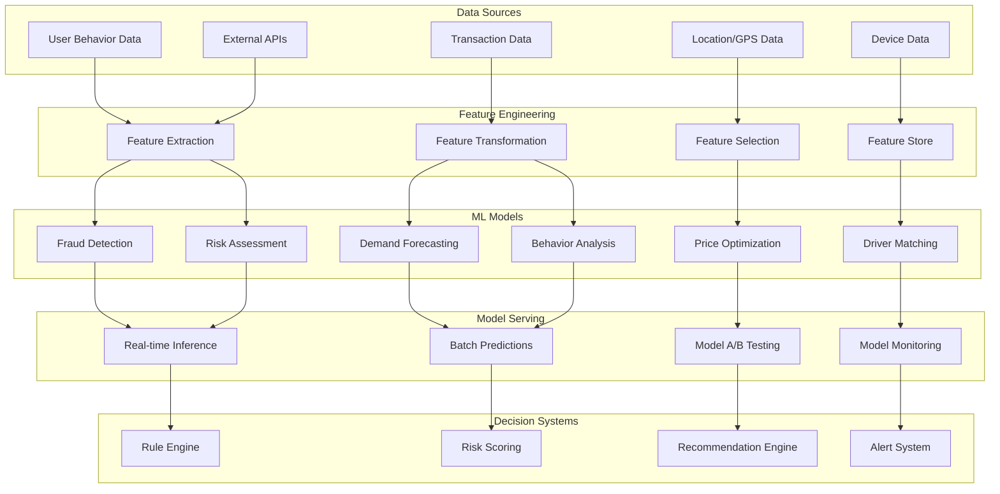

# Machine Learning Specification - Xpress Ops Tower

## Overview

The Xpress Ops Tower incorporates advanced machine learning capabilities to optimize ridesharing operations, detect fraud, predict demand, and enhance user experience. This document provides comprehensive specifications for all ML components, models, and pipelines in the system.

## Machine Learning Architecture

### ML System Overview



## 1. Fraud Detection ML System

### 1.1 Model Architecture

#### Ensemble Model Design
```python
class FraudDetectionEnsemble:
    """
    Multi-model ensemble for fraud detection combining:
    - XGBoost for structured features
    - Neural Network for behavioral patterns
    - Isolation Forest for anomaly detection
    - Graph Neural Network for relationship analysis
    """
    
    def __init__(self):
        self.xgb_model = XGBClassifier(
            n_estimators=500,
            max_depth=6,
            learning_rate=0.1,
            subsample=0.8,
            colsample_bytree=0.8,
            objective='binary:logistic',
            eval_metric='auc',
            random_state=42
        )
        
        self.nn_model = self._build_neural_network()
        self.isolation_forest = IsolationForest(
            n_estimators=200,
            contamination=0.1,
            random_state=42
        )
        self.gnn_model = GraphNeuralNetwork(
            hidden_dim=128,
            num_layers=3,
            dropout=0.2
        )
        
    def _build_neural_network(self):
        """Build neural network for behavioral pattern detection"""
        model = tf.keras.Sequential([
            tf.keras.layers.Dense(256, activation='relu', input_shape=(247,)),
            tf.keras.layers.Dropout(0.3),
            tf.keras.layers.Dense(128, activation='relu'),
            tf.keras.layers.Dropout(0.2),
            tf.keras.layers.Dense(64, activation='relu'),
            tf.keras.layers.Dropout(0.1),
            tf.keras.layers.Dense(1, activation='sigmoid')
        ])
        
        model.compile(
            optimizer=tf.keras.optimizers.Adam(learning_rate=0.001),
            loss='binary_crossentropy',
            metrics=['auc', 'precision', 'recall']
        )
        
        return model
    
    def predict_fraud_probability(self, features, user_graph=None):
        """Generate fraud probability using ensemble approach"""
        # XGBoost prediction
        xgb_prob = self.xgb_model.predict_proba(features)[:, 1]
        
        # Neural network prediction
        nn_prob = self.nn_model.predict(features).flatten()
        
        # Anomaly score from isolation forest
        anomaly_score = self.isolation_forest.decision_function(features)
        anomaly_prob = 1 / (1 + np.exp(-anomaly_score))  # Sigmoid transformation
        
        # Graph-based prediction if user graph is available
        gnn_prob = 0.5  # Default neutral score
        if user_graph is not None:
            gnn_prob = self.gnn_model.predict(user_graph, features)
        
        # Weighted ensemble
        ensemble_prob = (
            0.4 * xgb_prob +
            0.3 * nn_prob +
            0.2 * anomaly_prob +
            0.1 * gnn_prob
        )
        
        return ensemble_prob
```

### 1.2 Feature Engineering

#### Feature Categories and Specifications
```python
class FraudFeatureEngineer:
    """
    Comprehensive feature engineering for fraud detection
    Total features: 247 across multiple categories
    """
    
    def __init__(self):
        self.feature_groups = {
            'behavioral': 87,      # User behavior patterns
            'transactional': 94,   # Transaction characteristics
            'device': 43,          # Device fingerprinting
            'network': 23          # Social network features
        }
    
    def extract_behavioral_features(self, user_data, time_window='30d'):
        """Extract behavioral pattern features"""
        features = {}
        
        # Transaction velocity features
        features['tx_count_1h'] = self._count_transactions(user_data, '1h')
        features['tx_count_24h'] = self._count_transactions(user_data, '24h')
        features['tx_count_7d'] = self._count_transactions(user_data, '7d')
        features['tx_count_30d'] = self._count_transactions(user_data, '30d')
        
        # Amount patterns
        features['avg_tx_amount_7d'] = self._avg_amount(user_data, '7d')
        features['max_tx_amount_7d'] = self._max_amount(user_data, '7d')
        features['std_tx_amount_7d'] = self._std_amount(user_data, '7d')
        
        # Time-based patterns
        features['night_tx_ratio'] = self._night_transaction_ratio(user_data)
        features['weekend_tx_ratio'] = self._weekend_transaction_ratio(user_data)
        features['time_since_last_tx'] = self._time_since_last_transaction(user_data)
        
        # Geographic patterns
        features['unique_locations_7d'] = self._unique_locations(user_data, '7d')
        features['avg_distance_from_home'] = self._avg_distance_from_home(user_data)
        features['foreign_country_tx'] = self._foreign_transaction_flag(user_data)
        
        # Payment patterns
        features['payment_method_diversity'] = self._payment_method_count(user_data)
        features['failed_payment_ratio'] = self._failed_payment_ratio(user_data)
        
        return features
    
    def extract_device_features(self, device_data):
        """Extract device fingerprinting features"""
        features = {}
        
        # Browser/App characteristics
        features['user_agent_hash'] = hash(device_data.get('user_agent', ''))
        features['screen_resolution'] = device_data.get('screen_resolution', 0)
        features['timezone_offset'] = device_data.get('timezone_offset', 0)
        features['language'] = hash(device_data.get('language', ''))
        
        # Device consistency
        features['device_age_days'] = (datetime.now() - device_data.get('first_seen', datetime.now())).days
        features['device_consistency_score'] = self._calculate_device_consistency(device_data)
        
        # Network characteristics
        features['ip_reputation_score'] = self._get_ip_reputation(device_data.get('ip_address'))
        features['is_vpn'] = self._detect_vpn(device_data.get('ip_address'))
        features['is_tor'] = self._detect_tor(device_data.get('ip_address'))
        
        return features
    
    def extract_network_features(self, user_id, graph_data):
        """Extract social network graph features"""
        features = {}
        
        # Centrality measures
        features['degree_centrality'] = self._degree_centrality(user_id, graph_data)
        features['betweenness_centrality'] = self._betweenness_centrality(user_id, graph_data)
        features['closeness_centrality'] = self._closeness_centrality(user_id, graph_data)
        features['pagerank_score'] = self._pagerank_score(user_id, graph_data)
        
        # Community detection
        features['community_size'] = self._community_size(user_id, graph_data)
        features['community_fraud_ratio'] = self._community_fraud_ratio(user_id, graph_data)
        
        # Path analysis
        features['shortest_path_to_fraudster'] = self._shortest_path_to_known_fraudster(user_id, graph_data)
        
        return features
```

### 1.3 Model Training Pipeline

#### Training Configuration
```yaml
fraud_model_training:
  dataset:
    training_size: 2_500_000
    validation_size: 500_000
    test_size: 300_000
    positive_class_ratio: 0.03
    
  data_preprocessing:
    - handle_missing_values: median_imputation
    - scale_features: standard_scaler
    - encode_categories: target_encoding
    - handle_imbalance: smote_oversampling
    
  model_hyperparameters:
    xgboost:
      n_estimators: 500
      max_depth: 6
      learning_rate: 0.1
      subsample: 0.8
      colsample_bytree: 0.8
      reg_alpha: 0.1
      reg_lambda: 1.0
      
    neural_network:
      hidden_layers: [256, 128, 64]
      dropout_rates: [0.3, 0.2, 0.1]
      learning_rate: 0.001
      batch_size: 512
      epochs: 100
      early_stopping_patience: 10
      
  training_process:
    cross_validation: 5_fold_stratified
    optimization_metric: auc_roc
    early_stopping: true
    model_selection: best_validation_auc
    
  performance_targets:
    minimum_auc: 0.95
    maximum_false_positive_rate: 0.005
    minimum_recall: 0.80
    inference_latency_p95: 50ms
```

## 2. Demand Forecasting System

### 2.1 Time Series Forecasting Models

#### Multi-horizon Forecasting Architecture
```python
class DemandForecastingSystem:
    """
    Multi-horizon demand forecasting using ensemble of time series models
    """
    
    def __init__(self):
        self.prophet_model = Prophet(
            yearly_seasonality=True,
            weekly_seasonality=True,
            daily_seasonality=True,
            holidays=self._get_philippines_holidays(),
            seasonality_mode='multiplicative',
            changepoint_prior_scale=0.05
        )
        
        self.lstm_model = self._build_lstm_model()
        self.xgb_model = XGBRegressor(
            n_estimators=1000,
            max_depth=8,
            learning_rate=0.05,
            subsample=0.8,
            random_state=42
        )
        
    def _build_lstm_model(self):
        """Build LSTM model for sequential demand patterns"""
        model = tf.keras.Sequential([
            tf.keras.layers.LSTM(128, return_sequences=True, input_shape=(168, 15)),  # 1 week lookback
            tf.keras.layers.Dropout(0.2),
            tf.keras.layers.LSTM(64, return_sequences=False),
            tf.keras.layers.Dropout(0.2),
            tf.keras.layers.Dense(32, activation='relu'),
            tf.keras.layers.Dense(24, activation='linear')  # 24-hour forecast horizon
        ])
        
        model.compile(
            optimizer=tf.keras.optimizers.Adam(learning_rate=0.001),
            loss='mse',
            metrics=['mae', 'mape']
        )
        
        return model
    
    def generate_forecast(self, historical_data, horizon_hours=24):
        """Generate multi-model ensemble forecast"""
        # Prophet forecast
        prophet_forecast = self.prophet_model.predict(
            self._prepare_prophet_data(historical_data, horizon_hours)
        )
        
        # LSTM forecast
        lstm_features = self._prepare_lstm_features(historical_data)
        lstm_forecast = self.lstm_model.predict(lstm_features)
        
        # XGBoost forecast
        xgb_features = self._prepare_xgb_features(historical_data)
        xgb_forecast = self.xgb_model.predict(xgb_features)
        
        # Ensemble forecast with weighted average
        ensemble_forecast = (
            0.4 * prophet_forecast +
            0.35 * lstm_forecast +
            0.25 * xgb_forecast
        )
        
        return {
            'forecast': ensemble_forecast,
            'confidence_intervals': self._calculate_confidence_intervals(
                prophet_forecast, lstm_forecast, xgb_forecast
            ),
            'model_contributions': {
                'prophet': prophet_forecast,
                'lstm': lstm_forecast,
                'xgboost': xgb_forecast
            }
        }
```

### 2.2 External Data Integration

#### Weather and Event Integration
```python
class ExternalDataIntegrator:
    """
    Integrate external data sources for enhanced forecasting
    """
    
    def __init__(self):
        self.weather_api = PAGASAWeatherAPI()
        self.events_api = EventsAPI()
        self.traffic_api = MMDATrafficAPI()
        
    def enrich_forecast_features(self, base_features, forecast_date):
        """Add external data features for forecasting"""
        enriched_features = base_features.copy()
        
        # Weather data
        weather_data = self.weather_api.get_forecast(forecast_date)
        enriched_features.update({
            'temperature': weather_data['temperature'],
            'humidity': weather_data['humidity'],
            'precipitation_probability': weather_data['rain_probability'],
            'wind_speed': weather_data['wind_speed'],
            'weather_condition': self._encode_weather_condition(weather_data['condition'])
        })
        
        # Special events
        events = self.events_api.get_events(forecast_date)
        enriched_features.update({
            'has_concert': any(event['type'] == 'concert' for event in events),
            'has_sports_event': any(event['type'] == 'sports' for event in events),
            'has_festival': any(event['type'] == 'festival' for event in events),
            'event_capacity': sum(event.get('capacity', 0) for event in events),
            'major_event_distance': self._calculate_min_distance_to_events(events)
        })
        
        # Traffic conditions
        traffic_data = self.traffic_api.get_predictions(forecast_date)
        enriched_features.update({
            'predicted_traffic_index': traffic_data['traffic_index'],
            'road_closures_count': len(traffic_data['closures']),
            'average_travel_time_increase': traffic_data['delay_factor']
        })
        
        return enriched_features
```

## 3. Price Optimization ML

### 3.1 Dynamic Pricing Model

#### Multi-objective Optimization
```python
class DynamicPricingOptimizer:
    """
    ML-powered dynamic pricing optimization considering:
    - Demand elasticity
    - Supply availability
    - Competitor pricing
    - Regulatory constraints
    """
    
    def __init__(self):
        self.demand_elasticity_model = ElasticityModel()
        self.supply_prediction_model = SupplyPredictionModel()
        self.revenue_optimization_model = RevenueOptimizationModel()
        
    def optimize_pricing(self, current_conditions):
        """Optimize pricing based on current market conditions"""
        # Predict demand elasticity
        elasticity = self.demand_elasticity_model.predict(current_conditions)
        
        # Predict supply availability
        supply_forecast = self.supply_prediction_model.predict(current_conditions)
        
        # Optimize for multiple objectives
        optimization_result = self._multi_objective_optimization(
            elasticity, supply_forecast, current_conditions
        )
        
        return {
            'recommended_price': optimization_result['price'],
            'expected_demand': optimization_result['demand'],
            'expected_supply': supply_forecast,
            'revenue_impact': optimization_result['revenue_impact'],
            'confidence': optimization_result['confidence'],
            'regulatory_compliance': self._check_price_compliance(optimization_result['price'])
        }
    
    def _multi_objective_optimization(self, elasticity, supply, conditions):
        """Multi-objective optimization using genetic algorithm"""
        from scipy.optimize import differential_evolution
        
        def objective_function(price):
            # Objective 1: Maximize revenue
            demand = self._predict_demand(price, elasticity, conditions)
            revenue = price * demand
            
            # Objective 2: Minimize supply-demand mismatch
            supply_demand_ratio = supply / max(demand, 1)
            mismatch_penalty = abs(1 - supply_demand_ratio)
            
            # Objective 3: Market share considerations
            competitor_prices = self._get_competitor_prices(conditions)
            price_competitiveness = self._calculate_competitiveness(price, competitor_prices)
            
            # Combined objective (maximize)
            combined_objective = (
                0.6 * revenue -
                0.3 * mismatch_penalty * revenue +
                0.1 * price_competitiveness * revenue
            )
            
            return -combined_objective  # Minimize negative objective
        
        # Optimization bounds
        min_price = conditions['base_price'] * 0.8  # 20% below base
        max_price = conditions['regulatory_max_price']  # Regulatory limit
        
        result = differential_evolution(
            objective_function,
            bounds=[(min_price, max_price)],
            maxiter=100,
            popsize=15
        )
        
        optimal_price = result.x[0]
        optimal_demand = self._predict_demand(optimal_price, elasticity, conditions)
        
        return {
            'price': optimal_price,
            'demand': optimal_demand,
            'revenue_impact': -result.fun,
            'confidence': self._calculate_optimization_confidence(result)
        }
```

### 3.2 Surge Pricing ML

#### Real-time Surge Detection
```python
class SurgePricingModel:
    """
    Real-time surge pricing based on supply-demand imbalance prediction
    """
    
    def __init__(self):
        self.imbalance_predictor = SupplyDemandImbalancePredictor()
        self.surge_multiplier_model = SurgeMultiplierModel()
        
    def calculate_surge_multiplier(self, region_data, time_context):
        """Calculate optimal surge multiplier"""
        # Predict supply-demand imbalance
        imbalance_prediction = self.imbalance_predictor.predict(region_data, time_context)
        
        # Calculate base surge multiplier
        base_multiplier = self._calculate_base_multiplier(imbalance_prediction)
        
        # Apply ML-based adjustments
        ml_adjustment = self.surge_multiplier_model.predict({
            'imbalance_score': imbalance_prediction['imbalance_score'],
            'historical_response': region_data['historical_surge_response'],
            'competitor_surge': region_data['competitor_surge_levels'],
            'time_of_day': time_context['hour'],
            'day_of_week': time_context['day_of_week'],
            'weather_conditions': region_data['weather'],
            'special_events': region_data['events']
        })
        
        final_multiplier = base_multiplier * ml_adjustment
        
        # Apply regulatory and business constraints
        final_multiplier = self._apply_constraints(final_multiplier, region_data)
        
        return {
            'surge_multiplier': final_multiplier,
            'imbalance_prediction': imbalance_prediction,
            'ml_adjustment': ml_adjustment,
            'confidence': imbalance_prediction['confidence'],
            'duration_estimate': self._estimate_surge_duration(imbalance_prediction)
        }
```

## 4. Driver-Passenger Matching ML

### 4.1 Intelligent Matching Algorithm

#### Multi-criteria Matching
```python
class IntelligentMatchingSystem:
    """
    ML-powered driver-passenger matching considering multiple criteria:
    - Distance and ETA
    - Driver ratings and preferences
    - Passenger preferences and history
    - Route efficiency
    - Driver earnings optimization
    """
    
    def __init__(self):
        self.eta_predictor = ETAPredictionModel()
        self.preference_model = UserPreferenceModel()
        self.satisfaction_predictor = TripSatisfactionModel()
        
    def find_optimal_matches(self, trip_request, available_drivers):
        """Find optimal driver matches using ML-based scoring"""
        match_scores = []
        
        for driver in available_drivers:
            # Calculate base matching score
            base_score = self._calculate_base_score(trip_request, driver)
            
            # ML-enhanced scoring
            ml_features = self._extract_matching_features(trip_request, driver)
            ml_score = self.satisfaction_predictor.predict(ml_features)
            
            # Combined score
            combined_score = 0.6 * base_score + 0.4 * ml_score
            
            match_scores.append({
                'driver_id': driver['id'],
                'score': combined_score,
                'eta': self.eta_predictor.predict(driver['location'], trip_request['pickup']),
                'predicted_satisfaction': ml_score,
                'estimated_earnings': self._estimate_driver_earnings(trip_request, driver)
            })
        
        # Sort by score and return top matches
        match_scores.sort(key=lambda x: x['score'], reverse=True)
        return match_scores[:5]  # Top 5 matches
    
    def _extract_matching_features(self, trip_request, driver):
        """Extract features for ML-based matching"""
        features = {
            # Distance and time features
            'pickup_distance': self._calculate_distance(driver['location'], trip_request['pickup']),
            'estimated_trip_distance': trip_request['estimated_distance'],
            'estimated_trip_duration': trip_request['estimated_duration'],
            
            # Driver features
            'driver_rating': driver['rating'],
            'driver_acceptance_rate': driver['acceptance_rate'],
            'driver_completion_rate': driver['completion_rate'],
            'driver_total_trips': driver['total_trips'],
            'driver_experience_days': (datetime.now() - driver['signup_date']).days,
            
            # Passenger features
            'passenger_rating': trip_request['passenger']['rating'],
            'passenger_total_trips': trip_request['passenger']['total_trips'],
            
            # Preference alignment
            'music_preference_match': self._check_music_preference_match(trip_request, driver),
            'language_match': self._check_language_match(trip_request, driver),
            'vehicle_type_match': trip_request['vehicle_type'] == driver['vehicle_type'],
            
            # Contextual features
            'time_of_day': datetime.now().hour,
            'day_of_week': datetime.now().weekday(),
            'weather_conditions': self._get_weather_conditions(),
            'traffic_conditions': self._get_traffic_conditions(trip_request['pickup'])
        }
        
        return features
```

## 5. Behavior Analysis ML

### 5.1 User Behavior Modeling

#### Behavioral Pattern Recognition
```python
class UserBehaviorAnalyzer:
    """
    Analyze user behavior patterns for personalization and risk assessment
    """
    
    def __init__(self):
        self.clustering_model = BehavioralClustering()
        self.anomaly_detector = BehavioralAnomalyDetector()
        self.preference_extractor = PreferenceExtractor()
        
    def analyze_user_behavior(self, user_id, behavior_history):
        """Comprehensive behavioral analysis"""
        # Extract behavioral features
        behavioral_features = self._extract_behavioral_features(behavior_history)
        
        # Cluster user into behavioral segment
        user_segment = self.clustering_model.predict(behavioral_features)
        
        # Detect anomalous behavior
        anomaly_score = self.anomaly_detector.predict(behavioral_features)
        
        # Extract preferences
        preferences = self.preference_extractor.extract(behavior_history)
        
        return {
            'user_segment': user_segment,
            'segment_characteristics': self._get_segment_characteristics(user_segment),
            'anomaly_score': anomaly_score,
            'risk_level': self._calculate_risk_level(anomaly_score),
            'preferences': preferences,
            'behavior_trends': self._calculate_behavior_trends(behavior_history),
            'personalization_features': self._extract_personalization_features(behavioral_features)
        }
    
    def _extract_behavioral_features(self, behavior_history):
        """Extract comprehensive behavioral features"""
        features = {}
        
        # Trip patterns
        features['avg_trips_per_week'] = self._calculate_weekly_trip_average(behavior_history)
        features['preferred_trip_times'] = self._extract_time_preferences(behavior_history)
        features['trip_distance_distribution'] = self._analyze_distance_patterns(behavior_history)
        
        # Payment behavior
        features['payment_method_consistency'] = self._calculate_payment_consistency(behavior_history)
        features['tip_behavior'] = self._analyze_tipping_patterns(behavior_history)
        
        # Interaction patterns
        features['driver_interaction_score'] = self._calculate_interaction_score(behavior_history)
        features['complaint_frequency'] = self._calculate_complaint_frequency(behavior_history)
        
        # Location patterns
        features['home_work_consistency'] = self._calculate_location_consistency(behavior_history)
        features['exploration_tendency'] = self._calculate_exploration_score(behavior_history)
        
        return features
```

## 6. Model Monitoring and Management

### 6.1 Model Performance Monitoring

#### Continuous Monitoring System
```python
class MLModelMonitoringSystem:
    """
    Comprehensive ML model monitoring and drift detection
    """
    
    def __init__(self):
        self.drift_detector = ModelDriftDetector()
        self.performance_monitor = ModelPerformanceMonitor()
        self.data_quality_monitor = DataQualityMonitor()
        
    def monitor_model_health(self, model_name, predictions, actuals, features):
        """Comprehensive model health monitoring"""
        monitoring_results = {}
        
        # Performance monitoring
        performance_metrics = self.performance_monitor.calculate_metrics(
            predictions, actuals, model_name
        )
        monitoring_results['performance'] = performance_metrics
        
        # Drift detection
        drift_results = self.drift_detector.detect_drift(features, model_name)
        monitoring_results['drift'] = drift_results
        
        # Data quality monitoring
        quality_results = self.data_quality_monitor.assess_quality(features)
        monitoring_results['data_quality'] = quality_results
        
        # Overall health score
        health_score = self._calculate_overall_health_score(
            performance_metrics, drift_results, quality_results
        )
        monitoring_results['health_score'] = health_score
        
        # Generate alerts if necessary
        alerts = self._generate_alerts(monitoring_results)
        monitoring_results['alerts'] = alerts
        
        return monitoring_results
    
    def _calculate_overall_health_score(self, performance, drift, quality):
        """Calculate overall model health score (0-100)"""
        # Weighted combination of different health aspects
        performance_score = performance['score']
        drift_score = max(0, 100 - drift['max_drift_score'] * 100)
        quality_score = quality['overall_score']
        
        overall_score = (
            0.5 * performance_score +
            0.3 * drift_score +
            0.2 * quality_score
        )
        
        return min(100, max(0, overall_score))
```

### 6.2 Model Retraining Pipeline

#### Automated Retraining System
```python
class AutomatedRetrainingPipeline:
    """
    Automated ML model retraining pipeline with approval workflow
    """
    
    def __init__(self):
        self.model_registry = ModelRegistry()
        self.data_pipeline = DataPipeline()
        self.training_pipeline = TrainingPipeline()
        self.validation_pipeline = ValidationPipeline()
        
    def trigger_retraining(self, model_name, trigger_reason):
        """Trigger automated model retraining"""
        try:
            # Log retraining trigger
            self._log_retraining_event(model_name, trigger_reason)
            
            # Prepare training data
            training_data = self.data_pipeline.prepare_training_data(
                model_name, 
                lookback_days=90
            )
            
            # Validate data quality
            data_quality = self._validate_training_data(training_data)
            if data_quality['score'] < 0.8:
                raise DataQualityException("Training data quality insufficient")
            
            # Train new model version
            new_model = self.training_pipeline.train_model(
                model_name, 
                training_data
            )
            
            # Validate new model
            validation_results = self.validation_pipeline.validate_model(
                new_model, 
                model_name
            )
            
            if validation_results['performance_improvement'] > 0.02:  # 2% improvement threshold
                # Register new model version
                model_version = self.model_registry.register_model(
                    new_model, 
                    model_name,
                    validation_results
                )
                
                # Queue for approval if performance improvement is significant
                if validation_results['performance_improvement'] > 0.05:  # 5% improvement
                    self._queue_for_human_approval(model_version, validation_results)
                else:
                    # Auto-deploy if improvement is modest but consistent
                    self._schedule_gradual_deployment(model_version)
                
                return {
                    'status': 'success',
                    'model_version': model_version,
                    'performance_improvement': validation_results['performance_improvement'],
                    'deployment_status': 'pending_approval' if validation_results['performance_improvement'] > 0.05 else 'scheduled'
                }
            else:
                return {
                    'status': 'no_improvement',
                    'performance_change': validation_results['performance_improvement']
                }
                
        except Exception as e:
            self._handle_retraining_failure(model_name, str(e))
            return {
                'status': 'failed',
                'error': str(e)
            }
```

## 7. A/B Testing Framework

### 7.1 ML Model A/B Testing

#### Experimental Design for ML Models
```python
class MLABTestingFramework:
    """
    A/B testing framework specifically designed for ML models
    """
    
    def __init__(self):
        self.experiment_manager = ExperimentManager()
        self.traffic_splitter = TrafficSplitter()
        self.metrics_collector = MetricsCollector()
        self.statistical_analyzer = StatisticalAnalyzer()
        
    def create_model_experiment(self, experiment_config):
        """Create A/B test experiment for ML models"""
        experiment = {
            'id': self._generate_experiment_id(),
            'name': experiment_config['name'],
            'model_a': experiment_config['control_model'],
            'model_b': experiment_config['treatment_model'],
            'traffic_split': experiment_config.get('traffic_split', 0.5),
            'success_metrics': experiment_config['success_metrics'],
            'guardrail_metrics': experiment_config['guardrail_metrics'],
            'duration_days': experiment_config.get('duration_days', 14),
            'minimum_sample_size': experiment_config.get('minimum_sample_size', 10000),
            'significance_threshold': experiment_config.get('significance_threshold', 0.05),
            'status': 'active'
        }
        
        # Set up traffic splitting
        self.traffic_splitter.configure_split(
            experiment['id'],
            experiment['traffic_split']
        )
        
        # Configure metrics collection
        self.metrics_collector.setup_experiment_tracking(experiment)
        
        return self.experiment_manager.create_experiment(experiment)
    
    def analyze_experiment_results(self, experiment_id):
        """Analyze A/B test results with statistical significance"""
        experiment = self.experiment_manager.get_experiment(experiment_id)
        metrics_data = self.metrics_collector.get_experiment_data(experiment_id)
        
        analysis_results = {}
        
        for metric in experiment['success_metrics']:
            # Perform statistical test
            test_result = self.statistical_analyzer.perform_statistical_test(
                metrics_data['control'][metric],
                metrics_data['treatment'][metric],
                test_type='welch_ttest'
            )
            
            analysis_results[metric] = {
                'control_mean': test_result['control_mean'],
                'treatment_mean': test_result['treatment_mean'],
                'relative_improvement': test_result['relative_improvement'],
                'p_value': test_result['p_value'],
                'confidence_interval': test_result['confidence_interval'],
                'is_significant': test_result['p_value'] < experiment['significance_threshold'],
                'statistical_power': test_result['statistical_power']
            }
        
        # Check guardrail metrics
        guardrail_violations = self._check_guardrail_metrics(
            experiment, metrics_data
        )
        
        # Generate recommendation
        recommendation = self._generate_experiment_recommendation(
            analysis_results, guardrail_violations
        )
        
        return {
            'experiment_id': experiment_id,
            'analysis_results': analysis_results,
            'guardrail_violations': guardrail_violations,
            'recommendation': recommendation,
            'statistical_significance': any(
                result['is_significant'] for result in analysis_results.values()
            )
        }
```

## 8. Philippines-Specific ML Considerations

### 8.1 Local Data Patterns

#### Philippines-Specific Feature Engineering
```python
class PhilippinesMLFeatures:
    """
    Philippines-specific ML features and considerations
    """
    
    def __init__(self):
        self.ph_holidays = self._load_ph_holidays()
        self.regional_characteristics = self._load_regional_data()
        self.cultural_events = self._load_cultural_events()
        
    def extract_philippines_features(self, base_features, location, timestamp):
        """Extract Philippines-specific features"""
        ph_features = base_features.copy()
        
        # Holiday and cultural event features
        ph_features['is_ph_holiday'] = self._is_philippine_holiday(timestamp)
        ph_features['days_to_holiday'] = self._days_to_next_holiday(timestamp)
        ph_features['is_fiesta_season'] = self._is_fiesta_season(location, timestamp)
        
        # Weather-related features (tropical climate)
        ph_features['is_rainy_season'] = self._is_rainy_season(timestamp)
        ph_features['typhoon_risk'] = self._get_typhoon_risk(location, timestamp)
        
        # Regional characteristics
        ph_features['region_economic_level'] = self._get_economic_level(location)
        ph_features['traffic_congestion_index'] = self._get_traffic_index(location, timestamp)
        ph_features['jeepney_competition_level'] = self._get_jeepney_density(location)
        
        # Cultural patterns
        ph_features['is_weekend_extended'] = self._is_extended_weekend(timestamp)  # Bridge holidays
        ph_features['mall_proximity_score'] = self._calculate_mall_proximity(location)
        ph_features['church_proximity_score'] = self._calculate_church_proximity(location)
        
        # Language and communication patterns
        ph_features['preferred_language'] = self._infer_language_preference(location)
        
        return ph_features
    
    def adjust_model_for_ph_market(self, base_model, model_type):
        """Adjust ML models for Philippines market characteristics"""
        adjustments = {}
        
        if model_type == 'demand_forecasting':
            # Adjust for Philippine holiday patterns
            adjustments['holiday_weight'] = 1.5  # Holidays have stronger impact
            adjustments['weather_weight'] = 2.0   # Weather more critical in tropics
            adjustments['traffic_weight'] = 1.8   # Heavy traffic patterns
            
        elif model_type == 'pricing':
            # Price sensitivity adjustments
            adjustments['price_elasticity'] = 1.2  # Higher price sensitivity
            adjustments['competitor_weight'] = 1.5  # Strong jeepney/tricycle competition
            
        elif model_type == 'fraud_detection':
            # Fraud patterns specific to Philippines
            adjustments['remittance_pattern_weight'] = 1.3  # OFW remittance patterns
            adjustments['cash_preference_weight'] = 1.4     # Higher cash usage
            
        return self._apply_model_adjustments(base_model, adjustments)
```

### 8.2 Regulatory Compliance in ML

#### Compliance-aware ML Pipeline
```python
class ComplianceAwareMLPipeline:
    """
    ML pipeline with built-in regulatory compliance for Philippines market
    """
    
    def __init__(self):
        self.ltfrb_validator = LTFRBComplianceValidator()
        self.dpa_validator = DataPrivacyActValidator()
        self.bsp_validator = BSPComplianceValidator()
        
    def validate_ml_compliance(self, model, model_type, predictions):
        """Validate ML model compliance with Philippine regulations"""
        compliance_results = {
            'ltfrb_compliance': True,
            'dpa_compliance': True,
            'bsp_compliance': True,
            'violations': [],
            'recommendations': []
        }
        
        # LTFRB compliance (transportation regulations)
        if model_type in ['pricing', 'surge_pricing']:
            ltfrb_result = self.ltfrb_validator.validate_pricing_model(model, predictions)
            compliance_results['ltfrb_compliance'] = ltfrb_result['compliant']
            if not ltfrb_result['compliant']:
                compliance_results['violations'].extend(ltfrb_result['violations'])
                compliance_results['recommendations'].extend(ltfrb_result['recommendations'])
        
        # Data Privacy Act compliance
        dpa_result = self.dpa_validator.validate_data_usage(model)
        compliance_results['dpa_compliance'] = dpa_result['compliant']
        if not dpa_result['compliant']:
            compliance_results['violations'].extend(dpa_result['violations'])
            compliance_results['recommendations'].extend(dpa_result['recommendations'])
        
        # BSP compliance (financial services)
        if model_type in ['fraud_detection', 'payment_risk']:
            bsp_result = self.bsp_validator.validate_financial_ml(model, predictions)
            compliance_results['bsp_compliance'] = bsp_result['compliant']
            if not bsp_result['compliant']:
                compliance_results['violations'].extend(bsp_result['violations'])
                compliance_results['recommendations'].extend(bsp_result['recommendations'])
        
        # Overall compliance status
        compliance_results['overall_compliant'] = all([
            compliance_results['ltfrb_compliance'],
            compliance_results['dpa_compliance'],
            compliance_results['bsp_compliance']
        ])
        
        return compliance_results
```

## 9. Model Deployment and Serving

### 9.1 Real-time Model Serving

#### High-performance Model Serving Architecture
```yaml
model_serving_config:
  infrastructure:
    serving_framework: TensorFlow Serving + FastAPI
    container_orchestration: Kubernetes
    load_balancer: Istio Service Mesh
    caching: Redis
    monitoring: Prometheus + Grafana
    
  performance_requirements:
    latency_p95: 50ms
    throughput: 10000_requests_per_second
    availability: 99.99%
    auto_scaling: enabled
    
  model_management:
    model_registry: MLflow
    version_control: semantic_versioning
    deployment_strategy: blue_green
    rollback_capability: automatic
    
  resource_allocation:
    cpu_request: 2_cores
    memory_request: 4GB
    gpu_support: enabled
    storage: 10GB_ssd
    
  security:
    authentication: JWT_tokens
    authorization: RBAC
    encryption: TLS_1.3
    audit_logging: enabled
```

### 9.2 Model Versioning and Registry

#### ML Model Registry Implementation
```python
class MLModelRegistry:
    """
    Centralized model registry for version control and deployment
    """
    
    def __init__(self):
        self.registry_backend = MLflowModelRegistry()
        self.metadata_store = ModelMetadataStore()
        self.artifact_store = ModelArtifactStore()
        
    def register_model(self, model, model_name, metadata):
        """Register new model version"""
        # Generate model version
        version = self._generate_version_number(model_name)
        
        # Store model artifacts
        artifact_uri = self.artifact_store.store_model(model, model_name, version)
        
        # Store metadata
        model_metadata = {
            'model_name': model_name,
            'version': version,
            'created_at': datetime.utcnow(),
            'model_type': metadata['model_type'],
            'framework': metadata['framework'],
            'performance_metrics': metadata['performance_metrics'],
            'training_data_version': metadata['training_data_version'],
            'hyperparameters': metadata['hyperparameters'],
            'feature_schema': metadata['feature_schema'],
            'artifact_uri': artifact_uri,
            'status': 'registered'
        }
        
        # Register in MLflow
        model_version = self.registry_backend.create_model_version(
            model_name, artifact_uri, model_metadata
        )
        
        # Store in metadata store
        self.metadata_store.store_metadata(model_name, version, model_metadata)
        
        return {
            'model_name': model_name,
            'version': version,
            'model_version': model_version,
            'artifact_uri': artifact_uri
        }
    
    def promote_model_to_production(self, model_name, version):
        """Promote model version to production"""
        # Validate model readiness
        validation_result = self._validate_production_readiness(model_name, version)
        
        if not validation_result['ready']:
            raise ModelNotReadyException(validation_result['reasons'])
        
        # Update model stage
        self.registry_backend.transition_model_version_stage(
            model_name, version, "Production"
        )
        
        # Update metadata
        self.metadata_store.update_status(model_name, version, "production")
        
        # Trigger deployment
        self._trigger_deployment(model_name, version)
        
        return {
            'status': 'promoted',
            'model_name': model_name,
            'version': version,
            'production_uri': self._get_production_endpoint(model_name)
        }
```

---

**Document Version**: 1.0  
**Last Updated**: 2025-09-02  
**Next Review**: 2025-12-02  
**Owner**: Data Science & ML Engineering Team  
**Classification**: Internal Use Only