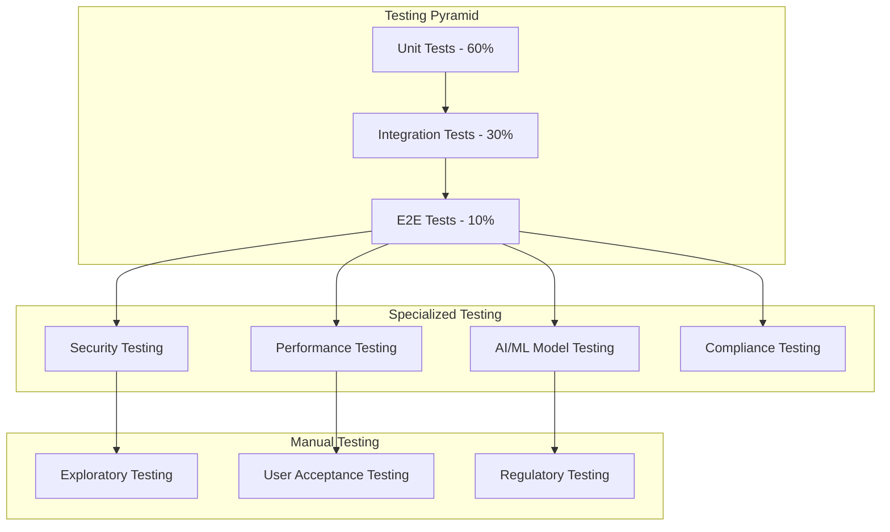

# Testing Strategy - Xpress Ops Tower

## Overview

This document outlines the comprehensive testing strategy for the Xpress Ops Tower platform, ensuring high quality, reliability, and security for the Philippines ridesharing market. The strategy covers all testing levels from unit tests to end-to-end validation, including specialized testing for AI/ML components and compliance requirements.

## Testing Philosophy

### Core Principles

```yaml
testing_philosophy:
  principles:
    - quality_first: Every feature must meet quality standards before release
    - shift_left: Testing starts in development phase
    - continuous_testing: Automated testing in CI/CD pipeline
    - risk_based_testing: Focus on high-risk, high-impact areas
    - user_centric: Testing from user perspective
    - compliance_driven: Philippines regulatory compliance validation
    
  quality_gates:
    - code_coverage: >80% for critical components
    - performance_requirements: All SLAs must be met
    - security_standards: No critical vulnerabilities
    - accessibility_compliance: WCAG 2.1 AA standards
    - cross_platform_compatibility: iOS, Android, Web
```

## Testing Pyramid Strategy

### Test Pyramid Architecture



## 1. Unit Testing Strategy

### 1.1 Unit Testing Framework

#### Technology Stack
```yaml
unit_testing:
  frameworks:
    javascript_typescript:
      framework: Jest
      assertion_library: Jest + Testing Library
      mocking: Jest mocks + MSW
      coverage_tool: Jest coverage
      
    python:
      framework: pytest
      assertion_library: pytest
      mocking: pytest-mock + responses
      coverage_tool: coverage.py
      
    go:
      framework: go test + testify
      assertion_library: testify/assert
      mocking: testify/mock
      coverage_tool: go tool cover
      
  standards:
    naming_convention: test_should_return_expected_when_condition
    test_structure: arrange_act_assert
    mock_strategy: minimal_mocking_with_clear_boundaries
    test_data: factory_pattern_for_test_data
```

#### Unit Test Implementation Example
```typescript
// Example: Trip Service Unit Tests
describe('TripService', () => {
  let tripService: TripService;
  let mockRepository: jest.Mocked<TripRepository>;
  let mockFraudService: jest.Mocked<FraudDetectionService>;
  let mockPricingService: jest.Mocked<PricingService>;

  beforeEach(() => {
    mockRepository = createMockTripRepository();
    mockFraudService = createMockFraudService();
    mockPricingService = createMockPricingService();
    
    tripService = new TripService(
      mockRepository,
      mockFraudService,
      mockPricingService
    );
  });

  describe('createTripRequest', () => {
    it('should_create_trip_when_valid_request_provided', async () => {
      // Arrange
      const tripRequest = TripRequestFactory.create({
        passengerId: 'passenger-123',
        pickup: PhilippineLocationFactory.manila(),
        destination: PhilippineLocationFactory.makati()
      });
      
      mockFraudService.analyzeTripRequest.mockResolvedValue({
        riskScore: 0.1,
        approved: true
      });
      
      mockPricingService.calculateFare.mockResolvedValue({
        totalFare: 150.00,
        currency: 'PHP'
      });

      // Act
      const result = await tripService.createTripRequest(tripRequest);

      // Assert
      expect(result.status).toBe('requested');
      expect(result.estimatedFare).toBe(150.00);
      expect(mockFraudService.analyzeTripRequest).toHaveBeenCalledWith(tripRequest);
      expect(mockRepository.save).toHaveBeenCalledWith(
        expect.objectContaining({
          passengerId: 'passenger-123',
          status: 'requested'
        })
      );
    });

    it('should_reject_trip_when_fraud_risk_high', async () => {
      // Arrange
      const tripRequest = TripRequestFactory.create();
      
      mockFraudService.analyzeTripRequest.mockResolvedValue({
        riskScore: 0.9,
        approved: false,
        reason: 'High fraud risk detected'
      });

      // Act & Assert
      await expect(tripService.createTripRequest(tripRequest))
        .rejects.toThrow('Trip request rejected due to fraud risk');
      
      expect(mockRepository.save).not.toHaveBeenCalled();
    });
  });

  describe('Philippines-specific tests', () => {
    it('should_handle_barangay_addresses_correctly', async () => {
      // Arrange
      const tripRequest = TripRequestFactory.create({
        pickup: {
          address: 'Barangay Magallanes, Makati City',
          coordinates: { lat: 14.5547, lng: 121.0244 }
        }
      });

      // Act
      const result = await tripService.createTripRequest(tripRequest);

      // Assert
      expect(result.pickup.barangay).toBe('Magallanes');
      expect(result.pickup.city).toBe('Makati');
    });
    
    it('should_apply_ltfrb_compliance_checks', async () => {
      // Arrange
      const tripRequest = TripRequestFactory.create({
        vehicleType: 'tnvs' // Transport Network Vehicle Service
      });

      // Act
      await tripService.createTripRequest(tripRequest);

      // Assert
      expect(mockRepository.save).toHaveBeenCalledWith(
        expect.objectContaining({
          complianceChecks: expect.objectContaining({
            ltfrbCompliant: true
          })
        })
      );
    });
  });
});
```

### 1.2 Code Coverage Requirements

#### Coverage Standards
```yaml
coverage_requirements:
  minimum_coverage:
    critical_components: 90%
    business_logic: 85%
    utility_functions: 80%
    integration_layers: 70%
    
  coverage_exclusions:
    - configuration_files
    - test_utilities
    - auto_generated_code
    - third_party_adapters
    
  coverage_reporting:
    format: lcov + html
    integration: sonarqube
    threshold_enforcement: ci_pipeline_failure
    trend_analysis: weekly_reports
```

## 2. Integration Testing

### 2.1 API Integration Testing

#### Test Configuration
```yaml
integration_testing:
  test_environment:
    database: postgresql_testcontainer
    cache: redis_testcontainer
    message_queue: kafka_testcontainer
    external_apis: wiremock_stubs
    
  test_data_management:
    strategy: isolated_test_databases
    cleanup: automatic_rollback
    seed_data: factory_generated
    
  philippines_specific_testing:
    ltfrb_api_simulation: enabled
    gcash_payment_simulation: enabled
    philippine_maps_simulation: enabled
    local_compliance_validation: enabled
```

#### Integration Test Example
```typescript
// API Integration Test
describe('Trip API Integration', () => {
  let app: TestApplication;
  let testDb: TestDatabase;
  let mockExternalAPIs: MockExternalAPIs;

  beforeAll(async () => {
    app = await TestApplication.create();
    testDb = await TestDatabase.setup();
    mockExternalAPIs = await MockExternalAPIs.setup({
      ltfrb: true,
      gcash: true,
      googleMaps: true
    });
  });

  beforeEach(async () => {
    await testDb.clean();
    await testDb.seedTestData();
  });

  describe('POST /api/trips', () => {
    it('should_create_trip_with_full_integration_flow', async () => {
      // Arrange
      const passenger = await testDb.createPassenger({
        location: 'Manila, Philippines',
        paymentMethod: 'gcash'
      });
      
      const tripRequest = {
        pickup: {
          address: 'SM Mall of Asia, Pasay City',
          coordinates: { lat: 14.5355, lng: 120.9823 }
        },
        destination: {
          address: 'Ninoy Aquino International Airport',
          coordinates: { lat: 14.5086, lng: 121.0198 }
        }
      };

      // Mock external API responses
      mockExternalAPIs.googleMaps.mockRoute({
        duration: 1800, // 30 minutes
        distance: 25000 // 25 km
      });
      
      mockExternalAPIs.gcash.mockPaymentValidation({
        accountValid: true,
        sufficientFunds: true
      });

      // Act
      const response = await app.request()
        .post('/api/trips')
        .set('Authorization', `Bearer ${passenger.token}`)
        .send(tripRequest);

      // Assert
      expect(response.status).toBe(201);
      expect(response.body.trip).toMatchObject({
        status: 'requested',
        pickup: expect.objectContaining({
          barangay: expect.any(String),
          city: 'Pasay'
        }),
        estimatedFare: expect.any(Number),
        currency: 'PHP'
      });

      // Verify database state
      const tripInDb = await testDb.trips.findById(response.body.trip.id);
      expect(tripInDb).toBeDefined();
      expect(tripInDb.fraudAnalysis.riskScore).toBeLessThan(0.5);
    });

    it('should_handle_philippines_compliance_requirements', async () => {
      // Arrange
      const driver = await testDb.createDriver({
        licenseType: 'professional',
        ltfrbCompliant: true,
        vehicleType: 'sedan'
      });

      const tripRequest = TripRequestFactory.manila();

      // Act
      const response = await app.request()
        .post('/api/trips')
        .send(tripRequest);

      // Assert
      expect(response.status).toBe(201);
      expect(response.body.trip.complianceChecks).toMatchObject({
        ltfrbValidation: true,
        ltoRegistration: true,
        insuranceValid: true,
        franchiseActive: true
      });
    });
  });

  describe('Real-time Integration', () => {
    it('should_handle_websocket_trip_updates', async (done) => {
      // Arrange
      const trip = await testDb.createActiveTrip();
      const passenger = await testDb.getPassenger(trip.passengerId);
      
      const wsClient = new WebSocketTestClient();
      await wsClient.connect(`ws://localhost:${app.port}/trips/${trip.id}`);

      // Act
      await app.request()
        .patch(`/api/trips/${trip.id}/location`)
        .send({
          driverLocation: { lat: 14.5500, lng: 121.0300 },
          estimatedArrival: 10
        });

      // Assert
      wsClient.onMessage((message) => {
        expect(message.type).toBe('location_update');
        expect(message.data.estimatedArrival).toBe(10);
        done();
      });
    });
  });
});
```

### 2.2 Database Integration Testing

#### Database Test Strategy
```yaml
database_testing:
  approach: testcontainers
  database_type: postgresql_14
  
  migration_testing:
    strategy: test_migrations_forward_and_backward
    data_preservation: verify_data_integrity
    performance_impact: measure_migration_time
    
  transaction_testing:
    concurrency: test_concurrent_operations
    isolation_levels: verify_acid_properties
    deadlock_scenarios: test_deadlock_handling
    
  philippines_data_testing:
    address_normalization: barangay_city_province_validation
    phone_number_formatting: plus63_format_validation
    currency_handling: php_decimal_precision
    timezone_handling: asia_manila_timezone
```

## 3. End-to-End Testing

### 3.1 E2E Testing Framework

#### Test Architecture
```yaml
e2e_testing:
  frameworks:
    web: playwright
    mobile: detox_appium
    api: supertest
    
  test_environments:
    staging: full_feature_testing
    production_like: smoke_testing
    
  browsers:
    - chrome_latest
    - firefox_latest
    - safari_latest
    - edge_latest
    
  mobile_platforms:
    - ios_15_plus
    - android_10_plus
    
  philippine_specific_testing:
    network_conditions: 3g_4g_simulation
    device_types: budget_premium_devices
    language_testing: english_tagalog_cebuano
```

#### E2E Test Implementation
```typescript
// End-to-End Test Example
describe('Complete Trip Journey - E2E', () => {
  let passengerPage: Page;
  let driverPage: Page;
  let adminPage: Page;

  beforeEach(async () => {
    // Setup multiple browser contexts for different user types
    passengerPage = await createPassengerSession({
      location: 'Manila, Philippines',
      paymentMethod: 'GCash'
    });
    
    driverPage = await createDriverSession({
      location: 'Manila, Philippines',
      vehicleType: 'sedan',
      ltfrbCompliant: true
    });
    
    adminPage = await createAdminSession();
  });

  it('should_complete_full_trip_lifecycle_successfully', async () => {
    // Step 1: Passenger requests trip
    await passengerPage.goto('/book-trip');
    await passengerPage.fill('[data-testid="pickup-input"]', 'SM Mall of Asia');
    await passengerPage.fill('[data-testid="destination-input"]', 'NAIA Terminal 3');
    await passengerPage.click('[data-testid="book-trip-button"]');

    // Verify trip request created
    await expect(passengerPage.locator('[data-testid="trip-status"]'))
      .toHaveText('Finding driver...');

    // Step 2: Driver receives and accepts trip
    await expect(driverPage.locator('[data-testid="trip-request"]'))
      .toBeVisible({ timeout: 10000 });
    
    await driverPage.click('[data-testid="accept-trip-button"]');

    // Step 3: Verify passenger sees driver details
    await expect(passengerPage.locator('[data-testid="driver-name"]'))
      .toBeVisible();
    await expect(passengerPage.locator('[data-testid="vehicle-details"]'))
      .toBeVisible();

    // Step 4: Driver navigates to pickup
    await driverPage.click('[data-testid="start-navigation"]');
    await simulateDriverMovement(driverPage, {
      from: { lat: 14.5000, lng: 121.0000 },
      to: { lat: 14.5355, lng: 120.9823 }, // SM Mall of Asia
      duration: 300000 // 5 minutes
    });

    // Step 5: Driver arrives at pickup
    await driverPage.click('[data-testid="arrived-button"]');
    
    await expect(passengerPage.locator('[data-testid="trip-status"]'))
      .toHaveText('Driver has arrived');

    // Step 6: Trip starts
    await driverPage.click('[data-testid="start-trip-button"]');
    
    await expect(passengerPage.locator('[data-testid="trip-status"]'))
      .toHaveText('Trip in progress');

    // Step 7: Navigate to destination
    await simulateDriverMovement(driverPage, {
      from: { lat: 14.5355, lng: 120.9823 }, // SM Mall of Asia
      to: { lat: 14.5086, lng: 121.0198 },   // NAIA Terminal 3
      duration: 1800000 // 30 minutes
    });

    // Step 8: Complete trip
    await driverPage.click('[data-testid="complete-trip-button"]');

    // Step 9: Verify payment processing
    await expect(passengerPage.locator('[data-testid="payment-status"]'))
      .toHaveText('Payment successful');

    // Step 10: Rating and feedback
    await passengerPage.click('[data-testid="rating-5-stars"]');
    await passengerPage.fill('[data-testid="feedback-text"]', 'Great trip!');
    await passengerPage.click('[data-testid="submit-rating"]');

    // Step 11: Verify trip completion in admin dashboard
    await adminPage.goto('/admin/trips');
    await adminPage.fill('[data-testid="search-trips"]', 'recent');
    
    await expect(adminPage.locator('[data-testid="completed-trips"]').first())
      .toContainText('Completed');

    // Verify Philippines-specific elements
    await expect(passengerPage.locator('[data-testid="receipt-currency"]'))
      .toHaveText('PHP');
    await expect(passengerPage.locator('[data-testid="bir-receipt"]'))
      .toBeVisible();
  });

  it('should_handle_emergency_scenarios', async () => {
    // Create active trip
    await createActiveTrip(passengerPage, driverPage);

    // Passenger activates panic button
    await passengerPage.click('[data-testid="panic-button"]');

    // Verify emergency response
    await expect(passengerPage.locator('[data-testid="emergency-active"]'))
      .toBeVisible();

    // Verify emergency contacts notified
    await expect(passengerPage.locator('[data-testid="emergency-contacts-notified"]'))
      .toHaveText('Emergency contacts have been notified');

    // Verify admin receives emergency alert
    await expect(adminPage.locator('[data-testid="emergency-alert"]'))
      .toBeVisible({ timeout: 5000 });

    // Verify PNP (Philippine National Police) integration
    await expect(adminPage.locator('[data-testid="pnp-notification"]'))
      .toBeVisible();
  });

  it('should_handle_philippines_specific_scenarios', async () => {
    // Test during typhoon season
    await mockWeatherCondition('typhoon');
    
    await passengerPage.goto('/book-trip');
    await expect(passengerPage.locator('[data-testid="weather-warning"]'))
      .toHaveText('Typhoon warning: Limited service availability');

    // Test with Filipino language
    await passengerPage.selectOption('[data-testid="language-selector"]', 'tl');
    await expect(passengerPage.locator('[data-testid="book-trip-button"]'))
      .toHaveText('Mag-book ng Trip');

    // Test with jeepney route conflict
    await passengerPage.fill('[data-testid="pickup-input"]', 'Quiapo Church');
    await expect(passengerPage.locator('[data-testid="jeepney-warning"]'))
      .toContainText('Jeepney route available');
  });
});
```

### 3.2 Mobile E2E Testing

#### Mobile Testing Strategy
```yaml
mobile_testing:
  platforms:
    ios:
      minimum_version: ios_14
      devices: [iphone_12, iphone_13, iphone_se]
      simulators: xcode_simulators
      
    android:
      minimum_version: api_28
      devices: [samsung_galaxy, google_pixel, budget_devices]
      emulators: android_studio_emulators
      
  philippines_specific:
    network_testing:
      - globe_network_simulation
      - smart_network_simulation
      - slow_3g_conditions
      - intermittent_connectivity
      
    device_testing:
      - budget_android_devices
      - local_brand_devices
      - older_device_models
      
    localization_testing:
      - tagalog_language_support
      - peso_currency_formatting
      - philippine_address_formats
```

## 4. AI/ML Testing Strategy

### 4.1 Machine Learning Model Testing

#### ML Testing Framework
```yaml
ml_testing:
  model_validation:
    training_data_validation:
      - data_quality_checks
      - bias_detection
      - feature_distribution_analysis
      - data_leakage_detection
      
    model_performance_testing:
      - accuracy_metrics
      - precision_recall_analysis
      - confusion_matrix_validation
      - auc_roc_evaluation
      
    model_explainability:
      - feature_importance_analysis
      - shap_value_validation
      - model_interpretability_checks
      - bias_fairness_testing
      
  fraud_detection_testing:
    accuracy_requirements:
      - fraud_detection_rate: >95%
      - false_positive_rate: <5%
      - model_latency: <100ms
      - throughput: >10000_predictions_per_second
      
    philippines_specific_fraud_patterns:
      - ofr_remittance_fraud
      - sim_card_swap_fraud
      - gcash_account_takeover
      - fake_ltfrb_documents
```

#### ML Model Test Implementation
```python
# AI/ML Model Testing
class TestFraudDetectionModel:
    def setup_method(self):
        self.model = FraudDetectionModel.load_latest()
        self.test_data = TestDataFactory.create_philippines_fraud_scenarios()
        self.performance_monitor = ModelPerformanceMonitor()
    
    def test_fraud_detection_accuracy(self):
        """Test model accuracy on Philippines-specific fraud patterns"""
        # Arrange
        test_cases = [
            self.test_data.create_gcash_fraud_scenario(),
            self.test_data.create_fake_license_scenario(),
            self.test_data.create_sim_swap_scenario(),
            self.test_data.create_legitimate_ofr_scenario()
        ]
        
        expected_results = [True, True, True, False]  # fraud/legitimate
        
        # Act
        predictions = []
        for case in test_cases:
            prediction = self.model.predict_fraud(case)
            predictions.append(prediction.is_fraud)
        
        # Assert
        accuracy = sum(p == e for p, e in zip(predictions, expected_results)) / len(predictions)
        assert accuracy >= 0.95, f"Model accuracy {accuracy} below threshold"
        
        # Verify feature importance for Philippines context
        feature_importance = self.model.get_feature_importance()
        assert feature_importance['philippine_phone_pattern'] > 0.1
        assert feature_importance['gcash_transaction_pattern'] > 0.1
        assert feature_importance['ltfrb_document_validation'] > 0.1
    
    def test_model_bias_detection(self):
        """Test for bias against different Filipino demographics"""
        # Arrange
        demographics = [
            'ncr_residents',
            'visayas_residents', 
            'mindanao_residents',
            'overseas_filipino_workers'
        ]
        
        # Act
        bias_scores = {}
        for demographic in demographics:
            test_set = self.test_data.create_demographic_test_set(demographic)
            predictions = self.model.predict_batch(test_set)
            bias_scores[demographic] = calculate_bias_score(predictions, test_set)
        
        # Assert
        max_bias_difference = max(bias_scores.values()) - min(bias_scores.values())
        assert max_bias_difference < 0.05, "Model shows demographic bias"
    
    def test_model_performance_requirements(self):
        """Test model meets performance SLAs"""
        # Arrange
        batch_size = 1000
        test_batch = self.test_data.create_batch(batch_size)
        
        # Act - Measure latency
        start_time = time.time()
        predictions = self.model.predict_batch(test_batch)
        end_time = time.time()
        
        # Assert
        total_time = end_time - start_time
        avg_latency = total_time / batch_size
        
        assert avg_latency < 0.1, f"Average latency {avg_latency}s exceeds 100ms requirement"
        assert len(predictions) == batch_size, "Batch processing failed"
        
        # Test throughput
        throughput = batch_size / total_time
        assert throughput > 10000, f"Throughput {throughput} predictions/sec below requirement"
    
    def test_philippines_compliance_validation(self):
        """Test model compliance with Philippine regulations"""
        # Test data privacy compliance
        assert self.model.is_gdpr_compliant(), "Model not GDPR compliant"
        assert self.model.is_dpa_compliant(), "Model not Data Privacy Act compliant"
        
        # Test explainability requirements
        explanation = self.model.explain_prediction(self.test_data.sample_case())
        assert 'feature_contributions' in explanation
        assert 'confidence_score' in explanation
        assert 'risk_factors' in explanation
        
        # Test audit trail
        audit_log = self.model.get_audit_log()
        assert len(audit_log) > 0, "No audit trail available"
```

### 4.2 A/B Testing Framework

#### A/B Test Implementation
```typescript
// A/B Testing for Features
describe('A/B Testing Framework', () => {
  let abTestFramework: ABTestFramework;
  let analyticsService: AnalyticsService;

  beforeEach(() => {
    abTestFramework = new ABTestFramework();
    analyticsService = new AnalyticsService();
  });

  it('should_run_pricing_algorithm_ab_test', async () => {
    // Arrange
    const experiment = await abTestFramework.createExperiment({
      name: 'Dynamic Pricing Algorithm V2',
      description: 'Test new pricing algorithm for Philippines market',
      variants: [
        { name: 'control', description: 'Current algorithm' },
        { name: 'treatment', description: 'New ML-based algorithm' }
      ],
      trafficSplit: 0.5,
      targetMetrics: ['revenue_per_trip', 'driver_acceptance_rate', 'passenger_satisfaction'],
      minimumSampleSize: 10000,
      durationDays: 14
    });

    // Act - Simulate traffic over test period
    const results = await simulateABTest(experiment, {
      totalUsers: 20000,
      conversionEvents: ['trip_completed', 'payment_successful'],
      philippinesContext: {
        regions: ['NCR', 'Cebu', 'Davao'],
        peakHours: [7, 18], // 7AM and 6PM
        weatherConditions: ['sunny', 'rainy', 'typhoon']
      }
    });

    // Assert
    expect(results.statistical_significance).toBe(true);
    expect(results.winner).toBeDefined();
    expect(results.metrics.revenue_per_trip.improvement).toBeGreaterThan(0.02); // 2% improvement
    
    // Philippines-specific validations
    expect(results.regional_breakdown.NCR.sample_size).toBeGreaterThan(5000);
    expect(results.weather_impact_analysis).toBeDefined();
    expect(results.ltfrb_compliance_maintained).toBe(true);
  });
});
```

## 5. Performance Testing

### 5.1 Load Testing Strategy

#### Performance Testing Framework
```yaml
performance_testing:
  tools:
    load_testing: k6
    monitoring: prometheus + grafana
    profiling: async_profiler
    
  test_scenarios:
    normal_load:
      concurrent_users: 10000
      duration: 30_minutes
      ramp_up: 5_minutes
      
    peak_load:
      concurrent_users: 50000
      duration: 15_minutes
      ramp_up: 2_minutes
      
    stress_test:
      concurrent_users: 100000
      duration: 10_minutes
      ramp_up: 1_minute
      
  philippines_scenarios:
    jeepney_strike_day: # Sudden spike in demand
      concurrent_users: 75000
      spike_duration: 2_hours
      
    payday_friday: # Regular high traffic
      concurrent_users: 60000
      duration: 4_hours
      
    typhoon_evacuation: # Emergency scenario
      concurrent_users: 40000
      duration: 6_hours
      emergency_features: enabled
```

#### Load Test Implementation
```javascript
// K6 Load Testing Script
import http from 'k6/http';
import { check, sleep } from 'k6';
import { Rate } from 'k6/metrics';

const errorRate = new Rate('errors');

export let options = {
  scenarios: {
    philippines_peak_traffic: {
      executor: 'ramping-vus',
      startVUs: 0,
      stages: [
        { duration: '2m', target: 10000 }, // Ramp up
        { duration: '30m', target: 10000 }, // Stay at peak
        { duration: '2m', target: 0 }, // Ramp down
      ],
    },
    fraud_detection_stress: {
      executor: 'constant-arrival-rate',
      rate: 1000,
      timeUnit: '1s',
      duration: '10m',
      preAllocatedVUs: 50,
    },
  },
  thresholds: {
    http_req_duration: ['p(95)<200'], // 95% of requests under 200ms
    http_req_failed: ['rate<0.01'], // Error rate under 1%
    errors: ['rate<0.05'], // Custom error rate under 5%
  },
};

export default function () {
  // Simulate realistic user journey
  let response;
  
  // User registration
  response = http.post('https://api.opstower.ph/auth/register', {
    phoneNumber: '+639' + Math.random().toString().substr(2, 9),
    firstName: 'TestUser',
    lastName: 'LoadTest',
    userType: 'passenger'
  });
  
  check(response, {
    'registration successful': (r) => r.status === 201,
  }) || errorRate.add(1);

  // Book a trip (Manila to Makati - common route)
  const tripRequest = {
    pickup: {
      address: 'Rizal Park, Manila',
      coordinates: { lat: 14.5832, lng: 120.9794 }
    },
    destination: {
      address: 'Ayala Triangle, Makati',
      coordinates: { lat: 14.5547, lng: 121.0244 }
    },
    paymentMethod: 'gcash'
  };

  response = http.post('https://api.opstower.ph/trips', JSON.stringify(tripRequest), {
    headers: { 'Content-Type': 'application/json' },
  });

  check(response, {
    'trip booking successful': (r) => r.status === 201,
    'fraud check completed': (r) => r.json().fraudAnalysis !== undefined,
    'fare calculated': (r) => r.json().estimatedFare > 0,
  }) || errorRate.add(1);

  // Simulate waiting for driver match
  sleep(Math.random() * 30 + 10); // 10-40 seconds

  // Check trip status
  const tripId = response.json().tripId;
  response = http.get(`https://api.opstower.ph/trips/${tripId}`);

  check(response, {
    'trip status retrieved': (r) => r.status === 200,
    'driver matched': (r) => r.json().driverId !== null,
  }) || errorRate.add(1);

  sleep(1);
}

// Philippines-specific test scenarios
export function philippinesWeatherImpact() {
  // Test during monsoon season with reduced capacity
  const weatherConditions = ['light_rain', 'heavy_rain', 'typhoon_warning'];
  const condition = weatherConditions[Math.floor(Math.random() * weatherConditions.length)];
  
  const response = http.get(`https://api.opstower.ph/availability?weather=${condition}`);
  
  check(response, {
    'service available during weather': (r) => r.status === 200,
    'surge pricing applied': (r) => condition !== 'light_rain' ? r.json().surgeActive : true,
  });
}
```

### 5.2 Security Testing

#### Security Test Strategy
```yaml
security_testing:
  automated_security_scanning:
    sast: sonarqube + semgrep
    dast: owasp_zap + burp_suite
    sca: snyk + dependabot
    container_scanning: trivy + clair
    
  penetration_testing:
    frequency: quarterly
    scope: full_application_infrastructure
    compliance: owasp_top_10 + philippines_cybercrime_act
    
  security_test_scenarios:
    authentication_attacks:
      - brute_force_protection
      - session_hijacking_prevention
      - jwt_token_manipulation
      - multi_factor_bypass_attempts
      
    authorization_attacks:
      - privilege_escalation
      - horizontal_authorization_bypass
      - vertical_authorization_bypass
      - resource_access_control
      
    data_security:
      - sql_injection_prevention
      - nosql_injection_prevention
      - xss_prevention
      - csrf_protection
      
    philippines_specific_security:
      - sim_card_swap_attack_simulation
      - gcash_account_takeover_prevention
      - ltfrb_document_forgery_detection
      - fake_driver_license_detection
```

## 6. Compliance Testing

### 6.1 Philippines Regulatory Compliance

#### Compliance Test Framework
```yaml
philippines_compliance_testing:
  data_privacy_act:
    consent_management:
      - explicit_consent_validation
      - consent_withdrawal_mechanism
      - data_processing_transparency
      - cross_border_data_restrictions
      
    data_subject_rights:
      - right_to_access_implementation
      - right_to_rectification_testing
      - right_to_erasure_validation
      - data_portability_functionality
      
  ltfrb_compliance:
    driver_verification:
      - license_validation_process
      - franchise_verification_system
      - vehicle_registration_checks
      - insurance_validation_process
      
    fare_regulation:
      - base_fare_compliance_testing
      - surge_pricing_limit_validation
      - transparent_pricing_display
      - receipt_generation_compliance
      
  bsp_compliance:
    payment_processing:
      - kyc_verification_process
      - aml_transaction_monitoring
      - fraud_reporting_mechanism
      - customer_due_diligence
      
  bir_compliance:
    taxation:
      - vat_calculation_accuracy
      - withholding_tax_computation
      - official_receipt_generation
      - quarterly_reporting_system
```

#### Compliance Test Implementation
```typescript
// Compliance Testing Suite
describe('Philippines Regulatory Compliance', () => {
  describe('Data Privacy Act Compliance', () => {
    it('should_implement_explicit_consent_mechanism', async () => {
      // Arrange
      const userRegistration = {
        personalInfo: UserFactory.createPersonalInfo(),
        consentTypes: ['data_processing', 'marketing', 'third_party_sharing']
      };

      // Act
      const response = await app.post('/auth/register', userRegistration);

      // Assert
      expect(response.body.consent.dataProcessing.explicit).toBe(true);
      expect(response.body.consent.dataProcessing.timestamp).toBeDefined();
      expect(response.body.consent.dataProcessing.ipAddress).toBeDefined();
      
      // Verify consent can be withdrawn
      const withdrawalResponse = await app.post('/user/consent/withdraw', {
        userId: response.body.userId,
        consentType: 'marketing'
      });
      
      expect(withdrawalResponse.status).toBe(200);
    });

    it('should_handle_data_subject_access_requests', async () => {
      // Arrange
      const user = await testDb.createUser();
      await testDb.createUserActivity(user.id, { trips: 5, payments: 10 });

      // Act
      const response = await app.post('/user/data-export', {
        userId: user.id,
        requestType: 'full_export'
      });

      // Assert
      expect(response.status).toBe(200);
      expect(response.body.exportData).toBeDefined();
      expect(response.body.exportData.personalInfo).toBeDefined();
      expect(response.body.exportData.tripHistory).toHaveLength(5);
      expect(response.body.exportData.paymentHistory).toHaveLength(10);
      
      // Verify sensitive data is properly handled
      expect(response.body.exportData.personalInfo.phoneNumber).toMatch(/^\+63\d{10}$/);
    });
  });

  describe('LTFRB Compliance', () => {
    it('should_validate_driver_franchise_requirements', async () => {
      // Arrange
      const driverApplication = {
        personalInfo: DriverFactory.createPersonalInfo(),
        licenseInfo: {
          licenseNumber: 'D12-34-567890',
          licenseType: 'professional',
          expiryDate: '2025-12-31'
        },
        franchiseInfo: {
          ltfrbNumber: 'LTFRB-NCR-2024-001',
          routeCode: 'MANILA-MAKATI',
          validUntil: '2025-12-31'
        }
      };

      // Mock LTFRB API response
      mockLTFRBAPI.validateFranchise.mockResolvedValue({
        valid: true,
        status: 'active',
        violations: []
      });

      // Act
      const response = await app.post('/drivers/register', driverApplication);

      // Assert
      expect(response.status).toBe(201);
      expect(response.body.driver.ltfrbCompliant).toBe(true);
      expect(response.body.driver.franchiseValidation.status).toBe('verified');
      
      // Verify LTFRB API was called
      expect(mockLTFRBAPI.validateFranchise).toHaveBeenCalledWith({
        ltfrbNumber: 'LTFRB-NCR-2024-001'
      });
    });

    it('should_enforce_fare_regulation_compliance', async () => {
      // Arrange
      const tripRequest = {
        distance: 10, // 10 km
        duration: 30, // 30 minutes
        vehicleType: 'sedan',
        timeOfDay: 'peak'
      };

      // Act
      const response = await app.post('/pricing/calculate', tripRequest);

      // Assert
      expect(response.status).toBe(200);
      
      const pricing = response.body;
      
      // Verify LTFRB base fare compliance
      expect(pricing.baseFare).toBeGreaterThanOrEqual(40); // Minimum LTFRB base fare
      expect(pricing.perKilometerRate).toBeLessThanOrEqual(13.50); // Maximum LTFRB rate
      
      // Verify surge pricing limits
      if (pricing.surgeActive) {
        expect(pricing.surgeMultiplier).toBeLessThanOrEqual(2.0); // LTFRB surge limit
      }
      
      // Verify transparent pricing breakdown
      expect(pricing.breakdown).toMatchObject({
        baseFare: expect.any(Number),
        distanceFare: expect.any(Number),
        timeFare: expect.any(Number),
        totalFare: expect.any(Number),
        currency: 'PHP'
      });
    });
  });

  describe('BSP Compliance', () => {
    it('should_implement_aml_transaction_monitoring', async () => {
      // Arrange
      const highValueTransaction = {
        amount: 150000, // PHP 150,000 - above BSP threshold
        paymentMethod: 'gcash',
        userId: 'user-123',
        transactionType: 'payment'
      };

      // Act
      const response = await app.post('/payments/process', highValueTransaction);

      // Assert - Transaction should be flagged for AML review
      expect(response.status).toBe(202); // Accepted but pending review
      expect(response.body.amlReview.required).toBe(true);
      expect(response.body.amlReview.reason).toBe('high_value_transaction');
      
      // Verify BSP reporting initiated
      const amlReport = await testDb.getAMLReport(response.body.transactionId);
      expect(amlReport.bspReported).toBe(true);
      expect(amlReport.reportedAt).toBeDefined();
    });
  });
});
```

## 7. Test Data Management

### 7.1 Test Data Strategy

#### Test Data Framework
```yaml
test_data_management:
  data_generation:
    approach: factory_pattern + faker_js
    localization: philippines_specific_data
    
  data_categories:
    personal_data:
      - filipino_names_generator
      - philippine_addresses
      - local_phone_numbers
      - government_id_numbers
      
    business_data:
      - ltfrb_franchise_numbers
      - plate_number_formats
      - business_permit_numbers
      - bir_tin_numbers
      
    geographic_data:
      - manila_metro_locations
      - provincial_addresses
      - barangay_boundaries
      - landmark_coordinates
      
  data_privacy:
    anonymization: automatic_pii_masking
    pseudonymization: reversible_id_mapping
    synthetic_data: ai_generated_realistic_data
    gdpr_compliance: right_to_be_forgotten_implementation
```

#### Test Data Factory Implementation
```typescript
// Test Data Factory
export class PhilippinesTestDataFactory {
  static createFilipinoPerson(): PersonData {
    const filipino_first_names = [
      'Maria', 'Jose', 'Antonio', 'Rosa', 'Miguel', 
      'Luz', 'Carmen', 'Josefa', 'Roberto', 'Ana'
    ];
    
    const filipino_last_names = [
      'Santos', 'Reyes', 'Cruz', 'Bautista', 'Ocampo',
      'Garcia', 'Mendoza', 'Torres', 'Castillo', 'Morales'
    ];

    return {
      firstName: faker.random.arrayElement(filipino_first_names),
      lastName: faker.random.arrayElement(filipino_last_names),
      phoneNumber: this.generatePhilippinePhoneNumber(),
      address: this.generatePhilippineAddress(),
      birthDate: faker.date.between('1970-01-01', '2000-12-31'),
      governmentId: this.generateGovernmentId()
    };
  }

  static generatePhilippinePhoneNumber(): string {
    const prefixes = ['917', '918', '919', '920', '921', '998', '999'];
    const prefix = faker.random.arrayElement(prefixes);
    const suffix = faker.random.numeric(7);
    return `+63${prefix}${suffix}`;
  }

  static generatePhilippineAddress(): PhilippineAddress {
    const regions = {
      'NCR': {
        cities: ['Manila', 'Quezon City', 'Makati', 'Taguig', 'Pasig'],
        barangays: ['Poblacion', 'San Antonio', 'Bagumbayan', 'Malate']
      },
      'Region III': {
        cities: ['Angeles', 'San Fernando', 'Malolos', 'Cabanatuan'],
        barangays: ['Sto. Domingo', 'Balibago', 'Sindalan']
      }
    };

    const regionKey = faker.random.objectKey(regions);
    const region = regions[regionKey];
    const city = faker.random.arrayElement(region.cities);
    const barangay = faker.random.arrayElement(region.barangays);

    return {
      street: `${faker.random.numeric(3)} ${faker.address.streetName()} Street`,
      barangay: `Barangay ${barangay}`,
      municipality: city,
      province: regionKey === 'NCR' ? 'Metro Manila' : 'Pampanga',
      region: regionKey,
      postalCode: faker.random.numeric(4),
      country: 'Philippines'
    };
  }

  static createTripScenario(type: 'normal' | 'fraud' | 'emergency'): TripTestData {
    const baseTrip = {
      pickup: this.generateManilaLocation(),
      destination: this.generateMakatiLocation(),
      passenger: this.createFilipinoPerson(),
      estimatedFare: faker.random.number({ min: 100, max: 500 })
    };

    switch (type) {
      case 'fraud':
        return {
          ...baseTrip,
          fraudIndicators: {
            newAccount: true,
            suspiciousLocation: true,
            multipleBankCards: true,
            vpnUsage: true
          }
        };
        
      case 'emergency':
        return {
          ...baseTrip,
          emergencyContext: {
            panicButtonPressed: true,
            emergencyContacts: [
              this.generateEmergencyContact(),
              this.generateEmergencyContact()
            ],
            locationSharing: true
          }
        };
        
      default:
        return baseTrip;
    }
  }

  static generateLTFRBCompliantDriver(): DriverTestData {
    return {
      personalInfo: this.createFilipinoPerson(),
      licenseInfo: {
        licenseNumber: `D${faker.random.numeric(2)}-${faker.random.numeric(2)}-${faker.random.numeric(6)}`,
        licenseType: 'professional',
        expiryDate: faker.date.future(2).toISOString().split('T')[0]
      },
      vehicleInfo: {
        plateNumber: this.generatePlatNumber(),
        make: faker.random.arrayElement(['Toyota', 'Honda', 'Mitsubishi', 'Hyundai']),
        model: faker.random.arrayElement(['Vios', 'City', 'Mirage', 'Accent']),
        year: faker.random.number({ min: 2015, max: 2023 })
      },
      franchiseInfo: {
        ltfrbNumber: `LTFRB-NCR-${new Date().getFullYear()}-${faker.random.numeric(3)}`,
        routeCode: faker.random.arrayElement(['MANILA-MAKATI', 'MANILA-BGC', 'MANILA-ORTIGAS']),
        validUntil: faker.date.future(1).toISOString().split('T')[0]
      },
      complianceDocuments: {
        nbiClearance: `NBI-${faker.random.numeric(10)}`,
        drugTestResult: 'negative',
        medicalCertificate: `MC-${faker.random.numeric(8)}`,
        insuranceCertificate: `INS-${faker.random.numeric(10)}`
      }
    };
  }

  private static generatePlateNumber(): string {
    const letters = faker.random.alpha({ count: 3, casing: 'upper' });
    const numbers = faker.random.numeric(4);
    return `${letters}-${numbers}`;
  }
}
```

## 8. Test Automation Infrastructure

### 8.1 CI/CD Integration

#### Test Pipeline Configuration
```yaml
# .github/workflows/test-pipeline.yml
name: Comprehensive Test Pipeline

on:
  push:
    branches: [main, develop]
  pull_request:
    branches: [main]

jobs:
  unit-tests:
    runs-on: ubuntu-latest
    strategy:
      matrix:
        service: [user-service, trip-service, payment-service, fleet-service]
    
    steps:
      - uses: actions/checkout@v4
      
      - name: Setup Node.js
        uses: actions/setup-node@v4
        with:
          node-version: '18'
          cache: 'npm'
          
      - name: Install dependencies
        run: npm ci
        working-directory: services/${{ matrix.service }}
        
      - name: Run unit tests
        run: npm run test:unit -- --coverage --coverageReporters=lcov
        working-directory: services/${{ matrix.service }}
        
      - name: Upload coverage to Codecov
        uses: codecov/codecov-action@v3
        with:
          file: services/${{ matrix.service }}/coverage/lcov.info
          flags: ${{ matrix.service }}

  integration-tests:
    runs-on: ubuntu-latest
    needs: unit-tests
    
    services:
      postgres:
        image: postgres:14
        env:
          POSTGRES_PASSWORD: postgres
        options: >-
          --health-cmd pg_isready
          --health-interval 10s
          --health-timeout 5s
          --health-retries 5
          
      redis:
        image: redis:7
        options: >-
          --health-cmd "redis-cli ping"
          --health-interval 10s
          --health-timeout 5s
          --health-retries 5
    
    steps:
      - uses: actions/checkout@v4
      
      - name: Setup test environment
        run: |
          docker-compose -f docker-compose.test.yml up -d
          sleep 30
          
      - name: Run database migrations
        run: npm run migrate:test
        
      - name: Run integration tests
        run: npm run test:integration
        
      - name: Run Philippines compliance tests
        run: npm run test:compliance:philippines

  e2e-tests:
    runs-on: ubuntu-latest
    needs: integration-tests
    
    steps:
      - uses: actions/checkout@v4
      
      - name: Setup E2E environment
        run: |
          docker-compose -f docker-compose.e2e.yml up -d
          ./scripts/wait-for-services.sh
          
      - name: Run Playwright E2E tests
        run: npx playwright test
        
      - name: Run mobile E2E tests (Android)
        run: npm run test:e2e:android
        
      - name: Upload E2E artifacts
        uses: actions/upload-artifact@v3
        if: always()
        with:
          name: e2e-results
          path: test-results/

  security-tests:
    runs-on: ubuntu-latest
    needs: integration-tests
    
    steps:
      - uses: actions/checkout@v4
      
      - name: Run SAST scan
        uses: github/super-linter@v4
        env:
          VALIDATE_ALL_CODEBASE: false
          DEFAULT_BRANCH: main
          
      - name: Run dependency scan
        run: npm audit --audit-level moderate
        
      - name: Run container security scan
        uses: aquasec/trivy-action@master
        with:
          scan-type: 'fs'
          format: 'sarif'
          output: 'trivy-results.sarif'

  performance-tests:
    runs-on: ubuntu-latest
    needs: integration-tests
    if: github.ref == 'refs/heads/main'
    
    steps:
      - uses: actions/checkout@v4
      
      - name: Setup K6
        run: |
          sudo apt-key adv --keyserver hkp://keyserver.ubuntu.com:80 --recv-keys C5AD17C747E3415A3642D57D77C6C491D6AC1D69
          echo "deb https://dl.k6.io/deb stable main" | sudo tee /etc/apt/sources.list.d/k6.list
          sudo apt-get update
          sudo apt-get install k6
          
      - name: Run load tests
        run: k6 run tests/performance/load-test.js
        
      - name: Run Philippines-specific performance tests
        run: k6 run tests/performance/philippines-scenarios.js

  ml-model-tests:
    runs-on: ubuntu-latest
    needs: unit-tests
    
    steps:
      - uses: actions/checkout@v4
      
      - name: Setup Python
        uses: actions/setup-python@v4
        with:
          python-version: '3.9'
          
      - name: Install ML dependencies
        run: pip install -r requirements-ml.txt
        
      - name: Run ML model tests
        run: python -m pytest tests/ml/ -v --cov=src/ml
        
      - name: Validate model performance
        run: python scripts/validate_model_performance.py
        
      - name: Test bias detection
        run: python scripts/test_model_bias.py --region=philippines

  compliance-validation:
    runs-on: ubuntu-latest
    needs: [integration-tests, security-tests]
    
    steps:
      - uses: actions/checkout@v4
      
      - name: Run GDPR compliance tests
        run: npm run test:compliance:gdpr
        
      - name: Run Philippines DPA compliance tests
        run: npm run test:compliance:dpa
        
      - name: Run LTFRB compliance tests
        run: npm run test:compliance:ltfrb
        
      - name: Run BSP compliance tests
        run: npm run test:compliance:bsp
        
      - name: Generate compliance report
        run: npm run generate:compliance-report
        
      - name: Upload compliance artifacts
        uses: actions/upload-artifact@v3
        with:
          name: compliance-report
          path: reports/compliance/
```

### 8.2 Test Environment Management

#### Environment Configuration
```yaml
test_environments:
  local_development:
    purpose: Developer testing
    setup: docker_compose_local
    data: synthetic_test_data
    external_services: mocked
    
  ci_testing:
    purpose: Automated testing in CI
    setup: github_actions_containers
    data: factory_generated_data
    external_services: stubbed
    
  integration_testing:
    purpose: Integration and system testing
    setup: kubernetes_staging
    data: anonymized_production_subset
    external_services: sandbox_integrations
    
  performance_testing:
    purpose: Load and performance testing
    setup: dedicated_performance_cluster
    data: large_synthetic_dataset
    external_services: production_like_stubs
    
  security_testing:
    purpose: Penetration testing
    setup: isolated_security_environment
    data: security_focused_test_data
    external_services: vulnerable_test_services
```

## 9. Test Reporting and Analytics

### 9.1 Test Metrics and KPIs

#### Quality Metrics Dashboard
```yaml
quality_metrics:
  code_quality:
    - code_coverage_percentage
    - test_execution_time
    - test_flakiness_rate
    - bug_detection_rate
    
  test_effectiveness:
    - defect_detection_rate
    - false_positive_rate
    - test_automation_coverage
    - regression_detection_rate
    
  performance_metrics:
    - test_execution_speed
    - ci_pipeline_duration
    - test_environment_stability
    - resource_utilization
    
  business_impact:
    - production_defect_rate
    - customer_satisfaction_score
    - deployment_frequency
    - mean_time_to_recovery
    
  philippines_specific:
    - ltfrb_compliance_score
    - fraud_detection_accuracy
    - payment_gateway_reliability
    - philippine_user_experience_score
```

## 10. Maintenance and Optimization

### 10.1 Test Suite Maintenance

#### Test Maintenance Strategy
```yaml
test_maintenance:
  automated_maintenance:
    - flaky_test_detection_and_quarantine
    - outdated_test_identification
    - unused_test_cleanup
    - test_data_refresh_automation
    
  manual_maintenance:
    - monthly_test_review_sessions
    - quarterly_strategy_updates
    - annual_framework_upgrades
    - continuous_improvement_initiatives
    
  philippines_context_updates:
    - regulatory_change_adaptations
    - new_payment_method_integrations
    - cultural_event_scenario_updates
    - local_competitor_analysis_integration
```

---

**Document Version**: 1.0  
**Last Updated**: 2025-09-02  
**Next Review**: 2025-12-02  
**Owner**: Quality Assurance & Testing Team  
**Classification**: Internal Use Only