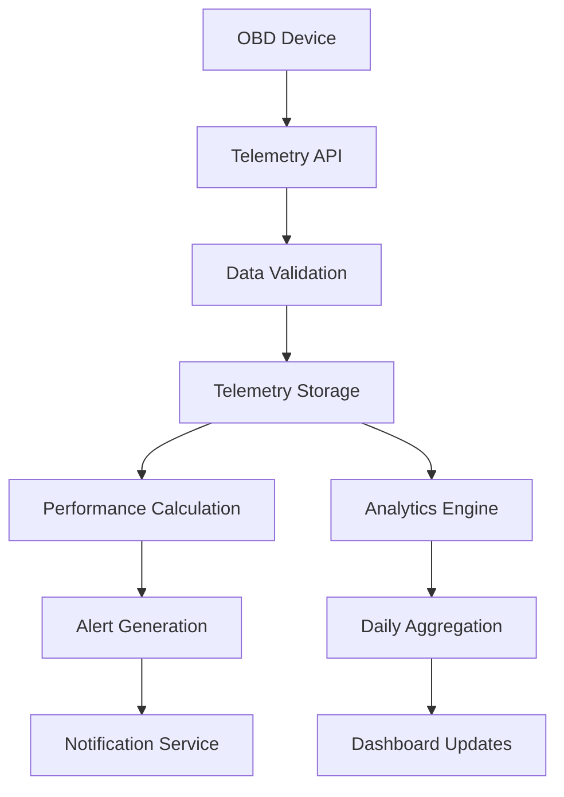
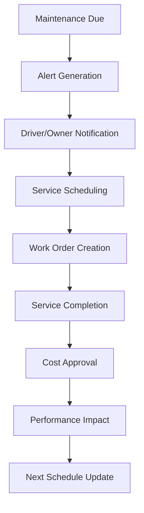
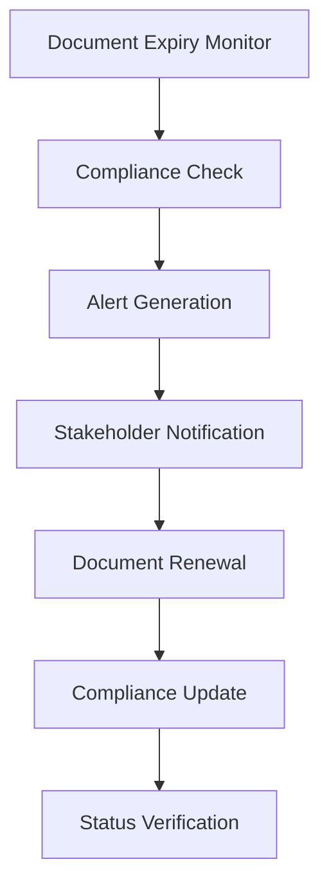

# Vehicle Management System Integration Guide
## Xpress Ops Tower Platform - Philippines Operations

### Overview
This guide provides comprehensive instructions for integrating the Vehicle Management System with the existing Xpress Ops Tower platform. The system supports 4 distinct vehicle ownership models with differentiated data access levels.

---

## Table of Contents
1. [System Architecture](#system-architecture)
2. [Database Integration](#database-integration)
3. [API Endpoints](#api-endpoints)
4. [Ownership Models](#ownership-models)
5. [Data Flow](#data-flow)
6. [Security & Permissions](#security--permissions)
7. [Monitoring & Analytics](#monitoring--analytics)
8. [Compliance & Regulations](#compliance--regulations)

---

## System Architecture

### Core Components
```
┌─────────────────────────────────────────────────────────────────┐
│                    Vehicle Management System                     │
├─────────────────────────────────────────────────────────────────┤
│  Vehicle Registry  │  Driver Assignment  │  Maintenance Mgmt   │
│  • Master Data     │  • Primary/Secondary│  • Scheduling       │
│  • Ownership Types │  • Rental Terms     │  • Cost Tracking    │
│  • Status Tracking │  • Performance      │  • Quality Control  │
├─────────────────────────────────────────────────────────────────┤
│  Telematics/OBD    │  Performance Metrics │  LTFRB Compliance  │
│  • Real-time Data  │  • Daily Aggregation │  • Franchise Mgmt   │
│  • Diagnostics     │  • Environmental     │  • Inspection Track │
│  • Fuel Efficiency │  • Utilization       │  • Document Mgmt    │
└─────────────────────────────────────────────────────────────────┘
```

### Integration Points
- **Existing Driver System**: Links to `drivers` table for assignment management
- **Regional Operations**: Integrates with `regions` table for area-based management  
- **User Management**: Leverages existing RBAC system for permissions
- **Audit System**: Extends existing audit logging for vehicle operations

---

## Database Integration

### Migration Execution
```sql
-- Apply the vehicle management schema
\i database/migrations/045_vehicle_management_schema.sql

-- Verify migration success
SELECT version, description, executed_at 
FROM schema_migrations 
WHERE version = '045';
```

### Key Tables Created

#### Core Tables
- `vehicles` - Master vehicle registry with ownership-based data access
- `vehicle_driver_assignments` - Driver-vehicle relationships with terms
- `vehicle_maintenance` - Comprehensive maintenance tracking
- `vehicle_obd_devices` - OBD device management
- `vehicle_telemetry_data` - Real-time telematics (partitioned by date)

#### Analytics Tables
- `vehicle_performance_daily` - Daily performance aggregations
- `vehicle_carbon_footprint` - Environmental impact tracking
- `ltfrb_compliance` - Philippines regulatory compliance

#### Alert Tables
- `maintenance_alerts` - Automated maintenance notifications
- `compliance_alerts` - Regulatory deadline notifications

### Indexes for Performance
The schema includes 25+ optimized indexes for:
- Vehicle lookups by license plate, region, status
- Maintenance scheduling and cost analysis
- Telematics data queries with geospatial support
- Performance analytics aggregations
- Compliance deadline monitoring

---

## API Endpoints

### Vehicle Management Endpoints

#### Vehicle Registry
```typescript
// Get all vehicles with filtering
GET /api/v1/vehicles
Query Parameters:
- ownership_type: xpress_owned | fleet_owned | operator_owned | driver_owned
- status: active | maintenance | inspection | inactive
- region_id: UUID
- has_obd: boolean
- maintenance_due: overdue | due_soon | upcoming

Response: {
  data: Vehicle[],
  pagination: PaginationInfo,
  filters: AppliedFilters
}

// Get vehicle details with performance metrics
GET /api/v1/vehicles/{vehicleId}
Response: {
  vehicle: VehicleDetails,
  currentDriver: DriverAssignment,
  performance30d: PerformanceMetrics,
  maintenanceStatus: MaintenanceInfo,
  complianceStatus: ComplianceInfo
}

// Create new vehicle
POST /api/v1/vehicles
Body: {
  vehicleCode: string,
  licensePlate: string,
  make: string,
  model: string,
  year: number,
  ownershipType: OwnershipType,
  regionId: UUID,
  serviceTypes: ServiceType[],
  // ... additional fields based on ownership type
}

// Update vehicle information
PUT /api/v1/vehicles/{vehicleId}
// PATCH /api/v1/vehicles/{vehicleId} - partial updates
```

#### Driver Assignment Management
```typescript
// Assign driver to vehicle
POST /api/v1/vehicles/{vehicleId}/assignments
Body: {
  driverId: UUID,
  assignmentType: 'primary' | 'secondary' | 'temporary',
  validFrom: DateTime,
  validUntil?: DateTime,
  rentalTerms?: {
    dailyFee: number,
    fuelResponsibility: 'driver' | 'owner' | 'shared',
    maintenanceResponsibility: 'driver' | 'owner' | 'shared'
  }
}

// Get vehicle assignments
GET /api/v1/vehicles/{vehicleId}/assignments
GET /api/v1/drivers/{driverId}/vehicle-assignments

// Update assignment terms
PUT /api/v1/vehicle-assignments/{assignmentId}

// End assignment
DELETE /api/v1/vehicle-assignments/{assignmentId}
```

#### Maintenance Management
```typescript
// Schedule maintenance
POST /api/v1/vehicles/{vehicleId}/maintenance
Body: {
  maintenanceType: string,
  priority: 'routine' | 'minor' | 'major' | 'urgent' | 'critical',
  scheduledDate: Date,
  serviceProvider: string,
  estimatedCost: number,
  description: string
}

// Get maintenance history
GET /api/v1/vehicles/{vehicleId}/maintenance
Query: {
  status?: 'scheduled' | 'in_progress' | 'completed' | 'cancelled',
  fromDate?: Date,
  toDate?: Date,
  priority?: MaintenancePriority
}

// Update maintenance record
PUT /api/v1/maintenance/{maintenanceId}
Body: {
  actualStartTime?: DateTime,
  actualCompletionTime?: DateTime,
  workPerformed?: string,
  partsReplaced?: Part[],
  actualCost?: number,
  qualityRating?: number
}

// Get maintenance alerts
GET /api/v1/vehicles/{vehicleId}/maintenance-alerts
GET /api/v1/maintenance-alerts (system-wide)
```

#### Telematics & OBD Data
```typescript
// Register OBD device
POST /api/v1/vehicles/{vehicleId}/obd-device
Body: {
  deviceSerial: string,
  deviceModel: string,
  manufacturer: string,
  telematicsProvider: string
}

// Get real-time vehicle data
GET /api/v1/vehicles/{vehicleId}/telemetry/current
Response: {
  location: GeoPoint,
  speed: number,
  engineMetrics: EngineData,
  fuelData: FuelData,
  diagnosticStatus: DiagnosticInfo
}

// Get telemetry history
GET /api/v1/vehicles/{vehicleId}/telemetry/history
Query: {
  fromTime: DateTime,
  toTime: DateTime,
  dataPoints: 'all' | 'location' | 'engine' | 'fuel' | 'diagnostics'
}

// Submit diagnostic event
POST /api/v1/vehicles/{vehicleId}/diagnostic-events
Body: {
  eventCode: string,
  eventType: string,
  severity: 'info' | 'warning' | 'error' | 'critical',
  description: string,
  location?: GeoPoint,
  diagnosticData?: object
}
```

#### Performance Analytics
```typescript
// Get vehicle performance metrics
GET /api/v1/vehicles/{vehicleId}/performance
Query: {
  period: 'daily' | 'weekly' | 'monthly',
  startDate: Date,
  endDate: Date,
  metrics?: 'utilization' | 'efficiency' | 'financial' | 'environmental'
}

// Get fleet performance summary
GET /api/v1/analytics/fleet-performance
Query: {
  regionId?: UUID,
  ownershipType?: OwnershipType,
  period: AnalyticsPeriod
}

// Get carbon footprint report
GET /api/v1/vehicles/{vehicleId}/carbon-footprint
GET /api/v1/analytics/environmental-impact
```

#### Compliance Management
```typescript
// Get compliance status
GET /api/v1/vehicles/{vehicleId}/compliance
Response: {
  overallStatus: 'compliant' | 'warning' | 'non_compliant',
  complianceScore: number,
  franchiseInfo: LTFRBInfo,
  registrationInfo: RegistrationInfo,
  insuranceInfo: InsuranceInfo,
  inspectionInfo: InspectionInfo,
  activeViolations: Violation[]
}

// Update compliance information
PUT /api/v1/vehicles/{vehicleId}/compliance/{complianceType}

// Get compliance alerts
GET /api/v1/compliance-alerts
Query: {
  vehicleId?: UUID,
  alertType?: string,
  priority?: AlertPriority,
  status?: AlertStatus
}
```

---

## Ownership Models

### 1. Xpress Owned (`xpress_owned`)
**Data Access Level**: Complete
- Full maintenance tracking with cost management
- Mandatory OBD device installation
- Complete financial tracking (acquisition cost, depreciation)
- Direct operational control

**Key Features**:
- Asset management and depreciation tracking
- Comprehensive maintenance scheduling
- Performance optimization based on full data
- Insurance and warranty management

### 2. Fleet Owned (`fleet_owned`)  
**Data Access Level**: Moderate with Optional OBD
- External fleet management company owns vehicles
- Optional OBD connectivity for performance tracking
- Basic maintenance coordination
- Revenue sharing arrangements

**Key Features**:
- Fleet owner contact and contract management
- Service level agreements (SLA) tracking
- Optional telematics integration
- Performance reporting to fleet owner

### 3. Operator Owned (`operator_owned`)
**Data Access Level**: Basic + Optional OBD
- Individual operators own 1-3 vehicles
- Basic vehicle information + optional OBD data
- Maintenance assistance and cost sharing
- Performance incentives based on data sharing

**Key Features**:
- Rental fee structure for vehicle use
- Maintenance cost sharing agreements
- Performance-based incentives
- Owner contact and support

### 4. Driver Owned (`driver_owned`)
**Data Access Level**: Minimal Tracking
- Driver owns and maintains vehicle
- Basic vehicle identification only
- Minimal system tracking
- Self-managed maintenance

**Key Features**:
- Basic vehicle registration for platform use
- Compliance verification only
- Driver responsibility for all maintenance
- Performance tracking limited to trip data

---

## Data Flow

### Real-time Data Processing


### Maintenance Workflow


### Compliance Monitoring


---

## Security & Permissions

### Role-Based Access Control

#### Ground Operations (`ground_ops`)
- View vehicle status and location
- Basic maintenance scheduling
- Driver assignment management
- Regional scope only

#### Operations Manager (`ops_manager`) 
- All ground ops permissions
- Maintenance cost approval (up to limit)
- Performance metrics access
- Vehicle status management

#### Fleet Manager (new role)
- Vehicle inventory management
- Maintenance planning and approval
- Performance analytics
- Cost center management
- Cross-regional view (if authorized)

#### Regional Manager (`regional_manager`)
- All fleet manager permissions within region
- Compliance oversight
- Budget approval authority
- Regulatory reporting

#### Finance Operations (`finance_ops`)
- Cost analysis and reporting
- Maintenance cost approval
- Revenue/expense tracking
- Insurance claim management

### Data Sensitivity Levels
- **Public**: Basic vehicle specifications
- **Internal**: Performance metrics, utilization data
- **Confidential**: Financial data, maintenance costs
- **Restricted**: OBD diagnostic data, detailed telematics

### API Security
```typescript
// Example middleware for vehicle access control
const checkVehicleAccess = async (req, res, next) => {
  const { vehicleId } = req.params;
  const vehicle = await Vehicle.findById(vehicleId);
  
  // Check regional access
  if (!hasRegionalAccess(req.user, vehicle.regionId)) {
    return res.status(403).json({ error: 'Regional access denied' });
  }
  
  // Check ownership-based data access
  const dataLevel = getDataAccessLevel(req.user.role, vehicle.ownershipType);
  req.dataAccess = dataLevel;
  
  next();
};
```

---

## Monitoring & Analytics

### Key Performance Indicators (KPIs)

#### Vehicle Utilization
- Daily/weekly/monthly utilization rates
- Revenue per vehicle per day
- Distance efficiency (billable vs total distance)
- Idle time analysis

#### Maintenance Metrics
- Preventive vs reactive maintenance ratio  
- Average maintenance cost per vehicle
- Maintenance-related downtime
- Service provider performance ratings

#### Environmental Impact
- Carbon emissions per vehicle
- Fuel efficiency trends
- Environmental compliance scores
- Sustainability improvements

#### Compliance Metrics
- Overall compliance rate by region
- Document expiry tracking
- Violation frequency and severity
- Regulatory fine amounts

### Dashboard Views

#### Fleet Operations Dashboard
```typescript
interface FleetDashboard {
  activeVehicles: number;
  maintenanceDue: number;
  avgUtilization: number;
  totalRevenue: number;
  alerts: {
    critical: number;
    warning: number;
    info: number;
  };
  regionalBreakdown: RegionalMetrics[];
}
```

#### Vehicle Detail View
```typescript
interface VehicleDetail {
  basicInfo: VehicleInfo;
  currentStatus: VehicleStatus;
  currentDriver: DriverAssignment;
  performanceMetrics: {
    utilizationRate: number;
    fuelEfficiency: number;
    revenueToday: number;
    tripsCompleted: number;
  };
  maintenanceStatus: {
    nextDue: Date;
    alertsCount: number;
    lastService: Date;
  };
  complianceStatus: ComplianceInfo;
  realtimeData?: TelemetryData;
}
```

---

## Compliance & Regulations

### LTFRB (Land Transportation Franchising and Regulatory Board)

#### Required Documentation
- **Franchise Certificate**: Commercial operation authorization
- **Route Permit**: Specific route authorization (for PUV)
- **Vehicle Registration**: LTO certificate of registration  
- **OR/CR**: Official receipt and certificate of registration
- **Insurance**: CTPL (Compulsory Third Party Liability)

#### Monitoring & Alerts
- Automatic expiry date tracking
- 30/60/90 day advance warnings
- Compliance score calculation
- Violation history tracking
- Fine and penalty management

#### Reporting Requirements
```typescript
// Generate LTFRB compliance report
GET /api/v1/compliance/ltfrb-report
Query: {
  regionId: UUID,
  reportType: 'monthly' | 'quarterly' | 'annual',
  includeViolations: boolean
}

Response: {
  summaryMetrics: {
    totalVehicles: number,
    compliantVehicles: number,
    pendingRenewals: number,
    activeViolations: number
  },
  vehicleDetails: VehicleComplianceInfo[],
  upcomingDeadlines: ComplianceDeadline[],
  violationSummary: ViolationSummary[]
}
```

### LTO (Land Transportation Office)

#### Vehicle Registration Management
- Registration renewal tracking
- Emission test compliance
- Safety inspection records
- Roadworthiness certificates

#### Integration Points
- Automated renewal reminders
- Document upload and verification
- Status synchronization with LTO systems
- Fine and penalty tracking

### Insurance Compliance

#### Coverage Types
- **CTPL**: Compulsory for all vehicles
- **Comprehensive**: Optional but recommended
- **Passenger Personal Accident**: Required for commercial vehicles

#### Claims Management
```typescript
// Insurance claim tracking
interface InsuranceClaim {
  claimId: string;
  vehicleId: UUID;
  incidentDate: Date;
  claimType: 'collision' | 'theft' | 'fire' | 'flood' | 'vandalism';
  claimAmount: number;
  status: 'filed' | 'investigating' | 'approved' | 'denied' | 'settled';
  insuranceProvider: string;
  relatedMaintenanceId?: UUID;
}
```

---

## Implementation Checklist

### Phase 1: Core Infrastructure
- [ ] Apply database migration 045
- [ ] Set up basic API endpoints for vehicle CRUD
- [ ] Implement vehicle-driver assignment system
- [ ] Create vehicle dashboard views
- [ ] Set up basic maintenance scheduling

### Phase 2: Advanced Features  
- [ ] Implement OBD device integration
- [ ] Build telemetry data collection system
- [ ] Create performance analytics engine
- [ ] Implement automated alert system
- [ ] Build compliance monitoring system

### Phase 3: Analytics & Optimization
- [ ] Carbon footprint calculation engine
- [ ] Advanced performance metrics
- [ ] Predictive maintenance algorithms
- [ ] Cost optimization recommendations
- [ ] Environmental impact reporting

### Phase 4: Integration & Testing
- [ ] Integration with existing driver management
- [ ] RBAC system integration
- [ ] Mobile app integration for drivers
- [ ] Third-party service provider APIs
- [ ] End-to-end testing and validation

---

## Support & Maintenance

### Database Maintenance Tasks
```sql
-- Weekly: Cleanup old telemetry data (runs automatically)
SELECT cleanup_old_telemetry_data(90);

-- Monthly: Archive completed maintenance records  
SELECT archive_old_maintenance_records(24);

-- Quarterly: Rebuild performance indexes
REINDEX CONCURRENTLY INDEX idx_vehicles_ownership_status;
REINDEX CONCURRENTLY INDEX idx_telemetry_vehicle_time;
```

### Monitoring Queries
```sql
-- Check system health
SELECT 
    COUNT(*) as total_vehicles,
    COUNT(*) FILTER (WHERE status = 'active') as active_vehicles,
    COUNT(*) FILTER (WHERE obd_device_installed = true) as obd_enabled,
    COUNT(*) FILTER (WHERE next_maintenance_due <= CURRENT_DATE) as maintenance_overdue
FROM vehicles 
WHERE is_active = true;

-- Performance monitoring
SELECT 
    vehicle_id,
    AVG(utilization_rate) as avg_utilization,
    SUM(total_trips) as total_trips,
    AVG(fuel_efficiency_kmpl) as avg_efficiency
FROM vehicle_performance_daily 
WHERE performance_date >= CURRENT_DATE - INTERVAL '30 days'
GROUP BY vehicle_id
ORDER BY avg_utilization DESC;
```

For technical support and additional documentation, contact the Xpress Ops Tower development team.