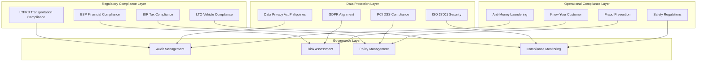

# Xpress Ops Tower - Compliance System Specifications

## Overview

This document outlines the comprehensive compliance system for Xpress Ops Tower, ensuring full adherence to Philippines regulatory requirements, international standards, and data protection laws. The compliance framework covers transportation regulations, financial services compliance, data privacy, and operational governance.

## Compliance Architecture Overview

### Multi-Layer Compliance Framework



## 1. Philippines Transportation Compliance (LTFRB)

### 1.1 Land Transportation Franchising and Regulatory Board (LTFRB) Compliance

#### Regulatory Framework
```yaml
ltfrb_compliance:
  applicable_regulations:
    - memorandum_circular_2023_015: Transport Network Vehicle Service (TNVS)
    - memorandum_circular_2023_008: Digital Platform Regulations
    - memorandum_circular_2022_012: Fare Matrix Guidelines
    - resolution_2023_045: Safety Standards for TNVS
    
  compliance_requirements:
    platform_operator_requirements:
      - valid_provisional_authority: required
      - certificate_of_public_convenience: required
      - business_permit: required
      - tax_identification_number: required
      - authorized_representative: designated
      
    driver_requirements:
      - valid_professional_drivers_license: required
      - ltfrb_driver_accreditation: required
      - drug_test_certification: quarterly
      - medical_certificate: annual
      - vehicle_insurance: comprehensive_coverage
      
    vehicle_requirements:
      - vehicle_registration: updated_or_cr
      - ltfrb_vehicle_inspection: semi_annual
      - comprehensive_insurance: minimum_1m_coverage
      - tpms_gps_tracking: mandatory
      - dashcam_installation: front_and_rear
```

#### LTFRB Compliance Implementation
```typescript
interface LTFRBComplianceSystem {
  platformOperatorCompliance: {
    // Platform Operator Registration
    registerPlatformOperator(data: PlatformOperatorData): Promise<LTFRBRegistrationResult>;
    renewProvisionalAuthority(): Promise<RenewalResult>;
    
    // Digital Platform Requirements
    implementFareMatrix(): FareMatrixConfiguration;
    enableTransparrentPricing(): PricingTransparencyFeatures;
    implementSafetyFeatures(): SafetyComplianceFeatures;
  };
  
  driverAccreditation: {
    // Driver Registration and Verification
    accreditDriver(driverId: string): Promise<AccreditationResult>;
    verifyDriverLicense(licenseNumber: string): Promise<LicenseVerificationResult>;
    validateDrugTestCertificate(certificateId: string): Promise<CertificateValidationResult>;
    
    // Ongoing Compliance Monitoring
    monitorDriverCompliance(driverId: string): Promise<ComplianceStatus>;
    schedulePeriodicRequirements(driverId: string): Promise<ScheduleResult>;
  };
  
  vehicleCompliance: {
    // Vehicle Registration and Inspection
    registerVehicle(vehicleData: VehicleRegistrationData): Promise<RegistrationResult>;
    scheduleInspection(vehicleId: string): Promise<InspectionSchedule>;
    validateInsurance(policyNumber: string): Promise<InsuranceValidationResult>;
    
    // Technical Requirements
    verifyGPSInstallation(vehicleId: string): Promise<GPSVerificationResult>;
    validateDashcamInstallation(vehicleId: string): Promise<DashcamValidationResult>;
  };
  
  reportingRequirements: {
    // Regular Reporting to LTFRB
    generateMonthlyReport(): Promise<LTFRBMonthlyReport>;
    generateQuarterlyReport(): Promise<LTFRBQuarterlyReport>;
    generateAnnualReport(): Promise<LTFRBAnnualReport>;
    
    // Incident Reporting
    reportSafetyIncident(incidentData: SafetyIncidentData): Promise<IncidentReportResult>;
    reportDriverViolation(violationData: DriverViolationData): Promise<ViolationReportResult>;
  };
}

interface PlatformOperatorData {
  companyName: string;
  businessAddress: PhilippineAddress;
  tinNumber: string;
  businessPermitNumber: string;
  authorizedRepresentative: {
    name: string;
    position: string;
    contactInfo: ContactInfo;
  };
  operatingAreas: LTFRBRegion[];
  estimatedFleetSize: number;
}

interface DriverAccreditationData {
  personalInfo: DriverPersonalInfo;
  licenseInfo: {
    licenseNumber: string;
    licenseType: 'professional' | 'non_professional';
    expiryDate: Date;
    restrictions?: string[];
  };
  medicalCertificate: {
    certificateNumber: string;
    issuedDate: Date;
    validUntil: Date;
    medicalConditions?: string[];
  };
  drugTestCertificate: {
    testDate: Date;
    result: 'negative' | 'positive';
    laboratoryName: string;
    certificateNumber: string;
  };
}
```

### 1.2 LTFRB Reporting and Monitoring

#### Automated Compliance Reporting
```python
# LTFRB Compliance Reporting System
class LTFRBReportingSystem:
    def __init__(self):
        self.ltfrb_api = LTFRBAPIClient()
        self.database = ComplianceDatabase()
        self.scheduler = ComplianceScheduler()
    
    async def generate_monthly_report(self, reporting_period: str) -> LTFRBMonthlyReport:
        """Generate comprehensive monthly report for LTFRB submission"""
        
        # Collect operational data
        trip_data = await self.database.get_trip_statistics(reporting_period)
        driver_data = await self.database.get_driver_statistics(reporting_period)
        vehicle_data = await self.database.get_vehicle_statistics(reporting_period)
        incident_data = await self.database.get_incident_reports(reporting_period)
        
        # Generate report sections
        report = LTFRBMonthlyReport(
            reporting_period=reporting_period,
            platform_operator_info=await self.get_platform_operator_info(),
            
            operational_summary={
                'total_trips_completed': trip_data['completed_trips'],
                'total_revenue_generated': trip_data['total_revenue'],
                'average_fare_per_trip': trip_data['average_fare'],
                'peak_demand_hours': trip_data['peak_hours'],
                'service_areas': trip_data['service_areas']
            },
            
            fleet_status={
                'total_accredited_drivers': driver_data['active_drivers'],
                'total_registered_vehicles': vehicle_data['active_vehicles'],
                'new_driver_applications': driver_data['new_applications'],
                'driver_suspensions': driver_data['suspensions'],
                'vehicle_inspections_due': vehicle_data['inspections_due']
            },
            
            compliance_metrics={
                'driver_license_validity_rate': driver_data['valid_licenses_percentage'],
                'vehicle_insurance_coverage_rate': vehicle_data['insured_vehicles_percentage'],
                'safety_incident_rate': incident_data['incidents_per_thousand_trips'],
                'customer_complaint_resolution_rate': incident_data['resolved_complaints_percentage']
            },
            
            safety_incidents=await self.format_safety_incidents(incident_data),
            
            fare_compliance={
                'base_fare_adherence': await self.check_fare_matrix_compliance(),
                'surge_pricing_instances': trip_data['surge_pricing_events'],
                'fare_transparency_score': await self.calculate_transparency_score()
            }
        )
        
        # Submit to LTFRB API
        submission_result = await self.ltfrb_api.submit_monthly_report(report)
        
        # Store submission record
        await self.database.record_report_submission(report, submission_result)
        
        return report
    
    async def monitor_real_time_compliance(self):
        """Real-time monitoring of LTFRB compliance requirements"""
        
        compliance_checks = [
            self.check_driver_license_expiry(),
            self.check_vehicle_insurance_expiry(),
            self.check_medical_certificate_validity(),
            self.check_drug_test_currency(),
            self.monitor_fare_matrix_adherence(),
            self.validate_service_area_compliance()
        ]
        
        results = await asyncio.gather(*compliance_checks)
        
        # Process non-compliance issues
        for check_result in results:
            if not check_result.compliant:
                await self.handle_compliance_violation(check_result)
    
    async def handle_compliance_violation(self, violation: ComplianceViolation):
        """Handle identified compliance violations"""
        
        if violation.severity == 'critical':
            # Immediate action required
            if violation.type == 'expired_driver_license':
                await self.suspend_driver_immediately(violation.entity_id)
            elif violation.type == 'expired_vehicle_insurance':
                await self.disable_vehicle_immediately(violation.entity_id)
            
            # Notify LTFRB of critical violation
            await self.ltfrb_api.report_critical_violation(violation)
        
        elif violation.severity == 'warning':
            # Send notifications and schedule corrections
            await self.send_compliance_notification(violation)
            await self.schedule_compliance_correction(violation)
        
        # Log violation for audit trail
        await self.database.log_compliance_violation(violation)
```

## 2. Financial Services Compliance (BSP)

### 2.1 Bangko Sentral ng Pilipinas (BSP) Compliance

#### BSP Regulatory Framework
```yaml
bsp_compliance:
  applicable_circulars:
    - circular_1108_2021: Digital Payments Transformation Roadmap
    - circular_1048_2019: Guidelines on Electronic Money Issuers
    - circular_944_2017: Anti-Money Laundering Regulations
    - circular_1022_2018: Consumer Protection Guidelines
    
  payment_service_provider_requirements:
    registration_requirements:
      - bsp_registration_certificate: mandatory
      - minimum_capital_requirement: php_100_million
      - fit_and_proper_test: key_personnel
      - compliance_officer_appointment: required
      
    operational_requirements:
      - customer_due_diligence: enhanced_kyc
      - transaction_monitoring: real_time_aml
      - suspicious_transaction_reporting: automated
      - data_residency: philippines_only
      
    consumer_protection:
      - transparent_pricing: all_fees_disclosed
      - dispute_resolution: formal_process
      - data_privacy: strict_protection
      - service_reliability: 99_9_percent_uptime
```

#### BSP Compliance Implementation
```typescript
interface BSPComplianceSystem {
  amlCompliance: {
    // Customer Due Diligence
    performCustomerDueDiligence(customerId: string): Promise<CDDResult>;
    enhancedDueDiligence(customerId: string): Promise<EDDResult>;
    
    // Transaction Monitoring
    monitorTransactionPatterns(customerId: string): Promise<MonitoringResult>;
    detectSuspiciousTransactions(): Promise<SuspiciousTransaction[]>;
    
    // Reporting
    generateSuspiciousTransactionReport(transactionId: string): Promise<STRResult>;
    submitAMLReport(reportData: AMLReportData): Promise<SubmissionResult>;
  };
  
  consumerProtection: {
    // Pricing Transparency
    displayAllFees(transactionData: TransactionData): FeeDisclosure;
    provideReceiptDetails(transactionId: string): DetailedReceipt;
    
    // Dispute Resolution
    initiateDispute(disputeData: DisputeData): Promise<DisputeCase>;
    processDisputeResolution(disputeId: string): Promise<ResolutionResult>;
    
    // Service Reliability
    monitorServiceAvailability(): Promise<AvailabilityMetrics>;
    generateServiceReliabilityReport(): Promise<ReliabilityReport>;
  };
  
  dataResidency: {
    // Data Location Compliance
    validateDataResidency(): Promise<ResidencyComplianceStatus>;
    auditDataLocation(dataType: string): Promise<LocationAuditResult>;
    
    // Cross-border Data Transfer
    requestCrossBorderApproval(transferData: CrossBorderTransferData): Promise<ApprovalResult>;
    trackCrossBorderTransfers(): Promise<TransferTrackingReport>;
  };
  
  regulatoryReporting: {
    // Regular Reporting to BSP
    generateQuarterlyComplianceReport(): Promise<BSPQuarterlyReport>;
    generateAnnualAMLReport(): Promise<BSPAMLReport>;
    
    // Incident Reporting
    reportSecurityIncident(incidentData: SecurityIncidentData): Promise<IncidentReportResult>;
    reportSystemOutage(outageData: SystemOutageData): Promise<OutageReportResult>;
  };
}

// Anti-Money Laundering Implementation
class AMLComplianceEngine {
  constructor(
    private riskScoringEngine: RiskScoringEngine,
    private transactionAnalyzer: TransactionAnalyzer,
    private bspReportingAPI: BSPReportingAPI
  ) {}
  
  async analyzeTransactionForAML(transaction: Transaction): Promise<AMLAnalysisResult> {
    // Customer risk assessment
    const customerRisk = await this.riskScoringEngine.assessCustomerRisk(
      transaction.customerId
    );
    
    // Transaction pattern analysis
    const patternAnalysis = await this.transactionAnalyzer.analyzePatterns({
      customerId: transaction.customerId,
      amount: transaction.amount,
      frequency: transaction.frequency,
      destinations: transaction.destinations,
      timePatterns: transaction.timePatterns
    });
    
    // Philippines-specific AML checks
    const philippinesChecks = await this.performPhilippinesAMLChecks(transaction);
    
    // Calculate overall AML risk score
    const overallRisk = this.calculateAMLRiskScore(
      customerRisk,
      patternAnalysis,
      philippinesChecks
    );
    
    // Determine if suspicious transaction reporting is needed
    const requiresSTR = overallRisk.score > 70 || 
                       philippinesChecks.flagged ||
                       this.matchesSuspiciousPatterns(transaction);
    
    if (requiresSTR) {
      await this.generateSuspiciousTransactionReport(transaction, overallRisk);
    }
    
    return {
      riskScore: overallRisk.score,
      riskLevel: overallRisk.level,
      suspiciousTransactionReportGenerated: requiresSTR,
      recommendedActions: overallRisk.actions,
      complianceFlags: philippinesChecks.flags
    };
  }
  
  private async performPhilippinesAMLChecks(transaction: Transaction): Promise<PhilippinesAMLChecks> {
    const checks = {
      // High-value transaction threshold (PHP 500,000)
      highValueTransaction: transaction.amount >= 500000,
      
      // Cross-border transaction monitoring
      crossBorderTransaction: this.isCrossBorderTransaction(transaction),
      
      // OFW remittance pattern detection
      ofwRemittancePattern: await this.detectOFWPattern(transaction),
      
      // Politically Exposed Person (PEP) screening
      pepScreening: await this.screenForPEP(transaction.customerId),
      
      // Sanctions list checking
      sanctionsListCheck: await this.checkSanctionsList(transaction.customerId),
      
      // Cash-intensive business monitoring
      cashIntensiveBusiness: await this.checkCashIntensiveBusiness(transaction)
    };
    
    const flagged = Object.values(checks).some(check => check === true);
    
    return {
      checks,
      flagged,
      flags: Object.entries(checks)
        .filter(([_, value]) => value === true)
        .map(([key, _]) => key)
    };
  }
}
```

### 2.2 BSP Reporting and Data Management

#### Data Residency and Reporting
```python
class BSPDataComplianceManager:
    def __init__(self):
        self.data_classification_service = DataClassificationService()
        self.encryption_service = EncryptionService()
        self.audit_logger = ComplianceAuditLogger()
    
    async def ensure_data_residency_compliance(self, data_request: DataRequest) -> DataResidencyResult:
        """Ensure all sensitive data remains within Philippines jurisdiction"""
        
        # Classify data sensitivity
        classification = await self.data_classification_service.classify_data(data_request.data)
        
        if classification.sensitivity_level in ['confidential', 'restricted']:
            # Verify data location
            current_location = await self.get_data_location(data_request.data_id)
            
            if not self.is_philippines_jurisdiction(current_location):
                # Initiate data repatriation
                await self.repatriate_data(data_request.data_id)
                
                # Log compliance action
                await self.audit_logger.log_data_repatriation({
                    'data_id': data_request.data_id,
                    'original_location': current_location,
                    'repatriated_to': 'philippines',
                    'reason': 'bsp_data_residency_compliance'
                })
        
        # Apply encryption for all sensitive data
        if classification.requires_encryption:
            await self.encryption_service.encrypt_data(
                data_request.data_id,
                encryption_standard='aes_256_gcm'
            )
        
        return DataResidencyResult(
            compliant=True,
            data_location='philippines',
            encryption_applied=classification.requires_encryption
        )
    
    async def generate_bsp_quarterly_report(self, quarter: str, year: int) -> BSPQuarterlyReport:
        """Generate comprehensive quarterly report for BSP submission"""
        
        reporting_period = f"Q{quarter}-{year}"
        
        # Collect financial metrics
        financial_metrics = await self.collect_financial_metrics(reporting_period)
        
        # AML compliance metrics
        aml_metrics = await self.collect_aml_metrics(reporting_period)
        
        # Consumer protection metrics
        consumer_metrics = await self.collect_consumer_protection_metrics(reporting_period)
        
        # System reliability metrics
        reliability_metrics = await self.collect_system_reliability_metrics(reporting_period)
        
        report = BSPQuarterlyReport(
            reporting_period=reporting_period,
            submitted_by="Xpress Ops Tower Philippines Inc.",
            submission_date=datetime.now(),
            
            financial_summary={
                'total_transaction_volume': financial_metrics['total_volume'],
                'total_transaction_count': financial_metrics['total_count'],
                'average_transaction_value': financial_metrics['average_value'],
                'payment_method_breakdown': financial_metrics['payment_breakdown'],
                'revenue_by_service_type': financial_metrics['revenue_breakdown']
            },
            
            aml_compliance={
                'customers_subject_to_cdd': aml_metrics['cdd_customers'],
                'customers_subject_to_edd': aml_metrics['edd_customers'],
                'suspicious_transactions_detected': aml_metrics['suspicious_count'],
                'strs_filed_with_amlc': aml_metrics['strs_filed'],
                'high_risk_customers_monitored': aml_metrics['high_risk_monitoring']
            },
            
            consumer_protection={
                'total_customer_complaints': consumer_metrics['total_complaints'],
                'complaints_resolved_within_sla': consumer_metrics['resolved_on_time'],
                'average_resolution_time_hours': consumer_metrics['avg_resolution_time'],
                'fee_transparency_compliance_rate': consumer_metrics['fee_transparency'],
                'service_availability_percentage': reliability_metrics['uptime']
            },
            
            security_and_risk={
                'security_incidents_reported': await self.count_security_incidents(reporting_period),
                'data_breaches': await self.count_data_breaches(reporting_period),
                'system_outages': await self.count_system_outages(reporting_period),
                'business_continuity_tests': await self.count_bc_tests(reporting_period)
            },
            
            regulatory_changes_implemented=await self.get_regulatory_changes_implemented(reporting_period)
        )
        
        # Submit to BSP
        submission_result = await self.submit_to_bsp(report)
        
        # Store submission record
        await self.store_submission_record(report, submission_result)
        
        return report
```

## 3. Tax Compliance (BIR)

### 3.1 Bureau of Internal Revenue (BIR) Compliance

#### Tax Compliance Framework
```yaml
bir_compliance:
  applicable_regulations:
    - revenue_regulation_18_2020: Electronic Receipts and Invoices
    - revenue_regulation_5_2021: Digital Tax Payments
    - bir_ruling_2019_015: Platform Economy Taxation
    - tax_code_1997_section_114: Withholding Tax Requirements
    
  tax_obligations:
    platform_operator_taxes:
      - corporate_income_tax: 25_percent
      - value_added_tax: 12_percent
      - business_tax: varies_by_lgu
      - withholding_tax: various_rates
      
    driver_taxation:
      - income_tax: graduated_rates
      - withholding_tax: 8_percent_gross_revenue
      - business_tax: if_registered_business
      - vat_registration: optional_if_threshold_met
      
    transaction_taxation:
      - vat_on_platform_fees: 12_percent
      - withholding_tax_on_driver_fees: applicable
      - documentary_stamp_tax: certain_transactions
      
  reporting_requirements:
    monthly_reports:
      - bir_form_2550m: VAT Return
      - bir_form_1601c: Withholding Tax Return
      
    quarterly_reports:
      - bir_form_1702q: Quarterly Income Tax Return
      
    annual_reports:
      - bir_form_1702: Annual Income Tax Return
      - audited_financial_statements: if_required
```

#### BIR Tax System Implementation
```typescript
interface BIRTaxComplianceSystem {
  taxCalculation: {
    // VAT Calculation
    calculateVAT(transactionAmount: number): VATCalculationResult;
    applyVATExemptions(transaction: Transaction): VATExemptionResult;
    
    // Withholding Tax
    calculateWithholdingTax(grossRevenue: number, payeeType: string): WithholdingTaxResult;
    processWithholdingTaxPayment(paymentData: WithholdingTaxPayment): Promise<PaymentResult>;
    
    // Income Tax
    calculateDriverIncomeTax(annualIncome: number): IncomeTaxResult;
    generateTaxCertificate(driverId: string, taxYear: number): Promise<BIR2316>;
  };
  
  electronicReceiptSystem: {
    // Electronic Receipt Generation
    generateElectronicReceipt(transactionId: string): Promise<ElectronicReceipt>;
    validateReceiptNumber(receiptNumber: string): Promise<ValidationResult>;
    
    // BIR Receipt Compliance
    registerReceiptSeries(): Promise<ReceiptSeriesRegistration>;
    reportReceiptIssuance(): Promise<IssuanceReport>;
  };
  
  taxReporting: {
    // Monthly Reporting
    generateMonthlyVATReturn(): Promise<BIRForm2550M>;
    generateMonthlyWithholdingReturn(): Promise<BIRForm1601C>;
    
    // Quarterly Reporting
    generateQuarterlyIncomeTaxReturn(): Promise<BIRForm1702Q>;
    
    // Annual Reporting
    generateAnnualIncomeTaxReturn(): Promise<BIRForm1702>;
    generateAnnualInformationReturn(): Promise<BIRForm1604CF>;
  };
  
  auditCompliance: {
    // Record Keeping
    maintainTaxRecords(): Promise<TaxRecordManagement>;
    generateAuditTrail(dateRange: DateRange): Promise<AuditTrail>;
    
    // BIR Audit Support
    respondToBIRAudit(auditRequest: BIRAuditRequest): Promise<AuditResponse>;
    submitAuditDocuments(documents: AuditDocument[]): Promise<SubmissionResult>;
  };
}

class BIRTaxCalculationEngine {
  private readonly VAT_RATE = 0.12;
  private readonly WITHHOLDING_TAX_RATES = {
    'professional_driver': 0.08,  // 8% of gross receipts
    'business_entity': 0.02,      // 2% of gross receipts
    'individual_contractor': 0.10  // 10% of gross receipts
  };
  
  calculateTransactionTax(transaction: RideTransaction): TransactionTaxCalculation {
    const baseAmount = transaction.fareAmount;
    const platformFee = transaction.platformFee;
    const driverEarnings = baseAmount - platformFee;
    
    // VAT calculation on platform fee
    const vatOnPlatformFee = platformFee * this.VAT_RATE;
    const vatExclusivePlatformFee = platformFee - vatOnPlatformFee;
    
    // Withholding tax calculation on driver earnings
    const withholdingTaxRate = this.getWithholdingTaxRate(transaction.driverType);
    const withholdingTax = driverEarnings * withholdingTaxRate;
    
    // Net driver earnings after withholding tax
    const netDriverEarnings = driverEarnings - withholdingTax;
    
    return {
      transactionId: transaction.id,
      baseAmount: baseAmount,
      platformFee: vatExclusivePlatformFee,
      vatOnPlatformFee: vatOnPlatformFee,
      driverGrossEarnings: driverEarnings,
      withholdingTax: withholdingTax,
      netDriverEarnings: netDriverEarnings,
      totalTaxes: vatOnPlatformFee + withholdingTax,
      
      // BIR Receipt Details
      birReceiptNumber: this.generateBIRReceiptNumber(),
      taxIdentificationNumber: transaction.platformTIN,
      issuedDate: new Date(),
      
      // Tax Breakdown for Receipt
      taxBreakdown: {
        'VAT (12%)': vatOnPlatformFee,
        'Withholding Tax': withholdingTax,
        'Total Taxes': vatOnPlatformFee + withholdingTax
      }
    };
  }
  
  private getWithholdingTaxRate(driverType: string): number {
    return this.WITHHOLDING_TAX_RATES[driverType] || this.WITHHOLDING_TAX_RATES['professional_driver'];
  }
  
  private generateBIRReceiptNumber(): string {
    // Follow BIR receipt numbering format
    const series = 'XOT'; // Xpress Ops Tower
    const year = new Date().getFullYear();
    const sequentialNumber = this.getNextSequentialNumber();
    
    return `${series}${year}${sequentialNumber.toString().padStart(8, '0')}`;
  }
  
  async generateMonthlyBIRReports(month: number, year: number): Promise<MonthlyBIRReports> {
    const reportingPeriod = `${year}-${month.toString().padStart(2, '0')}`;
    
    // Collect transaction data for the month
    const monthlyTransactions = await this.getMonthlyTransactions(month, year);
    
    // Calculate VAT summary
    const vatSummary = this.calculateMonthlyVAT(monthlyTransactions);
    
    // Calculate withholding tax summary
    const withholdingTaxSummary = this.calculateMonthlyWithholdingTax(monthlyTransactions);
    
    // Generate BIR Form 2550M (VAT Return)
    const vatReturn = await this.generateForm2550M({
      reportingPeriod,
      taxPayerInfo: await this.getTaxPayerInfo(),
      salesInformation: vatSummary.salesInfo,
      purchasesInformation: vatSummary.purchasesInfo,
      vatPayable: vatSummary.vatPayable,
      taxCredits: vatSummary.taxCredits
    });
    
    // Generate BIR Form 1601C (Withholding Tax Return)
    const withholdingReturn = await this.generateForm1601C({
      reportingPeriod,
      taxPayerInfo: await this.getTaxPayerInfo(),
      withholdingTaxDetails: withholdingTaxSummary.details,
      totalWithholdingTax: withholdingTaxSummary.totalTax,
      payees: withholdingTaxSummary.payeeDetails
    });
    
    return {
      reportingPeriod,
      vatReturn,
      withholdingReturn,
      totalVATPayable: vatSummary.vatPayable,
      totalWithholdingTax: withholdingTaxSummary.totalTax,
      submissionDeadline: this.calculateSubmissionDeadline(month, year)
    };
  }
}
```

## 4. Data Privacy Compliance

### 4.1 Data Privacy Act (Philippines) Compliance

#### DPA Compliance Framework
```yaml
dpa_compliance:
  applicable_law:
    - republic_act_10173: Data Privacy Act of 2012
    - dpc_circular_16_01: Guidelines for Data Breach Notification
    - dpc_circular_21_01: Guidelines on Data Portability
    - dpc_circular_20_02: Guidelines on Personal Data Processing
    
  data_protection_principles:
    lawfulness_and_consent:
      - explicit_consent_required: true
      - legitimate_interest_basis: documented
      - consent_withdrawal_mechanism: available
      
    purpose_limitation:
      - data_collected_for_specified_purposes: true
      - purpose_communicated_to_data_subject: true
      - no_incompatible_processing: enforced
      
    data_minimization:
      - adequate_data_only: collected
      - relevant_data_only: processed
      - limited_to_necessary_data: stored
      
    accuracy:
      - data_accuracy_maintained: true
      - data_update_mechanisms: available
      - inaccurate_data_correction: timely
      
    retention_limitation:
      - retention_periods_defined: true
      - automated_data_deletion: implemented
      - legitimate_purpose_based_retention: applied
      
    security:
      - appropriate_technical_measures: implemented
      - organizational_measures: documented
      - data_breach_procedures: established
```

#### DPA Implementation System
```typescript
interface DPAComplianceSystem {
  consentManagement: {
    // Consent Collection and Management
    collectConsent(dataSubject: DataSubject, purposes: ProcessingPurpose[]): Promise<ConsentRecord>;
    withdrawConsent(consentId: string): Promise<ConsentWithdrawalResult>;
    
    // Consent Tracking
    getConsentHistory(dataSubjectId: string): Promise<ConsentHistory>;
    validateConsentCurrency(consentId: string): Promise<ConsentValidationResult>;
  };
  
  dataSubjectRights: {
    // Right to Access
    processDataAccessRequest(requestId: string): Promise<DataAccessResponse>;
    generateDataPortabilityExport(dataSubjectId: string): Promise<DataExport>;
    
    // Right to Rectification
    processDataCorrectionRequest(requestId: string): Promise<CorrectionResult>;
    
    // Right to Erasure
    processDataErasureRequest(requestId: string): Promise<ErasureResult>;
    
    // Right to Object
    processObjectionRequest(requestId: string): Promise<ObjectionResult>;
  };
  
  dataBreachManagement: {
    // Breach Detection
    detectDataBreach(incident: SecurityIncident): Promise<BreachAssessment>;
    
    // Breach Notification
    notifyDataProtectionCommission(breach: DataBreach): Promise<DPCNotificationResult>;
    notifyDataSubjects(breach: DataBreach, affectedSubjects: DataSubject[]): Promise<NotificationResult>;
    
    // Breach Response
    implementBreachResponse(breach: DataBreach): Promise<ResponseResult>;
    generateBreachReport(breachId: string): Promise<BreachReport>;
  };
  
  dataProcessingRecords: {
    // Processing Activity Records
    maintainProcessingRecords(): Promise<ProcessingRecord[]>;
    generateRopaReport(): Promise<RecordOfProcessingActivities>;
    
    // Impact Assessments
    conductDataProtectionImpactAssessment(processing: ProcessingActivity): Promise<DPIA>;
    updateDPIAForChanges(dpiaId: string, changes: ProcessingChange[]): Promise<DPIAUpdate>;
  };
}

class DPAConsentManager {
  private consentDatabase: ConsentDatabase;
  private auditLogger: DPAuditLogger;
  
  constructor() {
    this.consentDatabase = new ConsentDatabase();
    this.auditLogger = new DPAuditLogger();
  }
  
  async collectInformedConsent(
    dataSubject: DataSubject,
    processingPurposes: ProcessingPurpose[]
  ): Promise<ConsentRecord> {
    
    // Validate consent requirements
    const consentRequirements = this.validateConsentRequirements(processingPurposes);
    
    if (!consentRequirements.valid) {
      throw new ConsentValidationError(consentRequirements.errors);
    }
    
    // Create consent record
    const consentRecord = {
      consentId: this.generateConsentId(),
      dataSubjectId: dataSubject.id,
      consentTimestamp: new Date(),
      ipAddress: dataSubject.ipAddress,
      userAgent: dataSubject.userAgent,
      
      // Consent details
      processingPurposes: processingPurposes.map(purpose => ({
        purposeId: purpose.id,
        description: purpose.description,
        lawfulBasis: purpose.lawfulBasis,
        consented: purpose.consented,
        mandatory: purpose.mandatory
      })),
      
      // Consent method
      consentMethod: 'explicit_opt_in',
      consentInterface: 'web_application',
      
      // Data categories
      dataCategories: this.extractDataCategories(processingPurposes),
      
      // Retention periods
      retentionPeriods: this.calculateRetentionPeriods(processingPurposes),
      
      // Third party sharing
      thirdPartySharing: this.extractThirdPartySharing(processingPurposes),
      
      // Withdrawal information
      withdrawalMethod: 'user_dashboard_or_email',
      withdrawalContact: 'privacy@xpressopts.ph',
      
      // Consent status
      status: 'active',
      withdrawnAt: null,
      withdrawalReason: null
    };
    
    // Store consent record
    await this.consentDatabase.storeConsentRecord(consentRecord);
    
    // Log consent collection for audit
    await this.auditLogger.logConsentCollection({
      consentId: consentRecord.consentId,
      dataSubjectId: dataSubject.id,
      timestamp: consentRecord.consentTimestamp,
      purposes: processingPurposes.map(p => p.id)
    });
    
    return consentRecord;
  }
  
  async processDataSubjectAccessRequest(accessRequest: DataAccessRequest): Promise<DataAccessResponse> {
    // Validate request authenticity
    const validation = await this.validateDataSubjectIdentity(accessRequest);
    
    if (!validation.valid) {
      throw new IdentityValidationError('Unable to verify data subject identity');
    }
    
    const dataSubjectId = validation.dataSubjectId;
    
    // Collect all personal data
    const personalDataCollected = await Promise.all([
      this.collectUserProfileData(dataSubjectId),
      this.collectTripHistoryData(dataSubjectId),
      this.collectPaymentData(dataSubjectId),
      this.collectCommunicationData(dataSubjectId),
      this.collectConsentRecords(dataSubjectId),
      this.collectAuditTrailData(dataSubjectId)
    ]);
    
    const [profileData, tripData, paymentData, communicationData, consentData, auditData] = personalDataCollected;
    
    // Prepare data export
    const dataExport = {
      requestId: accessRequest.requestId,
      dataSubjectId: dataSubjectId,
      exportGeneratedAt: new Date(),
      exportFormat: 'json',
      
      personalData: {
        profile: this.anonymizeThirdPartyData(profileData),
        trips: this.anonymizeThirdPartyData(tripData),
        payments: this.anonymizePaymentDetails(paymentData),
        communications: this.anonymizeCommunicationData(communicationData),
        consents: consentData,
        auditTrail: this.filterRelevantAuditData(auditData)
      },
      
      processingInformation: {
        purposes: await this.getProcessingPurposes(dataSubjectId),
        lawfulBases: await this.getLawfulBases(dataSubjectId),
        thirdParties: await this.getThirdPartyProcessors(dataSubjectId),
        retentionPeriods: await this.getRetentionPeriods(dataSubjectId)
      },
      
      dataSubjectRights: {
        rightToRectification: 'Available via user dashboard or email',
        rightToErasure: 'Available via email request',
        rightToPortability: 'This export serves as data portability',
        rightToObject: 'Available via privacy settings',
        rightToWithdrawConsent: 'Available via privacy settings'
      },
      
      contactInformation: {
        dataProtectionOfficer: 'dpo@xpressopts.ph',
        privacyInquiries: 'privacy@xpressopts.ph',
        complaintProcess: 'Available at https://xpressopts.ph/privacy-complaints'
      }
    };
    
    // Log data access request fulfillment
    await this.auditLogger.logDataAccessFulfillment({
      requestId: accessRequest.requestId,
      dataSubjectId: dataSubjectId,
      fulfilledAt: new Date(),
      dataTypesProvided: Object.keys(dataExport.personalData)
    });
    
    return {
      requestId: accessRequest.requestId,
      status: 'fulfilled',
      dataExport: dataExport,
      fulfillmentDate: new Date()
    };
  }
}
```

### 4.2 Data Breach Management and Notification

#### Data Breach Response System
```python
class DataBreachResponseSystem:
    def __init__(self):
        self.incident_detector = SecurityIncidentDetector()
        self.breach_assessor = DataBreachAssessor()
        self.notification_service = BreachNotificationService()
        self.dpc_api = DataPrivacyCommissionAPI()
    
    async def handle_potential_data_breach(self, incident: SecurityIncident) -> BreachResponseResult:
        """Handle potential data breach with 72-hour notification requirement"""
        
        # Immediate breach assessment
        breach_assessment = await self.breach_assessor.assess_incident(incident)
        
        if breach_assessment.is_personal_data_breach:
            # Start breach response process
            breach_record = await self.initiate_breach_response(incident, breach_assessment)
            
            # Immediate containment
            await self.implement_immediate_containment(breach_record)
            
            # Assess notification requirements
            notification_assessment = await self.assess_notification_requirements(breach_record)
            
            # Notify Data Privacy Commission within 72 hours if required
            if notification_assessment.requires_dpc_notification:
                await self.schedule_dpc_notification(breach_record)
            
            # Notify affected data subjects if required
            if notification_assessment.requires_data_subject_notification:
                await self.schedule_data_subject_notification(breach_record)
            
            # Begin investigation and remediation
            await self.begin_breach_investigation(breach_record)
            
            return BreachResponseResult(
                breach_id=breach_record.id,
                status='breach_confirmed_response_initiated',
                dpc_notification_required=notification_assessment.requires_dpc_notification,
                data_subject_notification_required=notification_assessment.requires_data_subject_notification,
                estimated_affected_records=breach_assessment.estimated_affected_records
            )
        
        else:
            # Not a personal data breach, handle as security incident
            return BreachResponseResult(
                status='not_personal_data_breach',
                security_incident_id=incident.id
            )
    
    async def notify_data_privacy_commission(self, breach: DataBreachRecord) -> DPCNotificationResult:
        """Notify DPC within 72 hours of breach awareness"""
        
        # Prepare DPC notification
        dpc_notification = {
            'organization_details': {
                'name': 'Xpress Ops Tower Philippines Inc.',
                'dpo_contact': 'dpo@xpressopts.ph',
                'primary_contact': breach.incident_commander,
                'registration_number': await self.get_dpc_registration_number()
            },
            
            'breach_details': {
                'breach_id': breach.id,
                'discovery_date': breach.discovered_at,
                'occurrence_date': breach.estimated_occurrence_date,
                'breach_description': breach.description,
                'breach_category': breach.category,  # unauthorized_access, data_loss, etc.
                'affected_systems': breach.affected_systems,
                'root_cause': breach.preliminary_root_cause
            },
            
            'affected_data': {
                'data_categories': breach.affected_data_categories,
                'estimated_records_affected': breach.estimated_affected_records,
                'data_sensitivity_level': breach.data_sensitivity_assessment,
                'vulnerable_groups_affected': breach.vulnerable_groups
            },
            
            'potential_impact': {
                'risk_assessment': breach.risk_assessment,
                'potential_harm_to_individuals': breach.potential_individual_harm,
                'likelihood_of_harm': breach.harm_likelihood,
                'measures_to_mitigate_harm': breach.mitigation_measures
            },
            
            'containment_measures': {
                'immediate_actions_taken': breach.immediate_actions,
                'ongoing_response_activities': breach.ongoing_activities,
                'timeline_for_full_resolution': breach.estimated_resolution_timeline
            },
            
            'notification_plans': {
                'data_subject_notification_planned': breach.data_subject_notification_required,
                'notification_method': breach.planned_notification_method,
                'notification_timeline': breach.planned_notification_timeline,
                'notification_content_summary': breach.notification_content_preview
            }
        }
        
        # Submit notification to DPC
        try:
            submission_result = await self.dpc_api.submit_breach_notification(dpc_notification)
            
            # Update breach record with DPC submission details
            breach.dpc_notification_submitted = True
            breach.dpc_reference_number = submission_result.reference_number
            breach.dpc_submission_timestamp = datetime.now()
            
            await self.update_breach_record(breach)
            
            return DPCNotificationResult(
                success=True,
                reference_number=submission_result.reference_number,
                submitted_at=breach.dpc_submission_timestamp
            )
            
        except Exception as e:
            # Log notification failure and retry
            await self.log_notification_failure(breach.id, 'dpc_notification', str(e))
            await self.schedule_notification_retry(breach.id, 'dpc_notification')
            
            return DPCNotificationResult(
                success=False,
                error_message=str(e),
                retry_scheduled=True
            )
    
    async def notify_affected_data_subjects(self, breach: DataBreachRecord) -> DataSubjectNotificationResult:
        """Notify affected data subjects when required"""
        
        # Determine if notification is required
        if not self.requires_data_subject_notification(breach):
            return DataSubjectNotificationResult(
                notification_required=False,
                reason='Low risk to rights and freedoms'
            )
        
        # Get affected data subjects
        affected_subjects = await self.identify_affected_data_subjects(breach)
        
        # Prepare personalized notifications
        notifications_prepared = 0
        notifications_sent = 0
        
        for data_subject in affected_subjects:
            try:
                # Prepare personalized notification
                notification_content = await self.prepare_data_subject_notification(
                    breach, data_subject
                )
                
                notifications_prepared += 1
                
                # Send notification via preferred method
                send_result = await self.send_data_subject_notification(
                    data_subject, notification_content
                )
                
                if send_result.success:
                    notifications_sent += 1
                
                # Log notification attempt
                await self.log_data_subject_notification(
                    breach.id, data_subject.id, send_result
                )
                
            except Exception as e:
                await self.log_notification_error(
                    breach.id, data_subject.id, str(e)
                )
        
        # Update breach record
        breach.data_subject_notifications_sent = notifications_sent
        breach.data_subject_notification_completion_date = datetime.now()
        await self.update_breach_record(breach)
        
        return DataSubjectNotificationResult(
            notification_required=True,
            affected_subjects_count=len(affected_subjects),
            notifications_prepared=notifications_prepared,
            notifications_sent=notifications_sent,
            completion_date=breach.data_subject_notification_completion_date
        )
```

## 5. Operational Governance and Audit

### 5.1 Compliance Monitoring and Audit System

#### Comprehensive Audit Framework
```typescript
interface ComplianceAuditSystem {
  continuousMonitoring: {
    // Real-time Compliance Monitoring
    monitorLTFRBCompliance(): Promise<ComplianceStatus>;
    monitorBSPCompliance(): Promise<ComplianceStatus>;
    monitorBIRCompliance(): Promise<ComplianceStatus>;
    monitorDPACompliance(): Promise<ComplianceStatus>;
    
    // Automated Compliance Checks
    performDailyComplianceChecks(): Promise<DailyComplianceReport>;
    generateComplianceAlerts(): Promise<ComplianceAlert[]>;
    
    // Compliance Metrics
    calculateComplianceScore(): Promise<OverallComplianceScore>;
    trackComplianceTrends(): Promise<ComplianceTrendAnalysis>;
  };
  
  auditManagement: {
    // Internal Audits
    scheduleInternalAudit(auditScope: AuditScope): Promise<InternalAudit>;
    conductComplianceAudit(auditId: string): Promise<AuditResult>;
    
    // External Audit Support
    prepareForRegulatoryAudit(regulator: string): Promise<RegulatoryAuditPreparation>;
    respondToAuditFindings(findings: AuditFinding[]): Promise<AuditResponse>;
    
    // Audit Documentation
    maintainAuditTrail(): Promise<AuditTrail>;
    generateAuditEvidence(evidenceRequest: EvidenceRequest): Promise<AuditEvidence>;
  };
  
  riskManagement: {
    // Compliance Risk Assessment
    assessComplianceRisks(): Promise<ComplianceRiskAssessment>;
    identifyRiskMitigations(): Promise<RiskMitigation[]>;
    
    // Risk Monitoring
    monitorComplianceRisks(): Promise<RiskMonitoringReport>;
    updateRiskRegister(): Promise<RiskRegisterUpdate>;
  };
  
  policyManagement: {
    // Policy Development
    developCompliancePolicy(policyArea: string): Promise<CompliancePolicy>;
    updatePolicyForRegulatory Changes(regulatoryUpdate: RegulatoryChange): Promise<PolicyUpdate>;
    
    // Policy Implementation
    implementPolicyChanges(policyChanges: PolicyChange[]): Promise<ImplementationResult>;
    trainStaffOnPolicies(trainingRequirements: TrainingRequirement[]): Promise<TrainingResult>;
  };
}

class ComplianceMonitoringEngine {
  private ltfrbMonitor: LTFRBComplianceMonitor;
  private bspMonitor: BSPComplianceMonitor;
  private birMonitor: BIRComplianceMonitor;
  private dpaMonitor: DPAComplianceMonitor;
  private alertManager: ComplianceAlertManager;
  
  constructor() {
    this.ltfrbMonitor = new LTFRBComplianceMonitor();
    this.bspMonitor = new BSPComplianceMonitor();
    this.birMonitor = new BIRComplianceMonitor();
    this.dpaMonitor = new DPAComplianceMonitor();
    this.alertManager = new ComplianceAlertManager();
  }
  
  async performDailyComplianceCheck(): Promise<DailyComplianceReport> {
    const checkDate = new Date();
    
    // Parallel compliance checks
    const [ltfrbStatus, bspStatus, birStatus, dpaStatus] = await Promise.all([
      this.ltfrbMonitor.checkDailyCompliance(),
      this.bspMonitor.checkDailyCompliance(),
      this.birMonitor.checkDailyCompliance(),
      this.dpaMonitor.checkDailyCompliance()
    ]);
    
    // Compile compliance issues
    const complianceIssues: ComplianceIssue[] = [
      ...ltfrbStatus.issues,
      ...bspStatus.issues,
      ...birStatus.issues,
      ...dpaStatus.issues
    ];
    
    // Calculate overall compliance score
    const overallScore = this.calculateOverallComplianceScore([
      ltfrbStatus, bspStatus, birStatus, dpaStatus
    ]);
    
    // Generate alerts for critical issues
    const criticalIssues = complianceIssues.filter(issue => issue.severity === 'critical');
    
    if (criticalIssues.length > 0) {
      await this.alertManager.generateCriticalComplianceAlerts(criticalIssues);
    }
    
    // Generate daily report
    const dailyReport: DailyComplianceReport = {
      reportDate: checkDate,
      overallComplianceScore: overallScore,
      
      regulatoryCompliance: {
        ltfrb: {
          status: ltfrbStatus.overallStatus,
          score: ltfrbStatus.complianceScore,
          criticalIssues: ltfrbStatus.issues.filter(i => i.severity === 'critical').length,
          totalIssues: ltfrbStatus.issues.length
        },
        bsp: {
          status: bspStatus.overallStatus,
          score: bspStatus.complianceScore,
          criticalIssues: bspStatus.issues.filter(i => i.severity === 'critical').length,
          totalIssues: bspStatus.issues.length
        },
        bir: {
          status: birStatus.overallStatus,
          score: birStatus.complianceScore,
          criticalIssues: birStatus.issues.filter(i => i.severity === 'critical').length,
          totalIssues: birStatus.issues.length
        },
        dpa: {
          status: dpaStatus.overallStatus,
          score: dpaStatus.complianceScore,
          criticalIssues: dpaStatus.issues.filter(i => i.severity === 'critical').length,
          totalIssues: dpaStatus.issues.length
        }
      },
      
      issuesSummary: {
        totalIssues: complianceIssues.length,
        criticalIssues: criticalIssues.length,
        newIssues: complianceIssues.filter(i => i.isNew).length,
        resolvedIssues: complianceIssues.filter(i => i.status === 'resolved').length
      },
      
      upcomingDeadlines: await this.getUpcomingComplianceDeadlines(),
      
      recommendedActions: this.generateRecommendedActions(complianceIssues),
      
      trendsAnalysis: await this.analyzeComplianceTrends(checkDate)
    };
    
    // Store daily report
    await this.storeComplianceReport(dailyReport);
    
    // Notify relevant stakeholders
    await this.notifyComplianceOfficers(dailyReport);
    
    return dailyReport;
  }
  
  async generateComplianceAuditReport(auditPeriod: AuditPeriod): Promise<ComplianceAuditReport> {
    // Collect audit evidence
    const auditEvidence = await this.collectAuditEvidence(auditPeriod);
    
    // Perform audit testing
    const auditTests = await this.performComplianceAuditTests(auditEvidence);
    
    // Identify audit findings
    const auditFindings = this.identifyAuditFindings(auditTests);
    
    // Generate audit report
    const auditReport: ComplianceAuditReport = {
      auditPeriod: auditPeriod,
      auditDate: new Date(),
      auditor: 'Internal Compliance Team',
      
      executiveSummary: {
        overallAssessment: this.assessOverallCompliance(auditFindings),
        keyFindings: auditFindings.filter(f => f.significance === 'high'),
        managementResponseRequired: auditFindings.filter(f => f.requiresManagementResponse),
        complianceImprovement: this.calculateComplianceImprovement(auditPeriod)
      },
      
      regulatoryComplianceAssessment: {
        ltfrbCompliance: await this.assessLTFRBCompliance(auditEvidence),
        bspCompliance: await this.assessBSPCompliance(auditEvidence),
        birCompliance: await this.assessBIRCompliance(auditEvidence),
        dpaCompliance: await this.assessDPACompliance(auditEvidence)
      },
      
      auditFindings: auditFindings,
      
      recommendedActions: this.generateAuditRecommendations(auditFindings),
      
      managementResponse: {
        responseDeadline: this.calculateResponseDeadline(),
        expectedActions: this.identifyExpectedManagementActions(auditFindings),
        followUpSchedule: this.createFollowUpSchedule(auditFindings)
      }
    };
    
    return auditReport;
  }
}
```

---

**Document Version**: 1.0  
**Last Updated**: 2025-09-02  
**Next Review**: 2025-12-02  
**Owner**: Compliance & Legal Team  
**Classification**: Internal Use Only